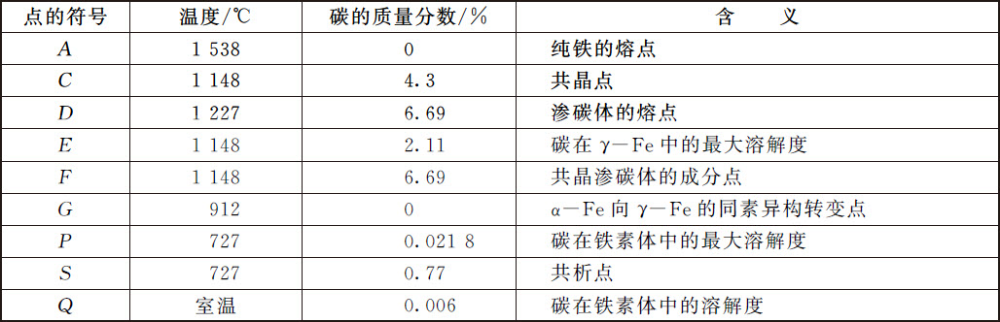
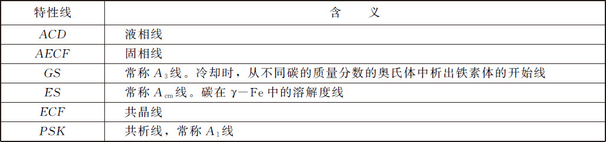
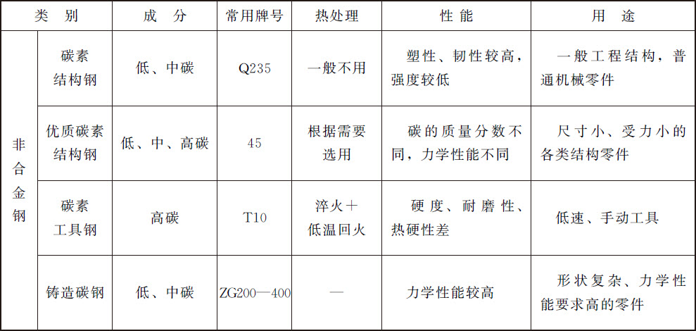
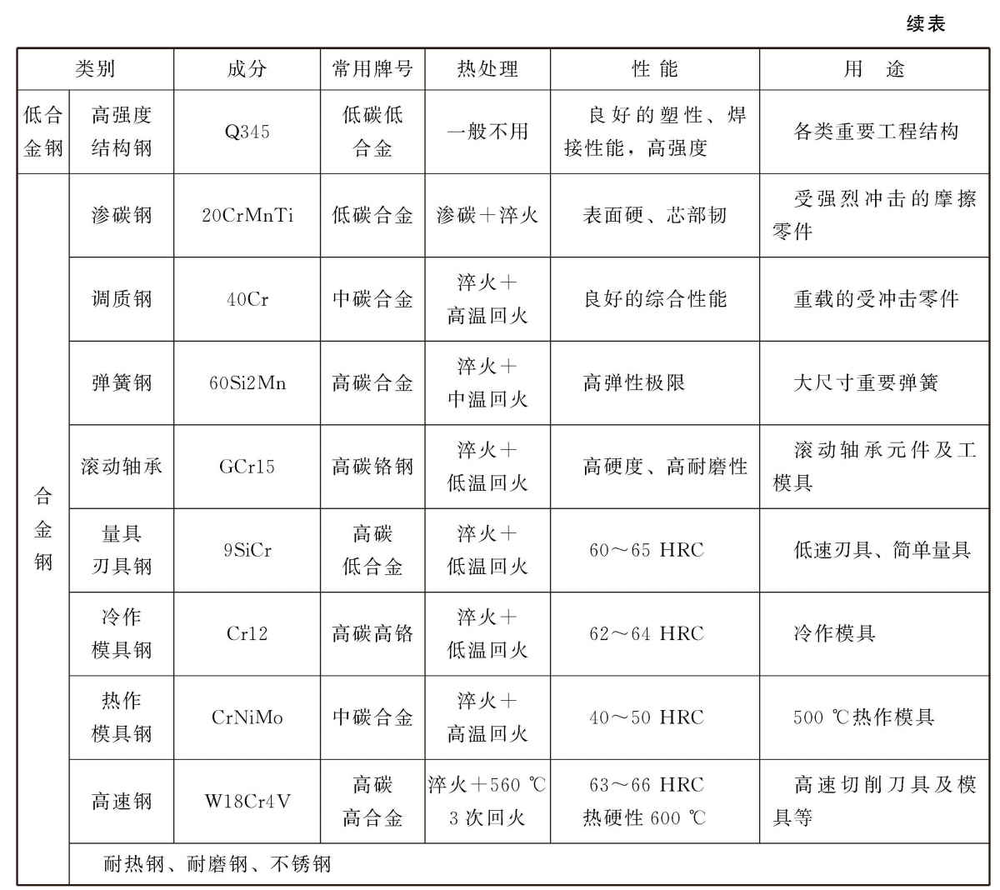
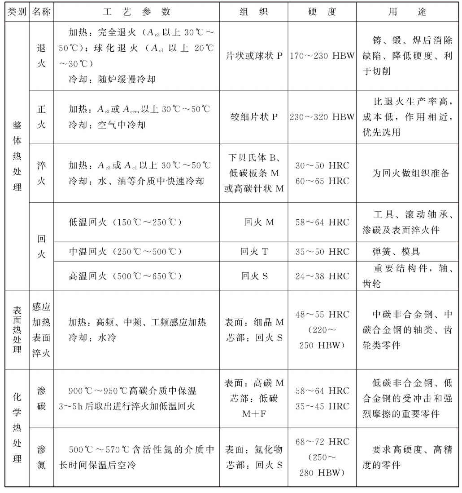
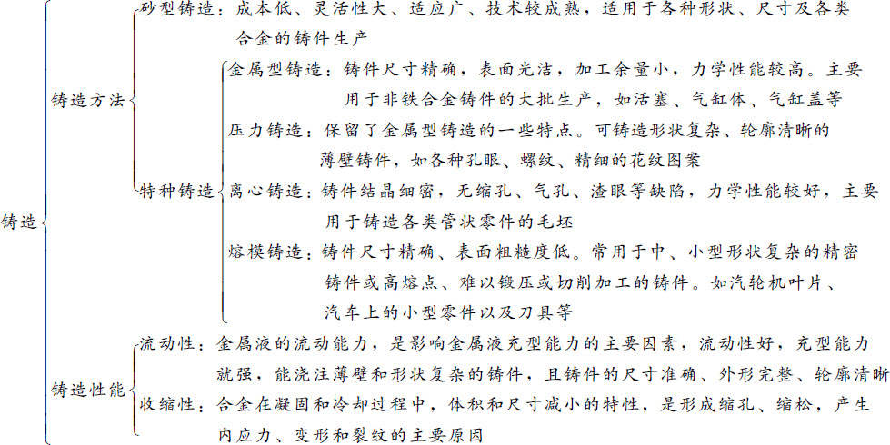
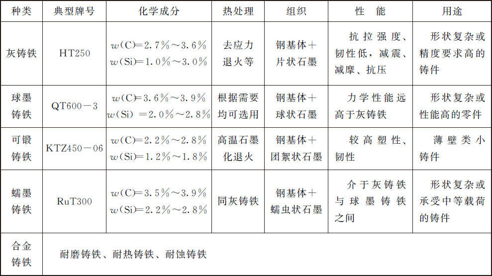
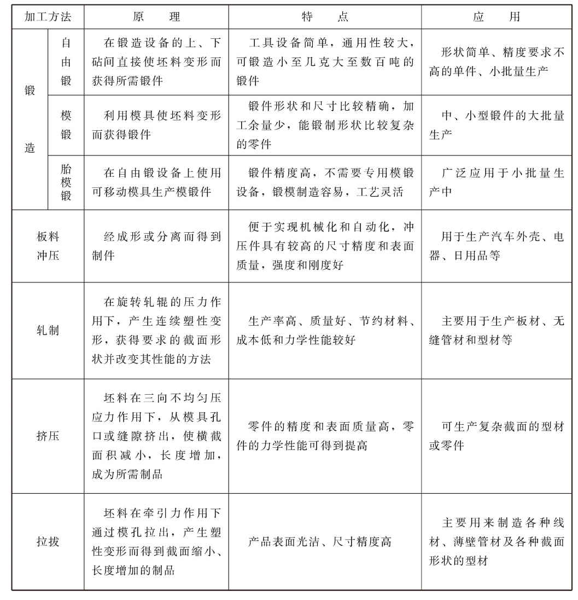
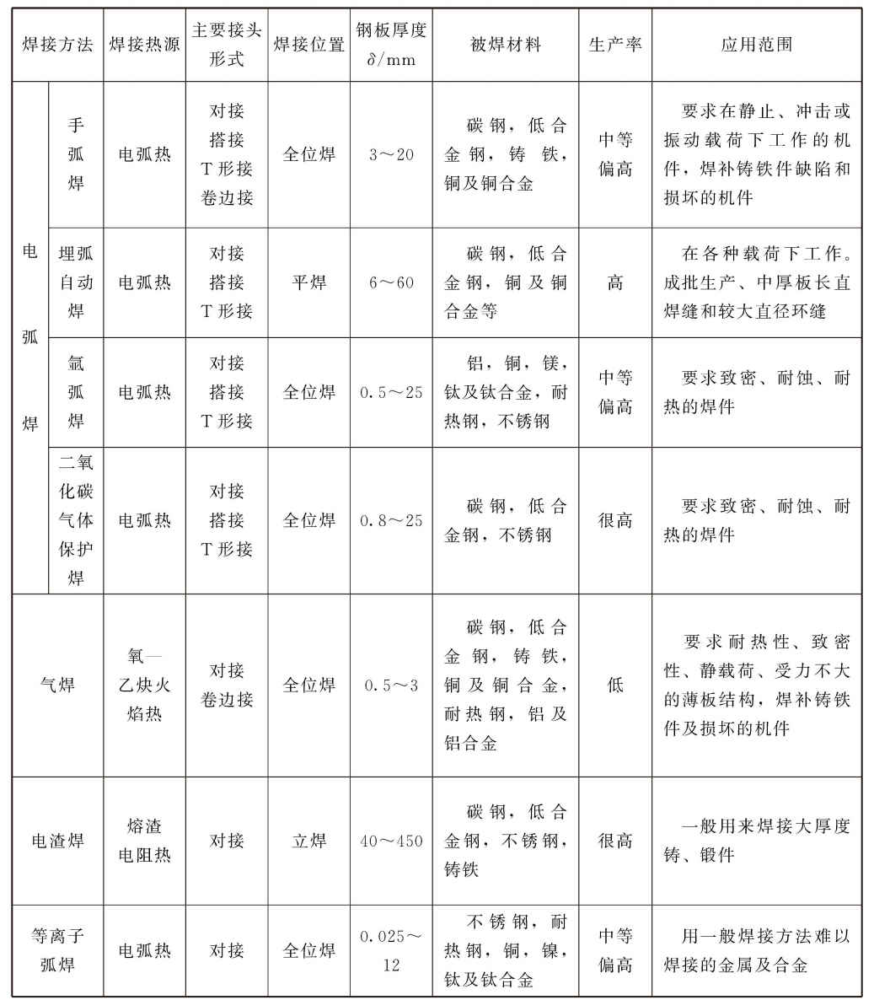

# 金属材料

- 力学性能
  1. 强度 *材料在外力作用下抵抗变形和断裂的能力*
  2. 塑性 *材料产生塑性变形而不破坏的能力，通常以伸长率和断面收缩率表示*
  3. 硬度 *材料抵抗表面局部变形的能力*布氏硬度HBS,HBW;洛氏硬度HRA,HRB,HRC;维氏硬度HV
  4. 冲击韧性 *材料在冲击载荷下抵抗变形和断裂的能力*
  5. 疲劳极限 *材料经无数次（常取$10^7$)应力而不发生断裂的最高应力值*
- 使用性能
  力学性能、物理性能、化学性能
- 工艺性能
  铸造、锻压、焊接、切削加工、热处理性能

---

> 晶体（crystal）是由大量微观物质单位（原子、离子、分子等）按一定规则有序排列的结构

1. 自然凝结的、不受外界干扰而形成的晶体拥有整齐规则的几何外形，即晶体的自范性。
2. 晶体拥有固定的熔点，在熔化过程中，温度始终保持不变。
3. 单晶体有各向异性的特点。
4. 晶体可以使X光发生有规律的衍射。
   宏观上能否产生X光衍射现象，是实验上判定某物质是不是晶体的主要方法。
5. 晶体相对应的晶面角相等，称为晶面角守恒。

常见金属晶格类型：
体心立方(2)

面心立方(4)

密排六方(6)

晶体缺陷

- 点缺陷：间隙原子，晶格空位，置换原子
- 线缺陷：主要是位错
- 面缺陷：主要是指晶界和亚晶界

体心立方晶格：$\alpha$铬、钨、钼、钒、$\alpha$铁、$\beta$钛、铌等
面心立方晶格：$\gamma$铁、铝、铜、镍、金、银、铂、锗、$\gamma$锰、铅等
密排六方晶格：镁、锌、锡等

**过冷度**：实际金属的冷却速度很快，因此金属液的实际结晶温度总是低于理论结晶温度。这种现象称为过冷，温度差称为过冷度。冷却速度越大过冷度越大。

纯金属的结晶过程是晶核形成和晶核长大的过程。

金属结晶后，***在常温下，同种材料晶粒越细小，金属的强度、硬度就越高，塑性、韧性越好。***
晶粒越细，晶界越多，塑性变形也越可分散在更多的晶粒内进行，使塑性变形越均匀，内应力集中小，同时晶粒与晶粒之间犬牙交错，不利于裂纹的传播和发展。
*通常总是希望钢铁材料的晶粒越细越好，但是在高温工作的金属材料，晶粒过大或过小都不好。因此通常希望得到适中的晶粒度，在有些情况下反而希望晶粒越粗越大越好。*

**细化晶粒**：提高冷却速度，变质处理，附加振动

---

**金属的同素异构转变**（重结晶） Fe、Ti、Co等金属在固态存在多种晶格形式，且晶格形式随温度改变而改变

---

> 合金（alloy）是指一种金属与另一种或几种金属或非金属经过混合熔化，冷却凝固后得到的具有金属性质的固体产物

组元：组成合金的独立的、最基本的单元
合金系：由给定组元可按不同比例配制出一系列不同成分的合金，这一系列合金就构成一个合金系统
相:系统中物理状态、物理性质和化学性质完全均匀的部分称为一个相（phase）

1. **固溶体**：溶质原子溶入溶剂晶格中而仍保持溶剂类型的合金相，这种相称为固溶体，这种组元称为溶剂，其他的组元即为溶质。
   置换固溶体：溶质原子替换了溶剂晶格某些结点的原子；间隙固溶体：溶质原子嵌入溶剂晶格的间隙之中
2. **金属化合物**：合金中的两个元素，按一定的原子数量之比相互化合，而形成的具有与这两元素完全不同类型晶格的化合物。金属化合物晶格一般比较复杂。通常它们具有高的硬度、熔点和脆性，因此，不能直接使用。金属化合物在合金中一般起强化作用。
3. **机械混合物**：由两种或以上的互不相溶晶体结构(纯金属、固溶体或化合物) 机械地混合而形成的显微组织。机械混合物的性能主要取决于组成它的各组成物的性能以及其数量、形状、大小和分布情况。

## 铁碳合金

### 铁碳合金相图

1. **铁素体**（F）：碳溶解在$\alpha$-Fe中形成的间隙固溶体
2. **奥氏体**（A）：碳溶解在$\gamma$-Fe中形成的间隙固溶体
3. **渗碳体**（$Fe_3C$）：铁和碳形成的金属化合物
4. **珠光体**（P）：铁素体和渗碳体组成的机械混合物（具有较高的硬度、强度和良好的塑性、韧性）
5. **莱氏体**（Ld）；奥氏体（或珠光体）和渗碳体组成的机械混合物

-*液相区（L）、固相区（$\delta$）*

工业纯铁是指碳的质量分数小于0.0218％的铁碳合金。
碳的质量分数为0.0218％～2.11％的铁碳合金称为钢。亚共析钢0.0218％＜w （C）＜0.77％；共析钢w （C）=0.77％；过共析钢0.77％＜w （C）＜2.11％。
碳的质量分数为2.11％～6.69％的铁碳合金称为白口铸铁。亚共晶白口铸铁2.11％≤w （C）＜4.3％；共晶白口铸铁w （C）=4.3％；过共晶白口铸铁4.3％＜w （C）＜6.69％。

### 常见金属材料及选用

**杂质元素对钢性能的影响**
实际生产中使用的钢除含有碳元素之外，还含有少量的硅、锰、硫、磷等杂质元素。这些元素含量虽少，但它们的存在对钢的组织和性能却有着重要的影响。

1．硅的影响

硅是作为脱氧剂在炼钢过程中带进钢中的。硅是`有益元素`，脱氧作用比锰要强，它能消除FeO对钢的不良影响；硅能溶于铁素体中，产生固溶强化，从而提高钢的强度和硬度，但会降低钢的塑性和韧性；硅和氧的亲和力很强，可形成SiO2 ，对钢的性能不利。故钢中一般规定硅的质量分数不超过0.5％。

2．锰的影响

锰是炼钢时用锰铁脱氧后残留在钢中的杂质元素。锰是`有益元素`，具有一定的脱氧能力，能把钢中的FeO还原成铁，改善钢的质量；锰还可以与硫化合形成MnS，以减轻硫的有害作用，降低钢的脆性，改善钢的热加工性能；锰能大部分溶解于铁素体中，形成置换固溶体，并使铁素体固溶强化，提高钢的强度和硬度。锰在非合金钢中的质量分数一般为0.25％～0.80％，最高可达1.2％。

3．硫的影响

硫是在炼钢时由矿石和燃料带进钢中的，而且是在炼钢时难以除尽的`有害杂质元素`，在固态下不溶于铁，而以FeS的形式存在。FeS与Fe能形成低熔点（985℃）的共晶体（Fe＋FeS），分布在晶界上，当钢材在1000℃～1200℃进行热压力加工时，共晶体会熔化，使钢材变脆，从而导致其热加工时开裂。这种现象称为热脆。
钢中硫的质量分数必须严格控制，我国一般都控制在0.05％以下。但在易切削钢中可适当提高硫的质量分数，其目的在于提高钢材的切削加工性。此外，硫对钢的焊接性有不良的影响，容易使焊缝产生热裂，形成气孔和疏松。

4．磷的影响

磷是由矿石带入钢中的`有害元素`。磷能全部溶于钢的铁素体中，有较强的固溶强化作用，可以提高铁素体的强度和硬度；但在室温下会使钢的塑性和韧性急剧下降，特别是低温韧性，使得钢在低温下变脆，这种现象称为冷脆。磷还会使钢的偏析严重，降低钢的焊接性能。钢中磷的质量分数即使只有千分之几，也会因析出脆性化合物FeP而使钢的脆性增加，特别是在低温时更为显著，因此要限制磷的质量分数。但在易切削钢中可适当提高磷的质量分数，以脆化铁素体，改善钢材的切削加工性。此外，钢中加入适量的磷还可以提高钢材的耐大气腐蚀性能。

---

**非合金钢的牌号及用途**
1．普通质量非合金钢

普通质量非合金钢中碳素结构钢的牌号由屈服点字母、屈服强度数值、质量等级符号、脱氧方法四部分按顺序组成。屈服点的字母以“屈”字汉语拼音字首“Q”表示；脱氧方式用F、b、Z、TZ分别表示沸腾钢、半镇静钢、镇静钢、特殊镇静钢，在牌号中“Z”和“TZ”可以省略。质量等级分A、B、C、D四级，从左至右质量依次提高。例如Q235-A·F，表示屈服强度R eL ≥235MPa，质量为A级的沸腾碳素结构钢。

碳素结构钢的质量分数较低，焊接性能好，塑性、韧性好，价格低，常热轧成钢板、钢带、型钢、棒钢等，用于桥梁、建筑等工程结构和要求不高的机器零件。

2．优质非合金钢

优质非合金钢中的优质碳素结构钢的牌号用两位数字表示，两位数字表示该钢的平均碳的质量分数的万分之几。例如45钢，表示钢中平均碳的质量分数为0.45％的优质碳素结构钢；08钢表示钢中平均碳的质量分数为0.08％的优质碳素结构钢。优质碳素结构钢中锰的质量分数较高［w （Mn）=0.70％～1.00％］时，在其牌号后面标出元素符号“Mn”，如15Mn、20Mn等。若为沸腾钢与半镇静钢，则在数字后分别加“F”与“b”，如08F与08b等。

优质碳素结构钢必须同时保证化学成分和力学性能；主要用于制造机器零件；一般都要经过热处理以提高力学性能；根据碳的质量分数不同，其有不同的用途。

08钢、08F钢、10钢、10F钢中碳的质量分数低，塑性、韧性好，冷成形性能和焊接性能好，主要用于制造冷冲压件和焊接件，如汽车车身、仪表外壳等。

15钢～25钢强度较低，但塑性、韧性较高，冷冲压性能和焊接性能很好，可以制造各种受力不大、韧性要求高的冲压件和焊接件，如焊接容器、螺钉、杆件、轴套等。这类钢经渗碳淬火后，表面硬度可达60 HRC以上，耐磨性好，而芯部具有一定的强度和韧性，常用于制造要求表面硬度高、耐磨并承受冲击载荷的零件。

30钢～55钢、40Mn、50Mn属于调质钢，经过热处理后具有良好的综合力学性能，主要用于制作要求强度、塑性、韧性都较高的机件，如齿轮、连杆、轴类零件。其中40钢和45钢在机械制造中应用广泛。

60钢～85钢、60Mn、65Mn、70Mn属于弹簧钢，经过热处理后可获得高的弹性极限、足够的韧性和一定的强度，主要用于制造负荷不大、尺寸较小的弹簧、弹性零件及耐磨零件。

3．特殊质量非合金钢

特殊质量非合金钢中碳素工具钢的牌号以“T”（“碳”的汉语拼音字首）开头，其后的数字表示平均碳的质量分数的千分数。例如T8表示平均碳的质量分数为0.80％的碳素工具钢。若为高级优质碳素工具钢，则在牌号后面标以字母A，如T12A表示平均碳的质量分数为1.20％的高级优质碳素工具钢。

**低合金钢和合金钢的牌号**
1．低合金高强度结构钢的牌号

低合金高强度结构钢的牌号由代表屈服点的汉语拼音首位字母、屈服点数值、质量等级符号（A、B、C、D、E）、脱氧方式符号（F、b、Z和TZ，其中Z和TZ可省略）四个部分按顺序组成。例如Q390A表示屈服强度R eL ≥390MPa、质量为A级的低合金高强度结构钢。

2．合金钢（包括部分低合结构钢）的牌号

我国合金钢的编号是按照合金钢中碳的质量分数及所含合金元素的种类（元素符号）和其质量分数来编制的。一般牌号的首部都是表示其平均碳的质量分数的数字，数字含义与优质碳素结构钢是一致的。对于结构钢，数字表示平均碳的质量分数的万分之几；对于工具钢，数字表示平均碳的质量的千分之几。当钢中某合金元素（Me）的平均质量分数w （Me）＜1.5％时，牌号中只标出元素符号，不标明含量；当1.5％≤w （Me）＜2.5％时，在该元素后面相应地用整数2表示其平均质量分数，依次类推。

（1）合金结构钢的牌号。例如，60Si2Mn表示平均w （C）=0.60％、w （Si）=2％、w （Me）＜1.5％的合金结构钢；09Mn2表示平均w （X）=0.09％、w （Mn）=2％的合金结构钢。钢中钒、钛、铝、硼、稀土等合金元素虽然含量很低，但仍应标出，例如40MnVB、25MnTiBRE等。

（2）合金工具钢的牌号。当钢中平均w （C）＜1.0％时，牌号前数字以千分之几（一位数）表示；当w （C）≥1.0％时，为了避免与合金结构钢相混淆，牌号前不标数字。例如9Mn2V表示平均w （C）＜0.9％、w（Mn）=2％、w（V）＜1.5％的合金工具钢；CrWMn表示钢中平均w （C）≥1.0％、w（W）=1.5％、w（Mn）＜1.5％的合金工具钢；高速工具钢牌号不标出碳的质量分数值，例如W18Cr4V。

（3）滚动轴承钢的牌号。滚动轴承钢牌号前面冠以汉语拼音字母“G”，其后为铬元素符号Cr，铬的质量分数以千分之几表示，其余合金元素与合金结构钢牌号规定相同，如GCr15SiMn钢。

（4）不锈钢和耐热钢的牌号。不锈钢和耐热钢的牌号表示方法与合金工具钢基本相同，只是w （C）≤0.08％及w （C）≤0.03％时，在牌号前分别冠以“0”及“00”，例如0Cr21Ni5Ti、00Cr30Mo2等。

### 钢的热处理

> 热处理是指材料在固态下，通过加热、保温和冷却的手段，以获得预期组织和性能的一种金属热加工工艺

加热是钢进行热处理的第一步，其目的是使钢获得均匀的奥氏体组织

#### 退火

将金属缓慢加热到一定温度，保持足够时间，然后以适宜速度冷却。

**降低硬度，改善切削加工性；降低残余应力，稳定尺寸，减少变形与裂纹倾向；细化晶粒，调整组织，消除组织缺陷；均匀材料组织和成分，改善材料性能或为以后热处理做组织准备。**

1. 完全退火：将 `亚共析钢`加热到Ac3以上30~50℃，保温后随炉缓慢冷却，以期得到接近于平衡组织（珠光体型组织）的热处理工艺方法。主要应用于亚共析钢的铸、锻件，如挖掘机底座、镗床镗杆等。加热温度为 Ac3 以上30～50℃，保温一段时间，使钢的原来组织全部转变为单一均匀的奥氏体然后在缓慢冷却中，使奥氏体转变为铁素体和珠光体以达到*细化组织、降低硬度和消除内应力*的目的。过共析钢不能采用完全退火。因为加热到 Acm(碳在奥氏体中的溶解限度线)以上退火后，二次渗碳体呈网状析出，使钢的机械性能显著降低，并易在淬火时开裂。
2. 球化退火：使钢中碳化物球化而进行的退火，得到在铁素体基体上均匀分布的球状或颗粒状碳化物的组织。球化退火主要用于 `共析钢`和 `过共析钢`，以获得类似粒状珠光体的球化组织(因不—定是共析成分，故称为球化组织)，*从而降低硬度，改善切削加工性能，并为淬火做组织准备*。球化组织不仅比片状组织有更好的塑性和韧性，而且硬度稍低。在切削加工具有球化组织的工件时，刀具可以避免切割硬而脆的渗碳体，而在软的铁素体中通过，因而延长了刀具的使用寿命，提高了钢的切削加工性。
3. 扩散退火：扩散退火又称均匀化退火。在略低于固相线温度长期保温的处理方法。减轻或消除钢锭、铸件、钢坯化学成分及显微组织偏析使其均匀化。高合金钢应用更为普遍，钢的扩散退火温度高于Ac3，在1100~1200℃之间，退火时间长且依工件截面厚度而定。由于温度高、时间长、成本高。对于钢件而言，扩散退火对其宏观偏析和夹杂物分布的改善不起作用。钢锭开坯后锻轧加热时，适当延长保温时间，能收到扩散退火以消除应力的作用。大多数有色金属在扩散退火的加热过程中不发生固态相变。应用时须相应考虑奥氏体晶粒细化和钢的氧化和脱碳问题。
4. 去应力退火：冷形变后的金属在低于再结晶温度加热，以去除内应力，但仍保留冷作硬化效果的热处理，称为去应力退火。 在去应力退火中金属组织及性能的变化，相当于温度曲线图中的恢复阶段。在实际生产 中，去应力退火工艺的应用比上述定义广泛得多。热锻轧、铸造、各种冷变形加工、切 削或切割、焊接、热处理，甚至机器零部件装配后，在不改变组织状态，保留冷作、热作或表面硬化的条件下，对钢材或机器零部件进行较低温度的加热，以去除内应力，减小变形开裂倾向的工艺，都可称为去应力退火。

再结晶退火（recrystallization annealing）是将经过冷变形加工的工件加热至再结晶温度以上，保温一定时间后冷却，使工件发生再结晶，从而消除加工硬化的工艺。这种退火一般只需制定最高加热温度和保温时间，加热和冷却速度可以不考虑。这种退火的特点为组织和性能是单向不可逆变化。

#### 正火

> 将钢构件加热到$A_{c3}$或$A_{ccm}$温度以上30〜50℃后，保温一段时间出炉空冷。主要特点是冷却速度快于退火而低于淬火，正火时可在稍快的冷却中使钢材的结晶晶粒细化，不但可得到满意的强度，而且可以明显提高韧性(AKV值），降低构件的开裂倾向。—些低合金热轧钢板、低合金钢锻件与铸造件经正火处理后，材料的综合力学性能可以大大改善，而且也改善了切削性能。

普通结构零件的最终热处理 ，由于正火后工件比退火状态具有更好的综合力学性能，对于一些受力不大、性能要求不高的普通结构零件可将正火作为最终热处理，以减少工序、节约能源、提高生产效率。此外，对某些大型的或形状较复杂的零件，当淬火有开裂的危险时，正火往往可以代替淬火、回火处理，作为最终热处理。

**正火与退火**
**区别**：
（1）正火的冷却速度较退火快，得到的珠光体组织的片层间距较小，珠光体更为细薄，目的是使钢的组织正常化，所以亦称常化处理。例如，含碳小于0.4%时，可用正火代替完全退火。
（2）正火和完全退火相比，能获得更高的强度和硬度。
（3）正火生产周期较短，设备利用率较高，节约能源，成本较低，因此得到了广泛的应用。

**选用**：
1.从切削加工性考虑
金属的切削加工性能，包括硬度、切屑脆性、加工表面粗糙度及对刀具的磨损等。一般说来，金属的硬度在170-230HBW范围内，切削性能较好。硬度过高，不但难以加工，而且使刀具很快磨损；硬度过低，切削时易造成粘刀及切屑缠绕，降低刀具寿命，且切削表面粗糙。在一般生产中，低，中碳结构钢以正火作为预备热处理较为合适，高碳结构钢（如轴承钢）和工具钢则以退火（球化退火）为好。对于合金钢，由于含有合金元素，钢的硬度有所提高，所以在大多数情况下，中碳以上的合金钢常选用退火。
2.从使用性能考虑
如果对钢件的性能要求不太高，可采用正火作为最终热处理。但如果零件尺寸较大或形状较复杂，正火有可能使零件产生较大的残余力或变形、开裂，这时应选择退火对力学性能要求较高，必须进行淬火+回火最终热处理零件，从减少变形和开裂的倾向性来说、预备热处理应选用退火。
3.从经济上考虑
正火比退火生产周期短，且操作简便。放在可能条件下，特别是在大批量生产时应优先考虑以正火代替退火。

#### 淬火与回火

马氏体相变是奥氏体的非扩散性型相变，只有当淬火速度快到足以阻止碳的扩散，才发生马氏体相变。任何扩散反应都导致铁素体和渗碳体相的形成。
‌合金钢适合采用油淬，可以减小淬火内应力

> **淬火**：将钢加热到临界温度Ac3（亚共析钢）或Ac1（过共析钢）以上温度，保温一段时间，使之全部或部分奥氏体化，然后以大于临界冷却速度的冷速快冷到Ms以下（或Ms附近等温）进行马氏体（或贝氏体）转变的热处理工艺。
> **回火**：将经过淬火的工件重新加热到低于下临界温度Ac1（加热时珠光体向奥氏体转变的开始温度）的适当温度，保温一段时间后在空气或水、油等介质中冷却的金属热处理工艺。或将淬火后的合金工件加热到适当温度，保温若干时间，然后缓慢或快速冷却。一般用于减小或消除淬火钢件中的内应力，或者降低其硬度和强度，以提高其延性或韧性。淬火后的工件应及时回火，通过淬火和回火的相配合，才可以获得所需的力学性能。

1. 低温回火（150~250℃）：保持淬火工件高的硬度和耐磨性，降低淬火残留应力和脆性。回火后得到回火马氏体（指淬火马氏体低温回火时得到的组织）。主要应用于各类高碳钢的工具、刃具、量具、模具、滚动轴承、渗碳及表面淬火的零件等。
2. 中温回火（350~500℃）：得到较高的弹性和屈服点，适当的韧性。回火后得到回火屈氏体（指马氏体回火时形成的铁素体基体内分布着极其细小球状碳化物或渗碳体的复相组织）。主要用于弹簧、发条、锻模、冲击工具等。
3. 高温回火（500~650℃）：得到强度、塑性和韧性都较好的综合力学性能。回火后得到回火索氏体（指马氏体回火时形成的铁素体基体内分布着细小球状碳化物包括渗碳体的复相组织）。广泛用于各种较重要的受力结构件，如连杆、螺栓、齿轮及轴类零件等。*工件淬火并高温回火的复合热处理工艺称为调质。调质不仅作最终热处理，也可作一些精密零件或感应淬火件预先热处理。*

回火一般紧接着淬火进行，其目的是：
（a）消除工件淬火时产生的残留应力，防止变形和开裂；
（b）调整工件的硬度、强度、塑性和韧性，达到使用性能要求；
（c）稳定组织与尺寸，保证精度；
（d）改善和提高加工性能。因此，回火是工件获得所需性能的最后一道重要工序。通过淬火和回火的相配合，才可以获得所需的力学性能。

#### 表面淬火和化学热处理

表面淬火：仅使钢铁工件的表面得到淬火的一种表面热处理工艺。目的是提高工件表面的硬度、耐磨性和疲劳强度，而心部仍具有较高的韧性。常用于轴类、齿轮类等零件。
化学热处理：化学热处理是将钢置于一定温度的活性介质中加热和保温，使活性物质渗入工件表层，达到改善表面性能的热处理工艺。由于机械零件的失效和破坏大多数都萌发在表面层，特别在可能引起磨损、疲劳、金属腐蚀、氧化等条件下工作的零件，表面层的性能尤为重要。经化学热处理后的钢件，实质上可以认为是一种特殊复合材料。心部为原始成分的钢，表层则是渗入了合金元素的材料。

## 加工工艺

### 铸造

> 铸造是将液体金属浇铸到与零件形状相适应的铸造空腔中，待其冷却凝固后，以获得零件或毛坯的方法。

为保证铸件质量，通常同时凝固适合于变形和裂纹倾向大的铸造合金
消除铸件中残余热应力的方法是时效处理
消除铸件中机械应力的方法是及时落砂

下列哪种方法不能提高合金流动性？（  ）

A.
提高金属液质量
B.
简化浇注系统结构
C.
将金属型铸造换成砂型铸造
D.
选用结晶温度范围宽的合金

#### 铸造性能

1. **流动性**：液体金属材料充满铸型型腔，获得轮廓清晰、形状完整的优质铸件的能力，称为液体合金的流动性。流动性主要受化学成分、浇注温度以及铸型等因素影响，流动性好的材料容易充满型腔，从而获得外形完整、尺寸精确和轮廓清晰的铸件。
2. **收缩性**：铸造合金从液态凝同和冷却至室温过程中，其体积和尺寸减少的现象称为收缩性。包括液态收缩、凝固收缩、固态收缩三个阶段。液态收缩是金属液由于温度的降低而发生的体积缩减。凝固收缩是金属液凝固（液态转变为同态）阶段的体积缩减。液态收缩和凝固收缩表现为合金体积的缩减，通常称为“体收缩”。固态收缩是金属在固态下由于温度的降低而发生的体积缩减，固态收缩虽然也导致体积的缩减，但通常用铸件的尺寸缩减量来表示，故称为“线收缩”。铸件收缩不仅影响尺寸，还会使铸件产生缩孔、疏松、内应力、变形和开裂等缺陷，故铸造用材料的收缩率越小越好。收缩直接影响铸件的质量。液态收缩和凝固收缩若得不到补足，会使铸件产生缩孔和缩松缺陷，固态收缩若受到阻碍会产生铸造内应力，导致铸件变形开裂。
   1. 缩孔和缩松：缩孔是由于金属的液态收缩和凝固收缩部分得不到补足时，在铸件的最后凝固处出现的较大的集中孔洞。缩松是分散在铸件内的细小的缩孔。缩孔和缩松都能使铸件的力学性能下降，缩松还能使铸件在气密性试验和水压试验时出现渗漏现象。可以通过合理地设计铸件结构、控制铸件凝固过程、合理应用冒口冷铁等工艺措施，防止缩松缩孔的形成。
   2. 变形与开裂：铸件在凝固后继续冷却过程中，若固态收缩受到阻碍就会产生铸造内应力，当内应力达到一定数值时，铸件便产生变形甚至开裂。铸造内应力主要包括收缩时的机械应力和热应力两种，机械应力是由铸型、型芯等外力的阻碍收缩引起的内应力；热应力是铸件在冷却和凝固过程中，由于不同部位的不均衡收缩引起的内应力。生产中为减小铸造内应力，经常从改进铸件结构和优化铸造工艺入手，如铸件的壁厚应均匀，或合理地设置冒口、冷铁等工艺措施，使铸件各部位冷却均匀，同时凝固，从而减小热应力；铸件的结构尽量简单、对称，这样可减小金属的收缩受阻，从而减小机械应力。
3. **偏析**：液态材料凝固后，铸锭或铸件化学成分和组织的不均匀现象称为偏析。铸件的偏析可分为晶内偏析、区域偏析和比重偏析三类。
   1. 晶内偏析（又称枝晶偏析）是指晶粒内各部分化学成分不均匀的现象。这种偏析出现在具有一定凝固温度范围的合金铸件中。为防止和减少晶内偏析的产生，在生产中常采取缓慢冷却或孕育处理的方法。
   2. 区域偏析是指铸件截面的整体上化学成分和组织的不均匀。避免区域偏析的发生，主要应该采取预防措施，如控制浇注温度不要太高，采取快速冷却使偏析来不及发生，或采取工艺措施造成铸件断面较低的温度梯度，使表层和中心部分接近同时凝固。
   3. 比重偏析是指铸件上、下部分化学成分不均匀的现象。为防止比重偏析，在浇注时应充分搅拌金属液或加速合金液的冷却，使液相和固相来不及分离，凝固即告结束。偏析过大会使铸件各部分的力学性能有很大的差异，降低铸件的质量。

#### 铸造缺陷

- 缩孔与缩松
- 内应力、变形与裂纹
- 气孔与偏析

#### 铸铁

根据碳在铸铁中的存在形式（渗碳体 `硬而脆`、石墨 `软而滑`）分为：

1. 白口铸铁 主要为渗碳体 断口银白色 硬而脆，不能切削加工，主要作炼钢的原料或制造可锻铸铁的毛坯
2. 麻口铸铁 一部分渗碳体一部分石墨 断口灰白相间 难加工，又无特殊优点
3. 灰口铸铁 主要为石墨 断口暗灰色 按石墨的形态及结晶生长过程有可分为
   - 普通灰口铸铁 石墨片状 强度低塑性差但铸造性能好
   - 可锻铸铁 石墨团絮状 塑性和韧性较高，但注意是不可锻的，用于受冲击振动的薄壁小件
   - 球墨铸铁 石墨球状
   - 蠕墨铸铁 石墨呈蠕虫状

#### 铸造方法

##### 砂型铸造

浇注位置：

1. 铸件的重要工作面、主要的加工面应朝下或侧立放置
2. 铸件的大平面应朝下，以免形成夹渣和夹砂等缺陷
3. 应将铸件薄而大的平面放在下部、侧面或倾斜位置
4. 应将铸件厚大部分放在上部或侧面，以获得组织致密、外形完整的铸件
5. 确定时应尽量减少型芯的数量，要有利于型芯的安装、固定、检查和排气

分型面的选择：

1. 为了分别起模而不损害铸型，分型面应选在铸件的最大截面上
2. 尽可能使全部或大部分铸件，或者加工基准面与重要的加工面处于同一半型内，以防止错型，减少铸件尺寸偏差
3. 尽量减少分型面数目
4. 分型面尽量选用平面
5. 分型面的选择应尽量减少型芯及活快数量
6. 为便于造型、下芯、合箱及检验铸件壁厚，应尽量使型腔及主要型芯位于下箱。但下箱型腔也不宜过深，并且尽量避免使用吊芯和大的吊砂

**铸造工艺参数**：
机械加工余量铸件机械加工余量的大小与生产批量、合金品种、铸件尺寸、加工面位置、加工面与基准面的距离等因素有关，加工方法对加工精度等级有影响。
防止铸件交角处粘砂或由于应力集中而产生裂纹，制造模型和设计铸件时，壁的连接和转角处都要做出铸造圆角。

冷铁一般放置在铸件壁厚过大，需较快凝固或铸件的热节部位。
铸件的结构斜度是在零件的非加工面上设置的，直接标注在零件图上，且斜度值较大。‌
铸件的起模斜度是在零件的加工面上设置的，在绘制铸造工艺图或模样图时使用，切削加工时将被切除。
起模斜度
浇注系统

##### 特种铸造

金属型铸造；压力铸造；低压铸造；离心铸造；熔模铸造（失蜡铸造）；陶瓷型铸造；消失模铸造；挤压铸造；半固态铸造

### 压力加工

> 金属压力加工是指固态金属在外力作用下产生塑性变形，获得具有一定形状、尺寸和力学性能的原材料、毛坯或零件的生产方法

#### 压力加工基础

金属的变形分为弹性变形和塑性变形

**`塑性变形的实质`**

- 单晶体塑性变形
  - 滑移
  - 孪生
- 多晶体塑性变形

对金属组织和性能的影响
金属的加工硬化
纤维组织

金属的可锻性

#### 压力加工方法

##### 常用的锻造方法

自由锻
模锻

##### 板材冲压

##### 特种压力加工

精密模锻；高速锤锻造；径向锻造；轧制；挤压；拉拔；超塑性成形；高速高能成形

### 焊接

> 焊接是一种永久性连接金属材料的方法。利用加热或加压等手段，借助金属原子的结合与扩散作用，使分离的金属材料牢固地连接起来

#### 焊接方法

1）熔焊
利用局部加热的方法，将待焊处的母材金属熔化以形成焊缝的焊接方法。
2）压焊
焊接过程中，无论加热或不加热，都对焊件施加压力以完成焊接的方法。
3）钎焊
采用比母材熔点低的金属材料作钎料，将焊件和钎料加热到高于钎料熔点且低于母材熔点的温度，利用液态钎料润湿母材，填充接头间隙并与母材相互扩散实现连接焊件的方法。

### 切削加工

> 利用刀具和工件做相对运动，从工件上切除多余金属材料的加工方法称为金属切削加工。其目的是保证工件的加工精度和表面质量，以达到图样规定的要求。

刀具切削部分材料的基本要求有高硬度、高的耐磨性、足够的强度和韧性、高的热硬性和良好的工艺性。

常用刀具材料有碳素工具钢、合金工具钢、高速钢和硬质合金等

车刀的角度有前角、后角、楔角、刃倾角、主偏角、副偏角和刀尖角等。

切削过程包括三个阶段，即弹性变形阶段、塑性变形阶段和产生裂纹。

由于材料和切削条件不同，所以产生的切屑有带状切屑、节状切屑、崩碎切屑三种类型。

切削运动分为主运动、进给运动和合成切削运动。

切削过程中，在工件上形成三个表面，即待加工表面、已加工表面和过渡表面。

切削用量是指切削过程中的切削速度、进给量和背吃刀量。

金属材料的强度和硬度越高，刀具磨损也越快。塑性好的材料可切削性差，脆性材料的可切削性要好些。

在车床上能进行多种车削，如车外圆、车端面、钻孔、车孔、车槽、切断、车锥体、车螺纹及车削其他成形表面等。车削加工具有易于保证被加工零件各表面位置精度、切削过程平稳、刀具简单、使用灵活和应用范围广等工艺特点。

铣削方式分为端铣和周铣。端铣的适应性较差，一般仅用于铣削平面，尤其是大平面。周铣的适应性强，能铣削平面、沟槽、齿轮和成形面等。周铣时又可分为顺铣和逆铣。只有在铣削余量较小、产生的切削力不超过工作台和导轨间的摩擦力时，才采用顺铣；在其他情况下，多采用逆铣。

镗床最适于加工大直径孔和箱体上的各种孔系，并能保证所加工孔的尺寸精度、形状精度、孔与基面间的位置精度及表面粗糙度等。

磨削一般可分为平面磨削、外圆磨削和内圆磨削。磨削加工具有加工精度高、可加工高硬材料和应用范围广等特点。

电火花加工可以加工任何硬度、强度的金属，而且在加工复杂、微细零件方面的表现更为突出。

#### 零件表面加工方法

### 特种加工

增材/减材，热加工/冷加工

电火花加工、电化学加工、超声波加工、激光加工、电子束加工、离子束加工、等电子弧加工、化学加工

#### 新型金属热加工工艺

`热等静压、放电等离子烧结（SPS）`的原理及特点

放电等离子烧结工艺是将金属等粉末装入石墨等材质制成的模具内，利用上、下模冲及通电电极将特定烧结电源和压制压力施加于烧结粉末，经放电活化、热塑变形和冷却完成制取高性能材料的一种新的粉末冶金烧结技术。
放电等离子烧结具有在加压过程中烧结的特点，脉冲电流产生的等离子体及烧结过程中的加压有利于降低粉末的烧结温度。同时低电压、高电流的特征，能使粉末快速烧结致密。
加热均匀，升温速度快，烧结温度低，烧结时间短，生产效率高，产品组织细小均匀，能保持原材料的自然状态，可以得到高致密度的材料，可以烧结梯度材料以及复杂工件。

`电弧增材制造（WAAM`）的原理及特点

一种利用电弧为热源，通过丝材的添加，在程序的控制下，根据三维数字模型由线-面-体逐渐成形出金属零件的先进数字化制造技术。
具有沉积效率高、丝材利用率高、整体制造周期短、成本低等优点。

`选择性激光熔化（SLM）`的工艺原理、特点及应用

使用高功率密度激光器将金属粉末熔化和熔合在一起
可以减少材料使用，并为制造技术无法实现的设计提供更多自由度。

`激光近净成型技术（LENS）`的工艺原理、特点及应用

通过激光在沉积区域产生熔池并持续熔化粉末或丝状材料而逐层沉积生成三维物件。
可以实现金属零件的无模制造，节约成本，缩短生产周期。同时该技术解决了复杂曲面零部件在传统制造工艺中存在的切削加工困难、材料去除量大、刀具磨损严重等一系列问题。LENS技术是无需后处理的金属直接成形方法，成形得到的零件组织致密,力学性能很高,并可实现非均质和梯度材料零件的制造。

`电子束选区熔化（SEBM）`的工艺原理、特点及应用

利用高能电子束作为能量源在高真空环境下通过逐层熔化金属粉末的方式制造实体部件的增材制造技术。其原理是电子束按照规划路径快速扫描熔化成形底板上预先铺置的球形金属粉末，完成一层扫描熔化后，工作台下降一定高度，重新铺置一层粉末，电子束按照路径再次扫描熔化，如此反复进行，层层堆积，完成从二维到三维的金属零件制造。
能量吸收转化率高，成形速度快；电子束功率高，可成形难熔金属；选用较粗粒径粉末原材料，零件综合成本低；粉床温度高，可成形脆性易开裂材料，零件内应力小，对支撑依赖小，无需后续热处理；真空环境成形，零件更纯净；电子束穿透能力强，熔池更深，成形零件更致密

### 结构设计

#### 铸件的结构设计

铸造工艺对铸件结构的要求
1．铸件外形应力求简单

铸件外形应尽可能采用平直轮廓，尽量少用非圆曲面，以便于制造模样。

2．铸件应有起模斜度

铸件上垂直于分型面的不加工表面（尤其是大件），为起模方便，应具有起模斜度。

3．铸件应尽量不用或少用活块

4．型芯的设置要稳固并有利于排气与清理

合金铸造性能对铸件结构的要求
1．铸件应有合理的壁厚

若铸件壁厚不均匀，则会产生冷却不均匀，易引起大的内应力，从而使铸件产生变形和裂纹，同时，还会因金属局部积聚产生缩孔。
为保证金属液充满铸型，铸件壁厚不能小于金属所允许的最小壁厚，否则易产生浇不足、冷隔等缺陷。

2．铸件壁的连接应合理

铸件壁的连接应平缓、圆滑，避免直角处产生应力集中和金属积聚，铸件厚壁与薄壁间的连接要逐步过渡，做到减少应力集中，防止裂纹产生。

3．铸件应尽量避免有过大的水平面

大的水平面不利于金属液充填及排除气体和杂质物，易产生浇不到和冷隔现象；过大的型腔上表面受金属长时间烘烤，易开裂使铸件产生夹砂。

4．铸件结构应利于自由收缩

铸件收缩受阻将生产很大应力，设计时应尽量使其自由收缩。

5．铸件结构应符合凝固原则的要求

设计中、小型薄壁铸件，可采用同时凝固原则，此时铸件壁厚要均匀，过渡要平缓。对致密要求高、承受压力的铸件，应按定向凝固原则设计，以利于铸件上部由冒口补缩。

<!-- 

    
    

    
    

    
    

    
    
    

 -->

#### 焊接件结构设计

#### 零件的结构工艺性
