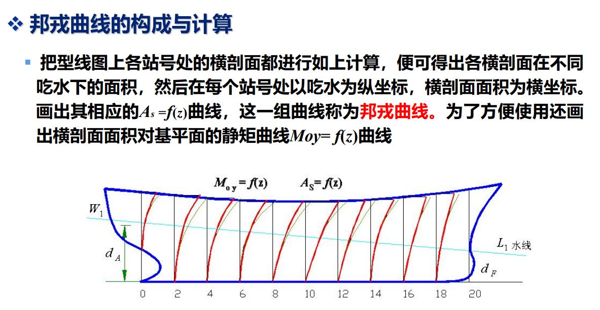
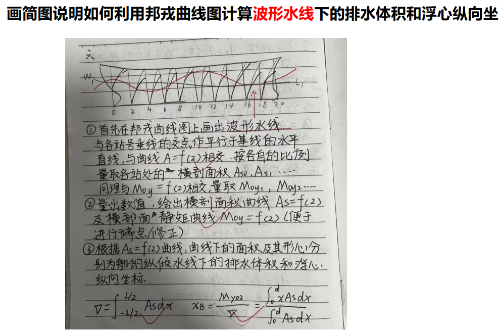

# 船舶原理

1kn=0.5144m/s

## 船体形状

中纵剖面、中横剖面、设计水线面

### 主尺度

船长$L$、型宽$B$、型深$D$、吃水$d$、干舷$F$

尺度比

### 船形系数

面积系数：
**水线面系数** $\displaystyle C_W=\frac{A_W}{LB}$

**中横剖面系数** $\displaystyle C_M=\frac{A_M}{BD}$

体积系数：
**方形系数** $\displaystyle C_B=\frac{\nabla}{LBD}$

**棱形系数** $\displaystyle C_P=\frac{\nabla}{A_M}$

**垂向棱形系数** $\displaystyle C_{VP}=\frac{\nabla}{A_W d}$

### 船体型线图

船体外形是一个复杂的多向曲度变化的流线型的几何曲面，一般无法用数学公式表示，通常借助于一种图形来表征其几何形状，这种图形称为船体型线图。

型线图中包括着三组剖面的投影：
1）横剖线图 平行于中站面的一组横剖面
2）半宽水线图 平行于基线面的一组水平剖面
3）纵剖线图 平行于中线面的一组纵剖面

### 船体近似计算

梯形法：$A=l(\sum y-\frac{y_0+y_n}{2})$

辛普森第一法则（二次曲线）：$\frac{1}{3}\qquad 14\dot{2}{\dot4}1$
辛普森第二法则（三次曲线）：$\frac{3}{8}\qquad 133\dot{2}\dot{3}\dot{3}1$

## 浮性

船舶在一定装载条件下，保持平衡位置的能力

### 平衡

平衡条件：重力与浮力大小相等，方向相反；重心和浮心在同一铅直线上。

浮态
正浮、横倾、纵倾、任意浮态

浮心、重心、排水体积

水密度

$$
\Delta d_p=\frac{W}{100TPC}\left(\frac{\rho_1}{\rho_2}-1\right)
$$

### 邦戎曲线

把型线图上各站号处的横剖面都进行如上计算，便可得出各横剖面在不同
吃水下的面积，然后在每个站号处以吃水为纵坐标，横剖面面积为横坐标。
画出其相应的As=f(z))曲线，这一组曲线称为邦戎曲线。为了方便使用还画
出横剖面面积对基平面的静矩曲线Moy=f(z)曲线

有了邦戎曲线可方便地算出任意纵倾下的和浮心坐标。

## 稳性

船舶在外力作用下偏离其平衡位置而倾斜，当外力消失后能自行回复到原平衡位置的能力

稳性按倾角大小分为：**初稳性**（10°~15°）、**大倾角稳性**（大于10°~15°）

### 初稳性

稳心半径：

$$
r=\frac{I_{xf}}{V}
$$

1）箱体船

$$
I_{xf}=\frac{LB^3}{12} \\
V=LBd
$$

2）横剖面为等腰三角形纵柱体船

$$
I_{xf}=\frac{Lb^3}{12} \\
V=0.5Lbd
$$

3）水线面为菱形的垂柱体船

$$
I_{xf}=\frac{LB^3}{48} \\
V=0.5LBd
$$

#### 船内问题

货物水平横移：

$$
\tan\theta=\frac{Pl_y}{D\overline{GM}}
$$

#### 静水力曲线

船舶在正浮状态的浮性参数、初稳性参数、船型系数与吃水之间的函数关系绘制在同一张图上，此图称为静水力曲线图。

### 大倾角稳性

## 抗沉性

船舶在舱室进水后仍能保持一定浮性和稳性的能力

### js

根据进水情况，可将船舱分为三类：
第一类舱：舱的顶部位于水线以下，船体破损后海水灌满整个舱室，但舱
顶未破损，因此舱内没有自由液面。双层底和顶盖在水线以下的舱柜等属
于这种情况。
第二类舱：进水舱未被灌满，舱内的水与船外的海水不相联通，有自由液
面。为调整船舶浮态而灌水的舱以及船体破洞已被堵塞但水还没有抽干的
舱室属于这类情况。
第三类舱：舱的顶盖在水线以上，舱内的水与船外海水相通，因此舱内水
面与船外海水保持同一水平面。这是船体破舱中最为普通的典型情况。

## 阻力

船舶在航行过程中受到的与船体运动相反的力 一般由流体（水、空气）产生

船舶快速性：对一定的船舶在给定主机功率时，能达到的航速较高者，快速性好

海军系数法：

$$
C_e=\frac{V^{\frac{2}{3}}V_s^3}{P_e}
$$

C代表海军部系数；D代表航行时排水量，以t为单位；S代表在该排水量时航行的任意速度，以kn为单位；Hp表示在该速度下的轮机功率，以kw或马力为单位。海军部系数越大，快速性越好

### 船模与相似定律

几何相似、运动相似、动力相似

$Re=\frac{vL}{\nu}$
$Fr=\frac{v}{\sqrt{gL}}$

运动：Fr相似，Re可不相似
动力：Fr法（几何相似、Fr相似）
1957ITTC公式$C_f=\frac{0.075}{(\lg Re-2)^2}$
$R_f=0.5C_f \rho v^2 S$

## 船舶推进

### 螺旋桨

几何特征

## 耐波性

船舶在波浪中运动特性的统称，即在风浪等外力作用下，船舶产生摇荡运动以及砰击、上浪、失速等现象时仍能保持一定航速安全航行的性能

## 操纵性

船舶在控制装置的作用下按照驾驶者的意图保持或改变其运动状态的能力
