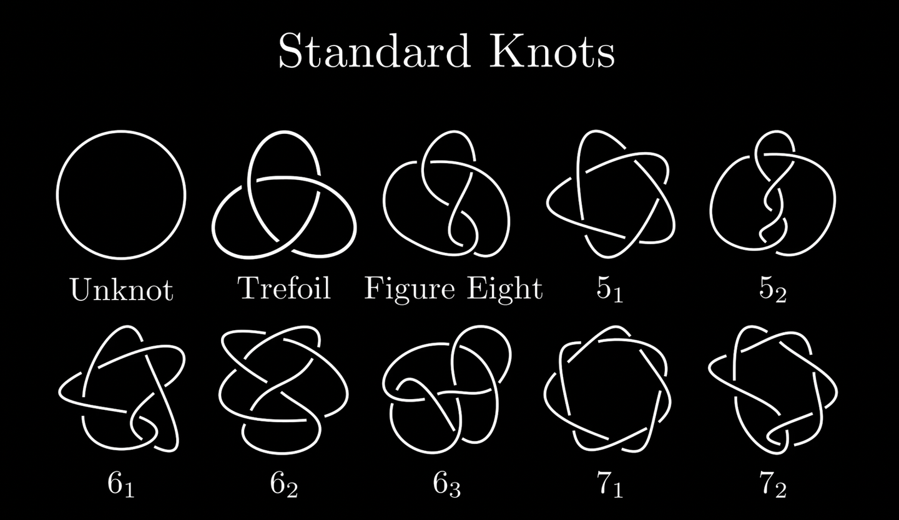
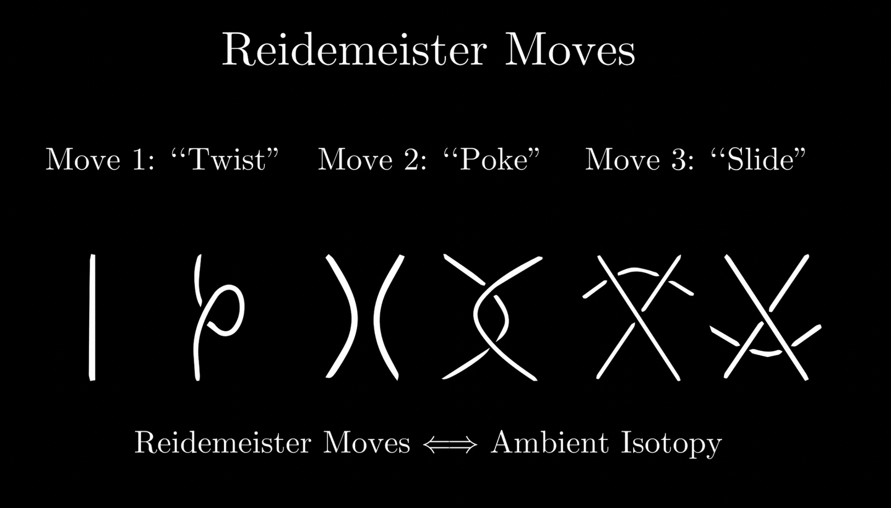

# 数学

## 数学杂谈

**转化**
对偶
**类比**
**归纳**
**反证**
例证

把复杂问题拆分成几个简单问题的组合

加强命题

待定系数法

---

数学中的错误

系统本身是不自洽的，当把系统的结论应用到系统本身上时，出现了荒谬的状况
解决悖论的方法有两种，一种是引入新的理论来解释它。第二种方法是对原先的理论加以限制，使其自洽。

1. 本体论和认识论的分离，也就是人类认知能力的局限性，人类的认知常常达不到世界的本质，人类经常有错误的直观而自己不知道。
2. 逻辑的问题，经典的逻辑可能不适用于悖论产生的那个领域。
3. 自然语言的缺陷性，主要是语义上的缺陷性。

1.定义出错
被除数不能为0

2.涉及无穷
无穷的运算与有限运算不同

3.条件不成立
证明的情况其实不可能存在

4.重复论证
证明时其实隐晦的使用了需要证明的结论

5.自指

过拟合（欠拟合-过拟合-完美）

**测度、度量**
关系(a,b)

分类：相似、映射**不变量**

无限：可列无限、、、

## 数学基础

### 集合

数集、点集（有序数对）

约定 $(a,b),[a,b]$

笛卡儿积 $A\times B=\{(a,b)|a\in A,b\in B\}$

容斥原理
鸽笼原理

划分、覆盖
等价类

### 映射

**定义 `映射`** 设 $A,B$ 是两个集合。如果到有一个对应法则 $f$ ，使得 $A$ 中每一个元素 $a$ 在 $B$ 中都有唯一确定的元素 $b$ 与它对应，则称 $f$ 是 $A$ 到 $B$ 的一个**映射**，表示为 $f:A\to B,a\mapsto b$ 或 $b=f(a)$
此时 $b$ 称为 $a$ 在 $f$ 下的**像**， $a$ 称为 $b$ 在 $f$ 下的**原像**；$A$ 称为映射 $f$ 的**定义域**，$B$ 称为**陪域**，$B$ 的子集 $f(A):=\{f(a)|a\in A\}$ 称为 $f$ 的**值域（像集）**，可记为 $\text{Im}\ f$，显然 $f(A)\subseteq B$
设 $f$ 是 $A$ 到 $B$ 的一个映射，如果在 $f$ 之下 $B$ 中每个元素在 $A$ 中都有逆像，则称 $f$ 是**满射**；如果在 $f$ 之下 $A$ 中不同元素在 $B$ 中的像也不同，则称 $f$ 是**单射**；如果 $f$ 既是满射又是单射，则称 $f$ 是**双射（一一对应）**
集合 $A$ 到自身的映射叫做 $A$ 的一个**变换**
当两个映射定义域、陪域、对应法则都相同时，称这两个**映射相等**

运算：$A\times A\to A$
二元关系

映射的乘法适合结合律
映射可逆的充要条件是双射

### 数理逻辑

**或** $\lor$、**与** $\land$、**非** $\lnot$
推出 $\to,\leftarrow$、等价 $\Leftrightarrow$

基本真值表：

| $\boldsymbol{p}$ | $\lnot \boldsymbol{p}$ |
| :----------------: | :----------------------: |
|       $T$       |          $F$          |
|       $F$       |          $T$          |

| $(\boldsymbol{p},\boldsymbol{q})$ | $\boldsymbol{p}\land \boldsymbol{q}$ | $\boldsymbol{p}\lor\boldsymbol{q}$ |
| :---------------------------------: | :------------------------------------: | :----------------------------------: |
|              $(T,T)$              |                 $T$                 |                $T$                |
|              $(T,F)$              |                 $F$                 |                $T$                |
|              $(F,T)$              |                 $F$                 |                $T$                |
|              $(F,F)$              |                 $F$                 |                $F$                |

> 上述都是命题的运算，得到的仍然是命题。其中非是一元运算，其他都是二元运算
> **或与非是三个基础运算**，因为 $p\to q\Longleftrightarrow \lnot p\lor q$ ; $p\Leftrightarrow q\Longleftrightarrow (\lnot p\lor q)\land (\lnot q\lor p)$
> $p\to q\land(q\to r)$ 为真即 $p\to q\to r$ 可以得到 $p\to r$ 为真
> 并且有以下运算规律（可根据真值表验证）

$\lnot(\lnot p)=p$
$\lnot(p\land q)=\lnot p\lor\lnot q$
$\lnot(p\lor q)=\lnot p\land\lnot q$
$p\land q=q\land p$
$p\lor q=q\lor p$
$p\land(q\land r)=p\land q\land r$
$p\lor(q\lor r)=p\lor q\lor r$

---

全称量词 $\forall$、存在量词 $\exist$

非运算时全称、存在要互换；二元关系要互换（如 $=,\ne;>,\leqslant;\in,\notin$）

原命题 $p\to q$
逆命题 $q\to p$
否命题 $\lnot p\to\lnot q$
逆否命题 $\lnot q\to\lnot p$

命题的否定(非运算) $\lnot(p\to q)=p\land\lnot q$

*全称、存在命题只有命题的否定，没有否命题*，因为虽然写成 $p\to q$ 的形式，但是 $p$ 只是条件而不是命题。$\forall p\to q$ 的否定是 $\exist p\to\lnot q$；$\exist p\to q$ 的否定是 $\forall p\to\lnot q$

**命题与逆否命题同真假** $\lnot q\to\lnot p=\lnot(\lnot q)\lor\lnot p=\lnot p\lor q=p\to q$
**命题与命题的否定真假性相反** $\lnot p$
**假命题可以推出任何命题（不论真假）** 设 $p$ 为假命题，则 $p\to q=\lnot p\lor q$ 恒为真命题

$p\Rightarrow q$ 是真命题，则称 $p$ 是命题的充分条件，$q$ 是命题的必要条件

---

反证法原理：
**已知真命题 $p$，欲判断命题 $q$ 真假**
假设 $\lnot q$ 为真，
得到 $\lnot q\to\lnot r$ (其中 $p\to r$ 为真) （即此时出现矛盾）

逻辑一：
$p\to r$ 为真，即 $\lnot p\lor r$ 为真，又根据 $p$ 为真，可以得到 $r$ 为真
$\lnot q\to\lnot r$ 为真，即 $q\lor\lnot r$ 为真，又根据 $r$ 为真，可以得到 $q$ 为真

逻辑二：
根据命题与逆否命题同真假，$r\to q$ 为真，于是 $p\to r\to q$($p\to q$) 为真
即 $\lnot p\lor q$ 为真，又根据 $p$ 为真，可以得到 $q$ 为真

### 公理体系

#### 自然数

数学归纳法

实数

复数

## 代数

### 算术

数域的扩张：自然数--（负数）--（分数）--无理数--复数，，四元数，，

### 初等代数

$a^n-b^n=(a-b)\sum\limits_{k=1}^na^{n-k}b^{k-1}$
**二项式定理**：$(a+b)^n=\sum\limits_{k=0}^n C_n^ka^{n-k}b^k$
**Abel变换**：记 $B_n=\sum\limits_{k=1}^nb_k$

$$
\sum_{k=1}^n a_kb_k=\sum_{k=1}^{n-1}(a_k-a_{k+1})B_k+a_nB_n
$$

阿贝尔变换可以看成离散版本的分部积分（将数列求和视为积分，差分视为微分）

$\displaystyle\sum n=\frac{n(n+1)}{2}$
$\displaystyle\sum n^2=\frac{n(n+1)(2n+1)}{6}$
$\displaystyle\sum n^3=(\sum n)^2=\frac{n^2(n+1)^2}{4}$

#### 函数

定义域、值域、对应法则
含参函数找定点

幂函数、指数函数、对数函数、三角函数称为初等函数

单调性
周期性          $f(x)=f(x+T)$
奇偶性（对称性）    $f(x)=f(-x)/f(x)=-f(-x)$
$f(x+a)=2b-f(a-x),(a,b)$
$f(x+a)=f(b-x),x=\frac{a+b}{2}$
有界性

函数图像
$f(x+k)+h,f(-x),-f(x),f^{-1}(x)$

##### 三角函数

对于复数 $z^n=r^ne^{n\theta i},z^{\frac{1}{n}}=r^{\frac{1}{n}}e^{\frac{\theta+2k\pi}{n}i}$

有界性、周期性

$e^{ix}=\cos x+i\sin x$

**复变三角函数的定义**：

$$
\sin z=\frac{e^{iz}-e^{-iz}}{2i}\\\cos z=\frac{e^{iz}+e^{-iz}}{2}
$$

基础公式
★ $\sin^2\alpha+\cos^2\alpha=1$
★ $\sin(\alpha+\beta)=\sin\alpha\cos\beta+\cos\alpha\sin\beta$
★ $\cos(\alpha+\beta)=\cos\alpha\cos\beta-\sin\alpha\sin\beta$
★ $\displaystyle\tan(\alpha+\beta)=\frac{\tan\alpha+\tan\beta}{1-\tan\alpha\tan\beta}$
★ 辅助角公式 $\displaystyle a\sin x+b\cos x=\sqrt{a^2+b^2}\sin(x+\varphi)\ ,\ \tan\varphi=\frac{a}{b}$
诱导公式

倍角公式
☆ $\sin 2\alpha=2\sin\alpha\cos\alpha$
☆ $\cos 2\alpha=\cos^2\alpha-\sin^2\alpha=2\cos^2\alpha-1=1-2\cos^2\alpha$
$\sin 3\alpha=4\sin\alpha\sin(60^o-\alpha)\sin(60^o+\alpha)=3\sin\alpha-4\sin^3\alpha$
$\cos 3\alpha=4\cos\alpha\cos(60^o-\alpha)\cos(60^o+\alpha)=4\cos^3\alpha-3\cos\alpha$
半角公式
☆ $\displaystyle\tan\frac{\alpha}{2}=\frac{1-\cos\alpha}{\sin\alpha}=\frac{\sin\alpha}{1+\cos\alpha}$

积化和差公式、和差化积公式
☆

万能公式
$\displaystyle\sin\alpha=\frac{2\tan\frac{\alpha}{2}}{1+\tan^2\frac{\alpha}{2}}$
$\displaystyle\cos\alpha=\frac{1-\tan^2\frac{\alpha}{2}}{1+\tan^2\frac{\alpha}{2}}$

其它公式

#### 方程

如果方程的标准形式是函数，那么**方程的根**与**函数零点**是等价的

绝对值的最小值是0

##### 多项式方程

**求根公式**:

* 一元二次方程 $ax^2+bx+c=0$
  $x= \displaystyle\frac { -b\pm \sqrt{\Delta }}{2a},\ \Delta=b^2-4ac$
* 一元三次方程 $ax^3+bx^2+cx+d=0$
  作变量替换 $t=x+\dfrac{b}{3a}$ 得到更简单的没有二次项的方程 $\displaystyle t^3+\frac{3ac-b^2}{3a^2}t+\frac{2b^3-9abc+27a^2d}{27a^3}=0$
  令 $p=\dfrac{3ac-b^2}{3a^2},~q=\dfrac{2b^3-9abc+27a^2d}{27a^3}$ ，方程简化为 $t^3+pt+q=0$
  记 $\displaystyle u=\sqrt[3]{-\frac{q}{2}+\sqrt{\frac{q^2}{4}+\frac{p^3}{27}}},v=\sqrt[3]{-\frac{q}{2}-\sqrt{\frac{q^2}{4}+\frac{p^3}{27}}},\omega=e^{\frac{2\pi i}{3}}=-\dfrac{1}{2}+\dfrac{\sqrt{3}}{2}i$
  方程的三个根为 $t_1=u+v,t_2=\omega u+\omega ^2v,t_3=\omega^2u+\omega v$
* 一元四次方程求根公式十分复杂
* 一元五次及以上方程无求根公式

**有理根定理**:
设整系数多项式 $f(x)=a_nx^n+a_{n-1}x^{n-1}+a_{n-2}x^{n-2}+\cdots+a_1x+a_0$，其中所有$a_i$都是整数，$a_n,a_0\ne0$。如果 $(p,q)=1$，并且$f(\dfrac{p}{q})=0$，则 $p|a_0$ 且 $q |a_n$。

**韦达定理**:
设 $n$ 次方程 $a_nx^n+a_{n-1}x^{n-1}+a_{n-2}x^{n-2}+\cdots+a_1x+a_0=0$ 有根 $x_1,x_2,...,x_n$ 那么这个 $n$ 次方程可以被表示成 $a_n(x-x_1)(x-x_2)\cdots(x-x_n)=0$，通过展开并且与原方程比较即得韦达定理：

$$
\begin{aligned}
    &e_1=\sum_{1\leqslant i\leqslant n}{x_{i}}=\left( -1\right)^{1}\frac{a_{n-1}}{a_{n}}\\
    &e_2=\sum_{1\leqslant i\ne j\leqslant n}{x_{i}x_{j}}=\left( -1\right)^{2}\frac{a_{n-2}}{a_{n}}\\
    &e_3=\sum_{1\leqslant i\ne j\ne k\leqslant n}{x_{i}x_{j}x_{k}}=\left( -1\right)^{3}\frac{a_{n-3}}{a_{n}}\\
    &\qquad.......\\
    &e_n=\prod_{1\leqslant i\leqslant n}x_{i}=\left( -1 \right)^n\frac{a_0}{a_n}
\end{aligned}
$$

**牛顿恒等式**:
设 $n$ 次方程 $a_nx^n+a_{n-1}x^{n-1}+\cdots+a_1x+a_0=0$ 有根 $x_1,x_2,...,x_n$。定义 $P_k=\sum\limits_{i=1}^n x_i^k$ 并规定 $P_0=n$，则

$$
\begin{aligned}
    &P_1=e_1\\
    &P_k=\sum_{i=1}^{k-1}(-1)^{i+1}e_iP_{k-i}+(-1)^{k+1}ke_k\quad(2\leqslant k\leqslant n-1)\\
    &P_k=\sum_{i=1}^{n}(-1)^{i+1}e_iP_{k-i}\qquad\qquad\qquad\qquad(n\leqslant k)
\end{aligned}
$$

##### 方程的数值解

#### 数列

递推关系、通项公式、前n项和

等差数列:$a_n=a_1+(n-1)d$

等比数列:$a_n=a_1q^{n-1}$

求通项：递归（借助待定系数法）、特征根、不动点
求和：$a_n=S_n-S_{n-1}$ 转化为求通项
裂项相消、错位相减
阿贝尔变换

#### 向量

极化恒等式
定比分点公式
奔驰定理

#### 不等式

不等是一种二元关系

证明不等式的方法：

* 基础方法：
  * 不等关系的性质
    * 三歧性：只有三种情形 $a>b,a=b,a<b$
    * 传递性：$a<b,b<c\Rightarrow a<c$
    * 加法运算保持顺序关系 $a<b\Rightarrow a+c<b+c$
    * 乘以正数的运算保持顺序关系 $a<b,c>0\Rightarrow a\cdot c<b\cdot c$
  * 常用不等式：
    * 绝对值：$-|a|\leqslant a\leqslant|a|\quad||a|-|b||\leqslant |a\pm b|\leqslant |a|+|b|$
    * 三角函数：$\displaystyle \frac{2}{\pi}x<\sin x<x<\tan x,x\in (0,\frac{\pi}{2})\quad |\sin x|<|x|,x\in\mathbb{R}$
    * 指对函数：$ e^x\geqslant x+1, \forall x\in\mathbb{R}\quad \frac{x}{1+x}\leqslant \ln(1+x)\leqslant x,\forall x>-1$
    * 高斯函数：$[x]\leqslant x<[x]+1\quad [x+y]\geqslant[x]+[y]\quad [xy]\geqslant [x][y]$
    * 糖水不等式
      均值不等式
      柯西不等式
    * 伯努利不等式：对于 $\alpha>1,x>-1$，有 $(1+x)^{\alpha}\geqslant 1+\alpha x$，等号当且仅当 $x=0$ 时成立
* 分析方法（不等式与函数的联系）
  * 函数单调性与极值
  * 函数凹凸性：区间下凸函数恒小于端点割线，恒大于区间任意点切线
  * 中值定理或泰勒公式：$0<\theta<1$
  * 比较图形的面积（体积）：利用积分可以准确比较面积
* 几何方法：（不等式与函数图形的联系）
  * 三元一次不等式 点在平面的一侧
    斜率
    距离

### 线性代数

### 抽象代数

### 交换代数

### 群表示论

### 初等数论

### 代数数论

### 解析数论

## 几何

坐标平面上任何包含原点的、面积大于4的、凸的、关于原点对称的闭区域一定含有异于原点的整点就是闵可夫斯基定理。

### 平面几何

正弦定理
余弦定理
三角形面积公式
瓜豆定理
梅涅劳斯定理

辅助线：
旋转、中点/三等分点、倍长、平移、中线、垂线

#### 几何不等式/最值

* **定点到定点** ：两点之间，线段最短
* **定点到定线** ：点线之间，垂线段最短

[定线到定线]：平行线之间，垂线段最短
[定点到定圆]：点圆之间，点心线截距最短（长）
[定线到定圆]：线圆之间，心垂线截距最短
[定圆到定圆]：圆圆之间，连心线截距最短（长）

将军饮马（对称）
胡不归（构造射线AD使得sin∠DAN=k，BC+kAC=BC+CH）

三角形两边之和大于第三边
圆内四边形托勒密

#### 尺规作图

高斯定理：

### 解析几何

### 微分几何

### 代数几何

### 点集拓扑

### 代数拓扑

#### 纽结

研究如何把若干个圆环嵌入到三维实欧氏空间中去的数学分支。纽结理论的特别之处是它研究的对象必须是三维空间中的曲线。在两维空间中，由于没有足够的维数，我们不可能把让一根曲线自己和自己缠绕在一起打成结；而在四维或以上的空间中，由于维数太多，无论怎么样的纽结都能够很方便地被解开成没有结的曲线。

纽结是三维空间中的简单闭曲线，即连通的封闭的不自交的曲线，或者说，三维空间中的与圆周同胚的图形。
一个圈叫作一个纽结（knot），多个圈叫作一个链环（link）。
如果把一个纽结在三维空间中经过连续变形（不许剪断或粘合）而变成另一个纽结，我们就说这两个纽结是等价的（equivalent），或同痕的（isotopic）。
与平面上的圆周等价的纽结称为平凡结
三叶结是交叉数最少的非平凡纽结。三叶结与它的镜像不等价，即有手性
8字结交叉数为4，无手性

**纽结的投影图**
纽结的等价类被它的投影图所完全确定，但是等价的纽结可以有不同的投影图。
每个纽结,选取适当的投影方向,总可以使它在平面上的投影的自交点都只是二重交叉点；以线的虚实表现交叉的情况，就得到纽结的投影图。

**Reidemeister运动**

两个纽结为等价的，当且仅当存在平面同痕，以及一系列Reidemeister运动，可以把一个纽结投影变换到另一个纽结投影。

**不变量**
最少交叉数
可三染色性 如果纽结投影图的每个交叉点的三条线颜色各异，或者颜色相同，但不允许所有线条使用同一种颜色，我们就称这个投影图是三色的（tricolored）。三色性还可以用来证明某些链环是扣住不散的
有向链环的环绕数
纽结的群
亚历山大—康威多项式 不能区分手性
**琼斯多项式** 可以区分手性。
考夫曼方法：设一个最小交叉点为 $n$ 的扭矩，把每个交叉点按两种方式破开（A开：实线继续往前；B开：实线掉头），共有 $2^n$ 种结果，最后一定得到一系列孤立的 $k$ 个环。假设每一个结果有 $a_i$ 个A开和 $n-a_i$ 个B开，定义乘积 $A^{a_i}B^{n-a_i}d^{k-1}$，记有向图的拧数为 $\omega(L)$，即正交叉点个数减负交叉点个数（沿一个方向环绕纽结，同向的交叉点为正）
于是考夫曼形式的琼斯多项式为 $f(L)=(-A^3)^{-\omega(L)}\sum A^{a_i}B^{n-a_i}d^{k-1}$，其中令 $B=A^{-1},d=-A^2-A^{-2}$ ，是关于 $A$ 的多项式。如果再令 $t=A^{-4}$ 即得到标准琼斯多项式
琼斯方法：根据交点处满足方程

并且平凡结的琼斯多项式为1，所以只需要按不同交点展开到方程除待求多项式外只有平凡结的琼斯多项式（即1）为止。

**纽结的运算**
在一条绳上先后打两个结，其结果称为两个结的和。很明显,这加法满足结合律,平凡结起着零的作用。交换律可以从图8看出。全体纽结在加法运算下构成一个交换半群。
如果一个非平凡纽结，不能被分解为两个非平凡纽结的连通和，那么它就是一个素纽结（prime knot），否则就是复合纽结（composite knot）。平凡纽结既不是素纽结也不是复合纽结。
就象每个正整数在乘法运算下有惟一的素因子分解一样，每个非平凡的纽结可以分解成素纽结（即不能再分解的非平凡纽结，例如三叶结与8字结）的和,而且只有一个这样的分解式。方结是三叶结与其镜像之和，而懒散结则是两个三叶结之和

### 非欧几何

## 分析

### 数学分析

#### 极限

洛必达法则

### 实分析

### 复分析

### 傅里叶分析

### 凸分析

### 调和分析

## 组合

### 排列组合

$C_m^n=C_{m-1}^n+C_{m-1}^{n-1}$
$C_m^n=C_m^{m-n}$
$C_{m+r+1}^r=\sum\limits_{i=0}^{r}{C_{m+i}^i}$
$C_m^n\cdot C_n^r=C_m^r \cdot C_{m-r}^{n-r}$
$n\cdot C_m^n=m\cdot C_{m-1}^{n-1}$
$\sum\limits_{i=0}^m(-1)^iC_m^i=0$
$C_m^0+C_m^2+C_m^4+\cdots=C_m^1+C_m^3+C_m^5+\cdots=2^{m-1}$
$C_{m+n}^r=\sum\limits_{i=0}^rC_m^iC_n^{r-i}$
$\sum\limits_{i=1}^nC_n^i\cdot i=\sum\limits_{i=0}^nC_n^i\cdot i=n\cdot 2^{n-1}$
$\sum\limits_{i=1}^nC_n^i\cdot i^2=\sum\limits_{i=0}^nC_n^i\cdot i^2=n(n+1)\cdot 2^{n-2}$
$\sum\limits_{i=0}^n(C_n^i)^2=C_{2n}^n$

## 计算

### 方程方程组

### 计算偏微分方程

## 统计
