# 解析几何

用数来决定几何图形的位置。一般情况下，默认在 $\mathbb{R}^3$ 空间中讨论。

## 几何空间

### 向量与坐标

**向量**：既有大小又有方向的量，记为 $\boldsymbol{a},\overrightarrow{a}$
向量的长度称为向量的模，长度为1的向量称为单位向量；长度为0的向量称为零向量；长度相同，方向相反的向量称为负向量
向量的坐标表示：空间直角坐标系 $\boldsymbol{a}=a_1\boldsymbol{i}+a_2\boldsymbol{j}+a_3\boldsymbol{k}=(a_1,a_2,a_3)$

向量加法：几何描述平行四边形法则；坐标描述 $\boldsymbol{a+b}=(a_1,a_2,a_3)+(b_1,b_2,b_3)=(a_1+b_1,a_2+b_2,a_3+b_3)$
向量减法：$\boldsymbol{a-b=a+(-b)}$
向量数乘：坐标描述 $\lambda\boldsymbol{a}=\lambda(a_1,a_2,a_3)=(\lambda a_1,\lambda a_2,\lambda a_3)$

**线段定比分点定理**：满足 $\overrightarrow{AC}=\lambda\overrightarrow{CB}$ 的线段分点 $C$ 的坐标是 $\displaystyle\overrightarrow{OC}=\frac{1}{1+\lambda}\overrightarrow{OA}+\frac{\lambda}{1+\lambda}\overrightarrow{OB}$

内积(数量积、点乘) $\boldsymbol{a\cdot b}=|a||b|\cos\theta=a_1b_1+a_2b_2+a_3b_3$
外积(向量积、叉乘) $\displaystyle\boldsymbol{a\times b}=\begin{vmatrix}\boldsymbol{i}&\boldsymbol{j}&\boldsymbol{k}\\a_1&a_2&a_3\\b_1&b_2&b_3\end{vmatrix}$
混合积 $\displaystyle\boldsymbol{(a,b,c)=(a\times b)\cdot c}=\begin{vmatrix}a_1&a_2&a_3\\b_1&b_2&b_3\\c_1&c_2&c_3\end{vmatrix}$

两向量共线 $\boldsymbol{a//b}\Leftrightarrow$ 它们线性相关 $\Leftrightarrow \boldsymbol{a\times b=0}$
三向量共面 $\Leftrightarrow$ 它们线性相关 $\Leftrightarrow \boldsymbol{(a,b,c)}=0$
两向量垂直 $\boldsymbol{a\bot b}\Leftrightarrow\boldsymbol{a\cdot b}=0$

### 空间的线性结构

**定理**：几何空间 $V$ 中任意给定三个不共面的向量 $\boldsymbol{d_1,d_2,d_3}$，则任意一个向量 $\boldsymbol{m}$ 可以唯一表示成 $\boldsymbol{d_1,d_2,d_3}$ 的线性组合

**定义 `基、坐标`** 几何空间 $V$ 中任意三个有次序的不共面的向量 $\boldsymbol{d_1,d_2,d_3}$ 称为几何空间 $V$ 的一个**基**。对于几何空间 $V$ 中任意一个向量 $\boldsymbol{m}$，若 $\boldsymbol{m}=x\boldsymbol{d_1}+y\boldsymbol{d_2}+z\boldsymbol{d_3}$，则把三元有序实数组 $(x,y,z)^T$ 称为 $\boldsymbol{m}$ 在基 $\boldsymbol{d_1,d_2,d_3}$ 下的**坐标**

**定义 `仿射坐标系`** 几何空间 $V$ 中一个**原点** $O$ 和一个**基** $\boldsymbol{d_1,d_2,d_3}$ 合在一起称为几何空间的一个**仿射坐标系**（或仿射标架），记作 $[O; \boldsymbol{d_1,d_2,d_3}]$
对于几何空间中任意一点 $M$，把它的定位向量 $\overrightarrow{OM}$ 在基 $\boldsymbol{d_1,d_2,d_3}$ 下的坐标称为点 $M$ 在仿射标架 $[O;\boldsymbol{d_1,d_2,d_3}]$ 中的坐标
特别地，如果基 $\boldsymbol{e_1,e_2,e_3}$ 两两垂直并且都是单位向量，则 $[O;\boldsymbol{e_1,e_2,e_3}]$ 称为一个**直角坐标系**

向量垂直 数量积为0
向量平行 向量积为0
三向量共面 混合积为0

### 坐标变换

空间坐标变换包括平移和旋转两种基本变换

设新坐标系的原点 $O'$ 在坐标系 $Oxyz$ 中的坐标为 $(a,b,c)$，则

$$
\begin{cases}
    x'=x-a\\
    y'=y-b\\
    z'=z-c
\end{cases}\\
$$

设每个新坐标轴与原坐标轴的夹角已知，为

|         | $Ox$       | $Oy$      | $Oz$       |
| ------- | ------------ | ----------- | ------------ |
| $Ox'$ | $\alpha_1$ | $\beta_1$ | $\gamma_1$ |
| $Oy'$ | $\alpha_2$ | $\beta_2$ | $\gamma_2$ |
| $Oz'$ | $\alpha_3$ | $\beta_3$ | $\gamma_3$ |

$$
\begin{cases}
    x'=x\cos\alpha_1+y\cos\beta_1+z\cos\gamma_1\\
    y'=x\cos\alpha_2+y\cos\beta_2+z\cos\gamma_2\\
    z'=x\cos\alpha_3+y\cos\beta_3+z\cos\gamma_3
\end{cases}
$$

### 方程与空间的轨迹

**定义 `图形的方程`** 如果图形$G$与方程$F$之间存在下述关系：
（1）图形$G$上的点的坐标都满足方程$F$
（2）不在图形$G$上的点都不满足方程$F$
则称$F$是$G$的方程，$G$是$F$的图形

## 空间平面与直线

### 平面

$$
\Pi=Ax+By+Cz+D=0
$$

平面的一个**法向量**为:$\mathbf{n}=(A,B,C)$

一般式

点法式
三点式
截距式

### 直线

$$
L=
\begin{cases}
    A_1x+B_1y+C_1z+D_1=0 \\
    A_2x+B_2y+C_2z+D_2=0
\end{cases}
$$

直线的一个**方向向量**为:

$$
\mathbf{s}=
(A_1,B_1,C_1)\times(A_2,B_2,C_2)=
\begin{vmatrix}
    i & j & k \\
    A_1&B_1&C_1\\
    A_2&B_2&C_2
\end{vmatrix}
=(m,n,p)
$$

一般式

点向式
参数式
两点式

### 度量关系

**距离**:

* **`点-点`**
* **`点-直线`**
* **`点-平面`**
* **`直线-直线`**
* `直线-平面`（直线与平面平行才有距离，即 `直线上任意点-平面`）
* `平面-平面`（平面与平面平行才有距离，即 `平面上任意点-平面`）

**夹角**:
**夹角为0°即平行或重合；夹角为90°即垂直**

* **`直线-直线`**
* **`直线-平面`**
* **`平面-平面`**

---

设点的位置向量$\mathbf{a}=(x_0,y_0,z_0),\mathbf{b}=(x_1,y_1,z_1)$

设直线的方程及方向向量

$$
\begin{matrix}
    L_0(x,y,z)=
    \begin{cases}
        A_{01}x+B_{01}y+C_{01}z+D_{01}=0 \\
        A_{02}x+B_{02}y+C_{02}z+D_{02}=0
    \end{cases}
    & \mathbf{s_0}=(A_{01},B_{01},C_{01})\times(A_{02},B_{02},C_{02}) \\
    L_1(x,y,z)=
    \begin{cases}
        A_{11}x+B_{11}y+C_{11}z+D_{11}=0 \\
        A_{12}x+B_{12}y+C_{12}z+D_{12}=0
    \end{cases}
    & \mathbf{s_1}=(A_{11},B_{11},C_{11})\times(A_{12},B_{12},C_{12}) \\
\end{matrix}
$$

设平面的方程及法向量

$$
\Pi_0(x,y,z)=A_0x+B_0y+C_0z+D_0=0\qquad \mathbf{n_0}=(A_0,B_0,C_0) \\
\Pi_1(x,y,z)=A_1x+B_1y+C_1z+D_1=0\qquad \mathbf{n_1}=(A_1,B_1,C_1)
$$

#### 两点$\mathbf{a,b}$距离

$$
|\mathbf{a}-\mathbf{b}|
$$

#### 点$\mathbf{a}$到直线$L$距离

1. 求出过点$\mathbf{a}$且与直线$L$垂直的平面方程
2. 利用直线$L$的参数方程，求出直线$L$与该平面的交点
3. 点$\mathbf{a}$与该交点的距离就是点到直线的距离

#### 点$\mathbf{a}$到平面$\Pi$距离

$$
\frac{|\Pi(x_0,y_0,z_0)|}{\sqrt{A^2+B^2+C^2}}
$$

#### 不相交直线$L_0,L_1$距离

设$P_0$是$L_0$上一点，$P_1$是$L_1$上一点

$$
\frac{(\mathbf{s_0}\times\mathbf{s_1})\cdot\mathbf{P_0P_1}}{|\mathbf{s_0}\times\mathbf{s_1}|}
$$

#### 两直线$L_0,L_1$夹角

$$
\cos\theta=\frac{|\mathbf{s_0}\cdot \mathbf{s_1}|}{|\mathbf{s_0}| |\mathbf{s_1}|}
$$

#### 直线$L$与平面$\Pi$夹角

$$
\sin\varphi=\frac{|\mathbf{s}\cdot \mathbf{n}|}{|\mathbf{s}| |\mathbf{n}|}
$$

#### 两平面$\Pi_0,\Pi_1$夹角

$$
\cos\theta=\frac{|\mathbf{n_0}\cdot \mathbf{n_1}|}{|\mathbf{n_0}| |\mathbf{n_1}|}
$$

## 空间曲面与曲线

### 曲面

$$
F(x,y,z)=0
$$

**柱面**

**旋转曲面**

曲线绕直线旋转

曲面某点的切平面

$$
F'_x(x_0,y_0,z_0)(x-x_0)+F'_y(x_0,y_0,z_0)(y-y_0)+F'_z(x_0,y_0,z_0)(z-z_0)=0
$$

### 曲线

$$
C=
\begin{cases}
    F(x,y,z)=0 \\
    G(x,y,z)=0
\end{cases}
$$

一般式

参数方程

 曲线某点的切线

$$
\frac{x-x_0}{\varphi'(t_0)}=\frac{y-y_0}{\psi'(t_0)}=\frac{z-z_0}{\omega'(t_0)}\\
\frac{x-x_0}{\begin{vmatrix*}F_y'&F_z'\\G_y'&G_z'\end{vmatrix*}_{P_0}}=\frac{y-y_0}{\begin{vmatrix*}F_z'&F_x'\\G_z'&G_x'\end{vmatrix*}_{P_0}}=\frac{z-z_0}{\begin{vmatrix*}F_x'&F_y'\\G_x'&G_y'\end{vmatrix*}_{P_0}}
$$

#### 曲线关于坐标面的投影方程

关于$xOy$面投影，将曲线方程中的 $z$ 消去，得到 $H(x,y)=0$
于是投影曲线包含于曲线：

$$
\begin{cases}
    H(x,y)=0 \\
    z=0
\end{cases}
$$

### 二次曲线

### 二次曲面

## 投影

## 坐标变换

## 解析

### 直线

坐标系

定比
复比，-1调和比

### 平面

平面直角坐标系。四个象限
斜坐标系
极坐标系

投影和坐标变换

方程的几何意义

#### 直线的方程

#### 二次曲线

圆、椭圆、双曲线、抛物线

一般理论
