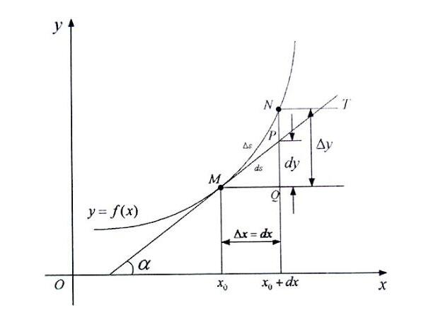

# 数学分析

需要部分**集合、数列、函数**的知识
主要研究连续/可导的函数

* $\Delta$**差分符号** 表示某个状态变量在某一过程结束和开始时的差值
  $\Delta x=x-x_0$
* $d$**全微分符号** 自变量产生微小变量，因变量产生的线性变化量
  $\displaystyle dz=\frac{\partial z}{\partial x}dx+\frac{\partial z}{\partial y}dy$
  对于自变量或恒等函数而言，$d$与$\Delta$一样；对于函数而言，$d$与$\Delta$在自变量趋于0时是等价无穷小，一般未必相等
* $\delta$**变分符号** 变分涉及泛函(泛函是以函数为自变量的映射)，表示与路径有关的变化
* $\partial$**偏导数符号** 多元函数仅由一个自变量变化所引起的微分

`可以仿造偏导数定义给一元函数定义偏导数`不过对于一元函数还是习惯把$\frac{\partial y}{\partial x}$改写成$\frac{dy}{dx}$

$\Delta x$ 是有限小的增量，$dx$ 是无限小的增量，$\lim\limits_{\Delta x\to 0}\Delta x=dx$
$\displaystyle\frac{\Delta y}{\Delta x}$ 是两点之间割线的斜率，$\displaystyle\frac{d y}{d x}$是一点切线的斜率，$\displaystyle\lim\limits_{\Delta x\to 0}\frac{\Delta y}{\Delta x}=\frac{d y}{d x}$

## $\mathbb{R}\to\mathbb{R}$

函数的性质：有界性、周期性、奇偶性、单调性

**`若数列收敛，则其必有界；若数列无界，则其必发散`**
**`单调有界数列必收敛`**
**`闭区间上连续必有界`**

定义 `上确界/下确界` 集合的最小上界称为上确界，记为 $\sup$；集合的最大下界称为下确界，记为 $\inf$
*确界与最值的区别是确界是可以取不到的，如 $[0,1)$ 无最大值，上确界是1；最小值是0，下确界是0*
定义 `邻域` 与点$P_0$距离小于$\delta$的点的集合，称为点$P_0$的$\delta$邻域，记作$U(P_0, \delta)$；不包含点$P_0$自己的邻域称为$P_0$的去心$\delta$邻域，记为$\mathring{U}(P_0, \delta)$
定义 `聚点` 点$P$的任何去心邻域总有中点集$E$的点，则称$P$为点集$E$的聚点

**极限不存在**的情况：

1. 极限为无穷
2. 左右极限不相等
3. 没有确定函数值（如函数震荡）

### 实数

无尽小数
实数

相反数

有尽小数在实数系中处处稠密

### 数列（一维序列）极限

**定义 `数列极限`** $\forall \varepsilon > 0, \exists N \in N$，当$n > N$时，有$| x_{n} - a | < \varepsilon$
则称**常数 $a$ 是数列 $\{x_{n}\}$ 的极限，或称数列收敛于$a$**，记为 $\lim\limits_{n \to \infty} x_{n} = a$（不收敛称为发散）

* **唯一性**：若数列收敛于$a$，则其极限$a$是唯一的
  > 反证法。假设极限为$a_1 < a_2$，按照极限的定义，取$\varepsilon = \frac{(a_2 - a_1)}{2}$，易知矛盾
  >
* **有界性**：若数列收敛，则其必有界（若数列无界，则其必发散）
* **保号性**：$若\lim\limits_{n \to \infty} x_{n} = a > 0(< 0),则 \exists N \in N,当 n > N时,有 x_{n} > 0(<0)$
* **子数列极限**：数列收敛于 $a$ 与其任意子数列也收敛于 $a$ 等价
  数列收敛于 $a$ 的充要条件是数列互不相交的子列极限都是 $a$。推论：数列的奇偶子列均收敛于 $a$，则数列收敛于 $a$
  波尔查诺-维尔斯特拉斯定理：有界数列具有收敛子列
* **数列极限的等价表述**：在极限的任一邻域外仅有有限项
  推论：收敛数列任意乱序的极限与原极限相同

### 一元实函数极限

**定义 `函数趋于有限值的极限` $\varepsilon-\delta$ 定义** 设函数$f(x)$在点$x_0$的某去心邻域内有定义。如果存在常数$A$，对于任意给定的无论多么小的正数$\varepsilon$，总存在正数$\delta$，使得当$x$满足$0<|x-x_0|< \delta$时，对应的函数值都满足不等式$|f(x)-A|< \varepsilon$，那么称 **$A$为函数$f(x)$当$x \to x_0$时的极限**，记为

$$
\lim\limits_{x \to x_0}f(x)=A
$$

**定义2 `函数趋于有限值的极限` 数列式定义** 设函数 $f(x)$ 在点 $x_0$ 的某去心邻域内有定义。如果对于任意在去心邻域内极限为 $x_0$ 的数列 $\{x_n\}$ ，相应的函数值数列 $\{f(x_n)\}$ 都以为 $A$ 极限，称函数 $f(x)$ 的极限为 $A$

**定义 `函数趋于无穷时的极限`** 设函数$f(x)$当$|x|$大于某一正数时有定义。如果存在常数$A$，对于任意给定的无论多么小的正数$\varepsilon$，总存在正数$M$，使得当$x$满足$|x|>M$时，对应的函数值都满足不等式$|f(x)-A|< \varepsilon$，那么称 **$A$为函数$f(x)$当$x \to \infty$时的极限**，记为

$$
\lim\limits_{x \to \infty}f(x)=A
$$

**定义 `单侧极限`**
若当$x \to x_0^-$时，$f(x)$无限接近于常数$A$，则**常数$A$称为函数当$x \to x_0^-$时的左极限**，记为

$$
\lim\limits_{x \to x_0^-}f(x)=A \qquad or \qquad f(x_0^-)=A
$$

若当$x \to x_0^+$时，$f(x)$无限接近于常数$A$，则**常数$A$称为函数当$x \to x_0^+$时的右极限**，记为

$$
\lim\limits_{x \to x_0^+}f(x)=A \qquad or \qquad f(x_0^+)=A
$$

* $\lim\limits_{x \to x_0}f(x)=A \Leftrightarrow \lim\limits_{x \to x_0^-}f(x)=A \quad and \quad \lim\limits_{x \to x_0^+}f(x)=A$
  $\lim\limits_{x \to \infty}f(x)=A \Leftrightarrow \lim\limits_{x \to -\infty}f(x)=A \quad and \quad \lim\limits_{x \to +\infty}f(x)=A$
  **`当趋于无穷时容易忘记也需要判断两个单侧极限是否相等`**
* **唯一性**：若极限存在则极限唯一
* **有界性**：如果$\lim\limits_{x\to x_0}f(x)=A$，那么存在常数$\delta>0,B>0$，使得当时$0<|x-x_0|<\delta$，有$|f(x)|\leqslant B$
* **保号性**：如果$\lim\limits_{x\to x_0}f(x)=A$，而且$A>0$(或$A<0$)，那么存在常数$\delta>0$，使得当$0<|x-x_0|<\delta$时，有$f(x)>0$或($f(x)<0$)
* **海涅定理**：(沟通函数极限和数列极限之间的桥梁)
  $\lim\limits_{x \rightarrow x_{0}}{f(x)}=A$的充要条件是对函数$f(x)$定义域内任一收敛于$x_0$的数列$\{x_{n}\}(x_n\neq x_0)$，都有$\lim\limits_{n\to\infty}f(x_n)=\lim\limits_{x\to x_0}f(x)$
  设 $f(x)$在$|x|>M$上有定义，则$\lim\limits_{x \rightarrow ∞}{f(x)}=A$的充要条件是，对于任何以∞为极限的数列$ \{ x_{n} \} (|x_{n}|>M)$,都有$\lim\limits_{n \rightarrow +∞}{x_{n}}=A$

### 极限运算准则

`收敛+收敛=收敛` | `收敛+发散=发散`

**极限运算准则** 以函数极限为例如果在自变量的同一变化过程中，$\lim f(x)=A,\lim g(x)=B$，那么
（1）$\lim[f(x)\pm g(x)]=\lim f(x)\pm\lim g(x)=A\pm B$
（2）$\lim[f(x)\cdot g(x)]=\lim f(x)\cdot\lim g(x)=A\cdot B$
（3）$\displaystyle\lim\frac{f(x)}{g(x)}=\frac{\lim f(x)}{\lim g(x)}=\frac{A}{B}(B\neq 0)$
*在求极限时，可以预判或配凑某一部分极限存在先将这一部分利用极限运算法则提出并计算*

根据极限的定义，**`极限为无穷大只是一种简便的描述，极限其实是不存在的`**，所以不能使用极限运算准则
扩充实数系 $\overline{R}=R\cup\{-\infty,+\infty\}$，使得运算法则可以出现无穷大的某些情况（$x>0\in R$）：
$x+(\pm\infty)=\pm\infty$
$x\cdot(\pm\infty)=\pm\infty$
$\displaystyle\frac{x}{\infty}=0$
$(+\infty)+(+\infty)=(+\infty)$
$(+\infty)\cdot(+\infty)=(+\infty)$
但仍需注意 $\displaystyle\infty-\infty,0\cdot\infty,\frac{\infty}{\infty}$ **没有定义，不能使用极限运算准则**

---

**复合函数极限** 若$\exists \delta_1>0$使得$f(u)$在$\mathring{U}(u_0,\delta_1)$有定义,且$\lim\limits_{u\to u_0}f(u)=A$,$\exists\delta_2>0,$使得$g(x)$在$\mathring{U}(x_0,\delta_2)$内有定义且满足$g(x)\neq u_0$，$\lim\limits_{x\to x_0}g(x)=u_0$,则成立$\lim\limits_{x\to x_0}f(g(x))=A$

> 可以把$\lim\limits_{x\to x_0}g(x)=u_0$换成$\lim\limits_{x\to x_0}g(x)=\infty$或$\lim\limits_{x\to\infty}g(x)=\infty$，而把$\lim\limits_{u\to u_0}f(u)=A$相应的换成$\lim\limits_{u\to\infty}f(u)=A$
>
> 如果$\lim\limits_{x\to x_0}g(x)=u_0,\lim\limits_{u\to u_0}f(u)=A$，那么$\lim\limits_{x\to x_0}f(g(x))$有下面三种可能：
> ①$\lim\limits_{x\to x_0}f(g(x))=\lim\limits_{u\to u_0}f(u)$
> ②$\lim\limits_{x\to x_0}f(g(x))=f(u_0)$
> ③$\lim\limits_{x\to x_0}f(g(x))$不存在
>
> * 当存在一个去心邻域使$g(x)\neq u_0$恒成立，就是为了使得 $x$ 趋近于 $x_{0}$ 时 $u$ 只能趋近于 $u_{0}$，于是得到的结果为①。
> * 当任一去心邻域都存在$x_0$,使得$g(x_0)=u_0$，于是分成三种情况讨论：
>   * 当 $f(u_0)$ 无意义时，在不拓展极限概念的情况下，可以认为没有极限，得到结果③
>   * 当$A=f(u_0)$（实际上也就是$f$在$u$处连续），那么对$u=u_0$的位置也满足$|f(u)-A|<\varepsilon$，从而也得到结果①；又$A=f(u_0)$，也得到结果②。
>   * 当$A\neq f(u_0)$,又可以分成两种情况：
>     * 若存在一个去心邻域，使$g(x)=u_0$恒成立，实际上$\lim\limits_{u\to u_0}f(u)=A$这个条件就没有用了。在这个去心邻域内，$f(g(x))\equiv f(u_0)$,自然极限也是$f(u_0)$,得到结果②。
>     * 若任一去心邻域，都$\exists x_1,x_2,$使得$g(x_1)\neq u_0,g(x_2)=u_0$，则可以取出两个趋于$u_0$的子列，$\{x_n\}$恒满足$g(x_n)=u_0$,也就是 $f(x_n)\equiv f(u_0)$,$\{x_n^{'}\}$ 满足定理1的情况，即$f(x_n^{'})\to A$,从而有两个同趋向的子列生成的函数子列的极限不同，从而函数极限不存在，得到结果③。

### 数列极限收敛原理和存在准则

**数列极限的夹逼准则** 如果实数数列 $\{x_n\},\{y_n\},\{z_n\}$ 满足下列条件：
（1）$x_n\leqslant y_n\leqslant z_n,\quad\forall n>N\in\mathbf{N}$
（2）$\lim\limits_{x \to \infty}x_n=\lim\limits_{x \to \infty}z_n=a$
那么 $\lim\limits_{x \to\infty}y_n$ 存在，且 $\lim\limits_{x \to\infty}y_n=a$

**单调收敛原理** 单增数列有上界/单减数列有下界，则数列极限存在且极限为上/下确界

**闭区间套原理**：如果实数数列 $\{a_n\},\{b_n\}$ 满足条件：
（1）$a_{n-1}\leqslant a_n\leqslant b_n\leqslant b_{n-1},\quad\forall n>1$
（2）$\lim(b_n-a_n)=0$
那么两数列收敛于相同的极限值 $c$，并且 $c$ 是满足 $a_n\leqslant c\leqslant b_n,\quad \forall\in\mathbf{N}$ 的唯一实数
（闭区间套是满足 $[a_n,b_n]\subset[a_{n+1},b_{n+1}],\lim(b_n-a_n)=0$ 的一系列闭区间）
**波尔查诺-维尔斯特拉斯定理**：有界数列具有收敛子列

**数列极限的柯西收敛原理**：数列 $\{x_n\}$ 收敛的充分必要条件是：对任意 $\varepsilon>0$，存在 $N\in\mathbf{N}$，使得当 $m,n>N$ 时，就有 $|x_m-x_n|<\varepsilon$
  不妨设 $m=n+p>n$，这种形式更方便运用

### 函数极限收敛原理和存在准则

**函数极限的夹逼准则** 如果函数$g(x),f(x),h(x)$满足下列条件：
（1）在 $x_0$ 的某去心邻域内有 $g(x) \leqslant f(x) \leqslant h(x)$
（2）$\lim\limits_{x \to x_0}g(x)=\lim\limits_{x \to x_0}h(x)=A$
那么 $\lim\limits_{x \to x_0}f(x)$ 存在，且 $\lim\limits_{x \to x_0}f(x)=A$

**函数极限的收敛原理**：设函数 $f(x)$ 在 $\mathring{U}(a,\eta)$ 上有定义，则有穷极限 $\lim\limits_{x\to a}f(x)$ 存在的充要条件是：$\forall\varepsilon>0,\exist\delta>0$，使得只要 $x,x'$ 满足 $0<|x-a|<\delta,0<|x'-a|<\delta$ 就有 $|f(x)-f(x')|<\varepsilon$

### 无穷小与无穷大

**定义 `无穷小`** 如果函数$f(x)$当$x \to x_0 (或 x \to \infty)$时极限为0，则称$f(x)$是当$x \to x_0 (或 x \to \infty)$时的无穷小
*无穷小量是以0为极限的变量而不是常数，不过常数0可以看成最高阶的无穷小量*（但是无穷个0的和也是0而不是未定式；0的倒数无意义而不是不存在）

**定义 `无穷大`** 如果函数$f(x)$在点$x_0$的某去心邻域内(或当$|x|$充分大)时有定义，如果对于任意的无论多大的$E$，都存在$\delta >0$(或存在$M>0$)，使得当$0<|x-x_0|<\delta$(或$|x|>M$)时有$|f(x)|>E$成立，则称$f(x)$是当$x \to x_0$(或$x \to \infty$)时的正无穷大，记为 $\lim f(x)= +\infty$；同理如果小于任意小的数则为负无穷大，记为 $\lim f(x)= -\infty$。正负无穷大统称无穷大，记为 $\infty$
`极限为无穷大只是一种简便的描述，极限其实是不存在的`

* **在自变量的同一变化过程中 $\lim f(x)=A \Leftrightarrow f(x)=A+ \alpha$(其中$\lim \alpha(x) =0$)**
* **有限个无穷小的和仍然是无穷小**
  有限个无穷小的乘积是无穷小
  **有界函数与无穷小的乘积是无穷小**
  常数与无穷小的乘积是无穷小
* **在自变量的同一变化过程中，如果$f(x)$为无穷大，则$\frac{1}{f(x)}$为无穷小；反之，如果$f(x)$为无穷小，且$f(x) \neq 0$，则$\frac{1}{f(x)}$为无穷大**

#### 无穷小的阶

**定义 `无穷小的阶`** 设自变量的同一变化过程中 $\lim\alpha=0,\lim\beta=0$ 且 $\beta\ne 0$

1. 若 $\displaystyle\lim\frac{\alpha}{\beta}=0$ 则称 $\alpha$ 是 $\beta$ 高阶的无穷小，记作 $\alpha=o(\beta)$
   （有个类似的记号 $\alpha=O(\beta)$ 表示 $\displaystyle\frac{\alpha}{\beta}$ 是 $x\to x_0$ 时的有界变量，即$\displaystyle\frac{\alpha}{\beta}$在 $x_0$ 的某个去心邻域上是有界的）
2. 若 $\displaystyle\lim\frac{\alpha}{\beta}=\infty$ 则称 $\alpha$ 是 $\beta$ 低阶的无穷小
3. 若 $\displaystyle\lim\frac{\alpha}{\beta}=c\ne0$ 称 $\alpha$ 是 $\beta$ 的同阶无穷小，记作 $\alpha\sim c\beta$
   特别地，如果 $c=1$ 则称 $\alpha$ 是 $\beta$ 的等价无穷小
4. 若 $\displaystyle\lim\frac{\alpha}{\beta^{k}}=c\ne0$ 称 $\alpha$ 是 $\beta$ 的 $k$ 阶无穷小，记作$\alpha\sim c\beta^{k}$
   因为$\displaystyle\lim\frac{\alpha}{\beta^{k-1}}=\lim\frac{\beta\alpha}{\beta^{k}}=\lim\frac{\alpha}{\beta^{k}}\cdot \lim\beta=c\cdot0=0$ 所以 $\alpha=o(\beta^{k-1})$

两个无穷小可能不存在阶，比如 $\displaystyle\frac{1}{x},\frac{\sin x}{x}(x\to\infty)$

* $\alpha\sim\beta\Leftrightarrow\alpha=\beta+o(\beta)$
* **等价无穷小替换**$\alpha\sim\tilde{\alpha}，\beta\sim\tilde{\beta}$，且$\displaystyle\lim\frac{\tilde{\alpha}}{\tilde{\beta}}$存在，则

  $$
  \lim\frac{\alpha}{\beta}=\lim\frac{\tilde{\alpha}}{\tilde{\beta}}
  $$

  无穷小替换只能用于乘除因子，不能对加减项使用。
  有时看似能够使用如 $\displaystyle\lim\frac{x-\sin x}{x}=\lim\frac{x-x}{x}=0$，其实是先利用极限运算法则 $\displaystyle\lim\frac{x-\sin x}{x}=\lim\frac{x}{x}-\lim\frac{\sin x}{x}=0$ 变成乘除因子但是省略了这个步骤

**无穷小阶的运算**：记号 $O、o$ 表示的是一种类型而不是一个具体的量，这里的 $=$ 应该理解为 $\in$ 指左边推出右边，因此不能左右交换。可以$o(x^n)$类比为最低次数高于n的多项式
$o(\varphi(x))=O(\varphi(x))\\O(\varphi(x))+O(\varphi(x))=O(\varphi(x))\\o(\varphi(x))+o(\varphi(x))=o(\varphi(x))\\o(\varphi(x))O(1)=o(\varphi(x))\\o(1)O(\varphi(x))=o(\varphi(x))$

$C\cdot o(x^n)=o(x^n)\\o(x^m)=o(x^n)\qquad m>n\\o(x^m)\pm o(x^n)=o(x^n)\\o(x^m)\times o(x^n)=o(x^{m+n})\\o(x^m)\times x^n=o(x^{m+n})$
若$\varphi(x)\sim x^n$，则$o(\varphi(x))=o(x^n)$

#### 常见无穷小与无穷大

**等价无穷小**：（只能乘除时替换， $\alpha\to 0$）
①$\alpha\sim\sin\alpha\sim\arcsin\alpha\sim\tan\alpha\sim\arctan\alpha\sim\ln(1+\alpha)\sim e^{\alpha}-1$
②$(\alpha+1)^{\lambda}\sim\lambda\alpha+1(\lambda>0)$
③$\cos\alpha\sim 1-\frac{1}{2}\alpha^2$

**高阶无穷大**：
$\ln\ln n\ll\ln^{\alpha}n\ll n^{\beta}\ll a^n\ll n!\ll n^n(n\to\infty,\alpha,\beta>0,a>1)$

**等价无穷大**：
1）等价无穷小的倒数互为等价无穷大
2）如果无穷大之差极限存在，则互为等价无穷大（$\displaystyle\lim\frac{u}{v}=\lim(\frac{u-v}{v}+1)=\lim(u-v)\lim\frac{1}{v}+1=1$）
①$ax^m+bx^n\sim ax^m(x\to\infty,m>n>0,ab\ne 0)$ 有限项相加依旧等价于次数最大项，注意偶次根号定义域 $x\geqslant 0$
②$\ln(1+x^{\alpha})\sim\alpha\ln x(x\to\infty,\alpha>0)$
③$\ln\ n!\sim n\ln n$ ， **斯特林公式**：$\displaystyle n!\sim\sqrt{2\pi n}\left(\frac{n}{e}\right)^n\ (n\to+\infty),\quad n!=\sqrt{2\pi n}\left(\frac{n}{e}\right)^ne^{\frac{\theta}{12n}},0<\theta<1$

#### 重要极限

（1）$\lim\limits_{x \to \infty} {( 1 + \frac{1}{x} )}^x = e$

首先证明极限 ${\left( 1+ \frac{1}{n} \right)}^n$ 存在。设 $x_n = {\left( 1+ \frac{1}{n} \right)}^n$ 根据牛顿二项式公式，

$$
\begin{aligned}
    x_n &= {( 1+ \frac{1}{n} )}^n = 1+ \frac{n}{1!} \cdot \frac{1}{n}+ \frac{n(n-1)}{2!} \cdot \frac{1}{n^2}+ \cdots + \frac{n(n-1) \cdots (n-n+1)}{n!} \cdot \frac{1}{n^n} \\
    &= 1+1+ \frac{1}{2!}(1- \frac{1}{n})+ \cdots + \frac{1}{n!}(1- \frac{1}{n})(1- \frac{2}{n})\cdots(1- \frac{n-1}{n})
\end{aligned}
$$

可知$\{ x_n \}$单调增加
用$1$代替展开式括号里的数，得$x_n < 1+1+ \frac{1}{2!}+ \frac{1}{3!}+ \cdots + \frac{1}{n!}<1+1+ \frac{1}{2}+ \frac{1}{2^2}+ \cdots + \frac{1}{2^{n-1}}<3$
数列单调有界极限必定存在，这个极限用 $e$ 表示，称为**自然常数**

当 $x\to+\infty$ 时，利用取整函数的性质 $[x]\leqslant x<[x]+1$，

$$
(1+\frac{1}{[x]+1})^{[x]}<(1+\frac{1}{x})^x<(1+\frac{1}{[x]})^{[x]+1}
$$

左式令 $n=[x]+1$，可得 $\displaystyle\lim_{n\to+\infty}(1+\frac{1}{n})^n(1+\frac{1}{n})^{-1}=\lim_{n\to+\infty}(1+\frac{1}{n})^n$
右式令 $n=[x]$，可得 $\displaystyle\lim_{n\to+\infty}(1+\frac{1}{n})^n(1+\frac{1}{n})=\lim_{n\to+\infty}(1+\frac{1}{n})^n$
根据夹逼准则，$\displaystyle\lim_{x\to+\infty}(1+\frac{1}{x})^x=\lim_{n\to+\infty}(1+\frac{1}{n})^n=e$
当 $x\to-\infty$ 时， $t=-x-1\to+\infty$

$$
\lim_{x\to-\infty}(1+\frac{1}{x})^x=\lim_{t\to+\infty}(1+\frac{1}{t})^t(1+\frac{1}{t})=\lim_{t\to+\infty}(1+\frac{1}{t})^t
$$

（2）$\displaystyle\lim\limits_{n \to \infty}(1+\frac{1}{2}+\cdots+\frac{1}{n}-\ln n)=C$
记 $\displaystyle x_n=1+\frac{1}{2}+\cdots+\frac{1}{n}-\ln n$
$\displaystyle x_{n+1}-x_n=\frac{1}{n+1}-\ln(1+\frac{1}{n})<0$
$\displaystyle x_n=\sum_{k=1}^n\frac{1}{k}-\sum_{k=1}^{n-1}\ln(1+\frac{1}{k})=\sum_{k=1}^{n-1}[\frac{1}{k}-\ln(1+\frac{1}{k})]+\frac{1}{n}>0$
数列单调有界极限必定存在，这个极限用 $C$ 表示，称为**欧拉常数**

### 函数的连续性

**定义 `连续性`** 设函数$y=f(x)$在点$x_0$的**某邻域内有定义**，如果

$$
\lim\limits_{x\to x_0}f(x)=f(x_0)\quad or\quad\lim\limits_{\Delta x\to 0}[f(x_0+\Delta x)-f(x_0)]=0
$$

则**称函数$y=f(x)$在点$x_0$处连续**。如果如果不连续，则**称$x_0$为函数$f(x)$的间断点**。
①$f(x)$ 在点 $x_{0}$ 处无定义
②$f(x)$ 在点 $x_{0}$ 处有定义，但 $\lim\limits_{x \rightarrow x_{0}}{f(x)}$ 不存在
③$f(x)$ 在点 $x_{0}$ 处有定义，但 $\lim\limits_{x \rightarrow x_{0}}{f(x)}$ 存在，但 $\lim\limits_{x \rightarrow x_{0}}{f(x)}≠f(x_0)$
**间断点的分类**:

1. 第一类间断点（左右极限均存在）
   1. **可去间断点**
      左极限，右极限存在且相等，但不等于该点的函数值或在该点无定义
      定义函数在该处函数值为极限值，即可将该间断点去除
   2. **跳跃间断点**
      左极限和右极限均存在，但不相等
2. 第二类间断点（左右极限至少有一个不存在）
   1. **无穷间断点**
      左右极限至少有一个不存在，且改函数在该点极限为∞
   2. **震荡间断点**
      当自变量趋于该点时，函数值在两个常数之间变动无限多次，此时左右极限均不存在

* 函数在某点连续的充要条件是在该点既左连续又右连续
* 若函数$f(x),g(x)$都在点$x_0$处连续，则函数$\displaystyle f(x)\pm g(x),f(x)\cdot g(x),\frac{f(x)}{g(x)}(g(x_0)\neq 0)$也在点$x_0$处连续
* 如果函数$y=f(x)$在某个区间上单调增加（或单调减少）且连续，则其反函数$x=f^{-1}(y)$也在相应的区间上单调增加（或单调减少）且连续
* 设函数$u=\varphi(x)$在点$x_0$处连续且$\varphi(x_0)=u_0$，而函数$y=f(u)$在点$u_0$处连续，则复合函数$y=f[\varphi(x)]$在点$x_0$处也连续
* **`一切初等函数在其有定义的范围内都是连续的`**

#### 一致连续性

**定义 `一致连续性`** 设 $E$ 是 $R$ 的一个子集，函数 $f(x)$ 在 $E$ 上有定义。如果对于任意 $\varepsilon>0$，存在 $\delta>0$，使得只要 $x_1,x_2\in E,|x_1-x_2|<\delta$ 就有 $|f(x_1)-f(x_2)|<\varepsilon$，那么称 $f(x)$ 在 $E$ 上是一致连续的
*函数的连续性是逐点定义的，而一致连续性是区间定义的，一致连续性比连续性条件更强*，因此**函数在一致连续区间上一定连续**

* **Heine-Cantor定理**：有限闭区间上的连续函数在该区间上一致连续
* 函数在区间上满足Lipschitz条件必一致连续。**Lipschitz条件**：$|f(x_1)-f(x_2)|\leqslant L|x_1-x_2|,\ \forall x_1,x_2\in I$ L为大于0的常数

#### 闭区间连续函数性质

**最值定理** 闭区间连续函数在该区间上一定存在最大值和最小值
推论：开区间连续的周期函数必有界

`介值定理与零点定理等价`
**零点定理** 设函数在闭区间$[a,b]$上连续，且$f(a) \cdot f(b) <0$，则在开区间$(a,b)$内至少有一点$\xi (a< \xi < b)$，使$f(\xi)=0$

**介值定理** 设函数在闭区间$[a,b]$上连续，且$f(a)=A,f(b)=B$，那么对于$A、B$之间的任意一个数$W$，在开区间$(a,b)$上至少有一点$\xi (a< \xi < b)$，使$f(\xi)=W$
*`推论`* 闭区间连续函数在该区间上必能取到介于最大值和最小值之间的任何值

### 微分学

**`函数导数(偏导)连续处必可微`**
**`函数可微处必可导、必连续`**
**`一元函数可导与可微等价，但多元函数不同`**
**`一元函数可导必连续，但多元函数可导与连续没有关系`**
**`区间内处处可导的函数，其导函数在区间内没有第一间断点和无穷间断点`**

#### 导数

**定义 `导数`** 设函数$y=f(x)$在点$x_0$处的邻域内有定义，当自变量$x$在$x_0$处取得增量($x_0 + \Delta x$仍然在$x_0$的邻域内)，相应的函数取得增量$\Delta y=f(x_0+\Delta x) - f(x_0)$。如果$\frac{\Delta y}{\Delta x}$在$\Delta x \to 0$时的极限存在，称为函数$y=f(x)$在点$x_0$处可导。它的导数记为$f'(x_0)$，即

$$
f'(x_0)=\lim_{\Delta x \to 0}\frac{f(x_0+\Delta x) - f(x_0)}{\Delta x}\quad or\quad\lim_{x \to x_0}\frac{f(x) - f(x_0)}{x-x_0}
$$

也可以记成$\displaystyle y',\frac{dy}{dx},$或$\displaystyle\frac{df(x)}{dx}$

* 一元函数在某点可导的充分必要条件是该点**左导数与右导数存在且相等**
* **一元函数可导处必连续**
* $\displaystyle\frac{dy}{dx}$可以看作函数的微分$dy$与自变量的微分$dx$之商
* **导数在二维空间的几何意义**：导数是曲线在该点处的切线斜率
* **区间内处处可导的函数，其导函数在区间内没有第一间断点和无穷间断点**
* 导数的介值性

***导数定义中的 $\Delta x \to 0$ `是沿实数趋于0`，如果改为 $\frac{1}{n} \to 0$ 则是 `沿有理数趋于0`。因此前者极限存在则后者一定存在且相等，反之后者极限存在前者极限不一定存在***

##### 常数及基本初等函数的导数

(1)$C'=0$                  (2)$(x^{\mu})'=\mu x^{\mu-1}$
(3)$(\sin x)'=\cos x$    (4)$(\cos x)'=-\sin x$
(5)$(e^x)'=e^x$             (6)$\displaystyle(\ln x)'=\frac{1}{x}$

##### 导数的运算法则

**导数四则运算** 如果函数$u=u(x)$及$v=v(x)$都在点$x$处可导，那么它们的和、差、积、商（除分母为0的点外）在点$x$处也可导，且：

1. $(u\pm v)'=u'\pm v'$
2. $(uv)'=u'v+uv'$
   对于常数函数 $v=C$，$(Cu)'=Cu'$
3. $\displaystyle (\frac{u}{v})'=\frac{u'v-uv'}{v^2}\quad(v\ne0)$

**反函数求导** 函数$x=f(y)$在区间内单调可导且导数不为零，则它的反函数$y=f^{-1}(x)$也可导，且

$$
[f^{-1}(x)]'=\frac{1}{f'(y)}\quad or\quad\frac{dy}{dx}=\frac{1}{\dfrac{dx}{dy}}
$$

**复合函数求导** 设$y=f(u),u=g(x)$且均可导，则复合函数导数为

$$
\{f[g(x)]\}'=f'[g(x)]\cdot g'(x)\quad or\quad\frac{dy}{dx}=\frac{dy}{du}\cdot\frac{du}{dx}
$$

**隐函数求导** 把方程 $F(x,y)=0$ 中的 $y$ 看作是 $x$ 的函数，方程两端同时对 $x$ 求导，然后解出 $\displaystyle\frac{dy}{dx}$ 即可
可以证明隐函数**求导公式** $\displaystyle\frac{dy}{dx}=-\frac{F_x(x,y)}{F_y(x,y)}$ ，使用公式只需要求偏导不容易出差错
对于隐函数方程组虽然也有求导公式，但是比较复杂难以记忆，直接对方程组求导即可
**`对数求导法`** 先对函数 $y=f(x)$ 取对数 $\ln y=\ln f(x)$ 变为隐函数方程，然后两边对 $x$ 求导得到 $\displaystyle \frac{y'}{y}=\frac{f'(x)}{f(x)}$，一般用于幂指函数 $f(x)^{g(x)}$；混合了多重乘、除法及根式的函数 $f(x)^{a}g(x)^{b}$

**参数方程求导** 若参数方程$\displaystyle\begin{cases}x=\varphi(t) \\y=\psi(t)\end{cases}$，则导数为

$$
\frac{dy}{dx}=\frac{\psi'(t)}{\varphi'(t)}\quad or\quad\dfrac{\dfrac{dy}{dt}}{\dfrac{dx}{dt}}
$$

同理，求二阶导也是参数方程求导 $\dfrac{d^2y}{dx^2}=\dfrac{d}{dx}\left(\dfrac{dy}{dx}\right)=\dfrac{\dfrac{d}{dt}\left(\dfrac{dy}{dx}\right)}{dx/dt}=\dfrac{\dfrac{d}{dt}\left(\dfrac{\psi'(t)}{\varphi'(t)}\right)}{dx/dt}$

##### 高阶导数

**定义 `高阶导数`** 设函数$y=f(x)$的导函数在点$x$处可导，则称函数$f(x)$在点$x$处**二阶可导**，$f'(x)$的导数称为$f(x)$的**二阶导数**，记作$\displaystyle y'',f''(x),f^{(2)}(x),\frac{d^2y}{dx^2},$或$\displaystyle\frac{d^2f(x)}{dx^2}$
类似定义**高阶导数**，则函数的$n$阶导数记作$\displaystyle y^{(n)},f^{(n)}(x),\frac{d^{(n)}y}{dx^{(n)}}$

**常见高阶导数**
（1）$(x^k)^{(n)}=\frac{k!}{(k-n)!}x^{k-n}\ (n\leqslant k)$
（2）$(a^x)^{(n)}=a^x(\ln a)^n$
（3）$(\sin x)^{(n)}=\sin(x+\frac{n\pi}{2}),(\cos x)^{(n)}=\cos(x+\frac{n\pi}{2})$
（4）$(\frac{1}{x+a})^{(n)}=\frac{(-1)^nn!}{(x+a)^{n+1}}$
（5）$[f(ax+b)]^{(n)}=a^nf^{(n)}(ax+b)$

**$n$阶导数求导公式**
①$(u\pm v)^{(n)}=u^{(n)}\pm v^{(n)}$
②$(Cu)^{(n)}=Cu^{(n)}$（$C$为常数）
③$\displaystyle(uv)^{(n)}=\sum_{k=0}^n C_n^k u^{(n-k)}v^{(k)}$，称为**莱布尼兹公式**

#### 微分

**定义 `微分`** 设函数$y=f(x)$在某区间内有定义，$x_0$及$x_0+\Delta x$在这区间内，如果函数的增量$\Delta y=f(x_0+\Delta x)-f(x_0)$可表示为

$$
\Delta y=A\Delta x+o(\Delta x)
$$

则称函数在点$x_0$是可微的，并称 $A\Delta x$为函数在点$x_0$的微分，记作$dy$，即

$$
dy\left.\right|_{x_0}=A\Delta x
$$

* **一元函数可微与可导等价**，且$dy=f'(x_0)\Delta x$(或$dy=f'(x_0)dx$)
* **无穷小增量公式**：$f(x)=f(x_0)+f'(x_0)(x-x_0)+o(x-x_o)\qquad \Delta x=x-x_0\to 0$
* **微分表示的不变性**：不论 $x$ 是自变量还是另一变量 $t$ 的函数 $x=\varphi(t)$，函数 $f(x)$ 的微分表示式都具有相同的形式 $df(x)=f'(x)dx$

#### 微分中值定理

**费马引理** 设函数$f(x)$在点$x_0$的某邻域$U(x_0)$内有定义，并且在$x_0$处可导，如果对任意$x\in U(x_0)$，有$f(x)\leqslant f(x_0)$（或$f(x)\geqslant f(x_0)$），那么$f'(x_0)=0$

`罗尔定理、拉格朗日中值定理、柯西中值定理是等价的`因此，所有有关中值定理的问题都可以构造函数利用罗尔定理导出
**应注意$\xi$是可以变化的，可以看作$\xi(x)$**

**罗尔定理** 如果函数$f(x)$满足：
（1）在闭区间$[a,b]$上连续
（2）在开区间$(a,b)$内可导
（3）在区间端点处函数值相等，即$f(a)=f(b)$
那么在$(a,b)$内至少存在一点$\xi$，使得$f'(\xi)=0$

**拉格朗日中值定理** 如果函数$f(x)$满足：
（1）在闭区间$[a,b]$上连续
（2）在开区间$(a,b)$内可导
那么在$(a,b)$内至少存在一点$\xi$，使得$f(b)-f(a)=f'(\xi)(b-a)$

* 函数在区间上导数恒为0等价于函数在该区间上是一个常数
* **有限增量公式**：$f(x)=f(x_0)+f'(\xi)(x-x_0)$      $\xi$ 介于 $x,x_0$ 之间
  $\Delta x=x-x_0$ 不再限定是无穷小量，可以是使得 $x\in I$ 的有限量。并且启发中值定理中的区间端点不一定是常量，可以是变量。

**柯西中值定理** 如果函数$f(x),F(x)$满足：
（1）在闭区间$[a,b]$上连续
（2）在开区间$(a,b)$内可导
（3）在内每一点处$F'(x)\neq 0$
那么在$(a,b)$内至少存在一点$\xi$，使得$\displaystyle\frac{f(b)-f(a)}{F(b)-F(a)}=\frac{f'(\xi)}{F'(\xi)}$

**导函数的介值定理**（达布定理） 设 $f(x)$ 在 $[a,b]$ 上可导且 $f'(a)\ne f'(b)$。则对介于 $f'(a),f'(b)$ 之间的任何值 $r$，都存在 $x'$ 使得 $f'(x')=r$
先证 $f'(a),f'(b)<0,r=0$ 的情况根据极限的保号性知 $f(a),f(b)$ 不是极值点，根据费马引理可得存在 $f'(c)=0$。再作辅助函数 $f(x)-rx$ 证一般情况。

#### 泰勒公式

**泰勒中值定理** 如果函数$f(x)$在含有$x_0$的某个开区间$(a,b)$内具有$n+1$阶导数，则对于任一$x\in(a,b)$，有

$$
f(x)=f(x_0)+f'(x_0)(x-x_0)+\frac{1}{2!}f''(x_0)(x-x_0)^2+\cdots+\frac{1}{n!}f^{(n)}(x_0)(x-x_0)^n+R_n(x)
$$

*特别的，取$x_0=0$，称为**麦克劳林公式***
$\displaystyle R_n=\frac{f^{(n+1)}(\xi)}{(n+1)!}(x-x_0)^{n+1}$ (其中$\xi(x)$在$x_0$与$x$之间)称为**拉格朗日型余项**
$R_n=o((x-x_0)^n)$ 称为**皮亚诺型余项**
$\displaystyle R_n=\frac{1}{n!}\int_{x_0}^x f^{(n+1)}(t)(x-t)^ndt$称为**积分型余项**，由分部积分得出，比其他形式余项更精密

设函数可以任意次求导，如果对于取定的 $x$，余项满足 $\lim\limits_{n\to\infty}R_n=0$，那么就有 $\displaystyle f(x)=\lim_{n\to\infty}\sum_{k=0}^n\frac{f^{(k)}(a)}{k!}(x-a)^k:=\sum_{k=0}^{\infty}\frac{f^{(k)}(a)}{k!}(x-a)^k$
此时称函数 $f(x)$ 展开成了**泰勒级数**，或者说泰勒级数收敛于 $f(x)$

---

常用皮亚诺余项的泰勒公式：

* $\displaystyle e^x=1+x+\frac{x^2}{2}+\frac{x^3}{6}+\cdots+\frac{x^n}{n!}+o(x^n)$
* $\displaystyle\sin x=x-\frac{x^3}{6}+\cdots+(-1)^{n-1}\frac{x^{2n-1}}{(2n-1)!}+o(x^{2n})$
* $\displaystyle\cos x=1-\frac{x^2}{2}+\cdots+(-1)^{n}\frac{x^{2n}}{(2n)!}+o(x^{2n+1})$
* $\displaystyle\ln(1+x)=x-\frac{x^2}{2}+\frac{x^3}{3}+\cdots+(-1)^{n-1}\frac{x^n}{n}+o(x^n)$
* $\displaystyle(1+x)^{\alpha}=1+\alpha x+\frac{\alpha(\alpha-1)x^2}{2}+\cdots+\frac{\alpha(\alpha-1)\cdots(\alpha-n+1)x^n}{n!}+o(x^n)=\sum_{k=1}^n\begin{pmatrix}k\\\alpha\end{pmatrix}x^k+o(x^n)$

#### 洛必达法则和施笃兹定理

**`要注意洛必达法则应用条件；不可以逆用洛必达法则`** （ *不过小题不严谨的逆用往往答案是对的* ）
**`洛必达后极限存在或为无穷则原极限存在且与之相等；但是洛必达后极限为非无穷的不存在时不能说明原极限不存在，此时洛必达法则失效`**
洛必达法则和施笃兹定理都主要用于求解 $\displaystyle\frac{0}{0},\frac{\infty}{\infty}$ 型未定式极限（*把数列差分看成函数导数可以发现这两个定理的相似之处*），而其他形式未定式都可以转化为这两种形式（这两种形式未定式更方便求解）：
（1）$\displaystyle 0\cdot\infty$ 将乘法改成除以倒数即可
（2）$\displaystyle 1^{\infty},\infty^0,0^0$ **取对数** 归结为 $\displaystyle 0\cdot\infty$ 型未定式
（3）$\displaystyle\infty-\infty$ 可以 $\displaystyle\infty-\infty=\frac{1}{\frac{1}{\infty}}-\frac{1}{\frac{1}{\infty}}=\frac{1}{0}-\frac{1}{0}=\frac{0-0}{0\cdot 0}=\frac{0}{0}$ 但是这样做往往很麻烦。一般若有分式则**通分**；若有根式则**有理化**；三角函数考虑**和差化积公式**；其他则**倒代换**

**趋于有限值的洛必达法则**
如果一个形如$\displaystyle \lim_{x \to a}\frac{f(x)}{F(x)}$的极限，如果它满足：
（1）$x$趋向于常数$a$时，函数$f(x)$和$F(x)$都趋向于0或者无穷
（2）在点$a$的去心邻域内，$f(x)$和$F(x)$的导数都存在，并且$F'(x) \neq 0$
（3）$\displaystyle \lim_{x \to a}\frac{f'(x)}{F'(x)}$存在
那么：

$$
\lim_{x \to a}\frac{f(x)}{F(x)}= \lim_{x \to a}\frac{f'(x)}{F'(x)} \\
$$

**趋于无穷的洛必达法则**
如果一个形如$\displaystyle \lim_{x \to a}\frac{f(x)}{F(x)}$的极限，如果它满足：
（1）$x$趋向于无穷时，$f(x)$和$F(x)$同时趋向于0或者无穷
（2）存在$N$使得当$|x| > N$时，$f(x)$和$F(x)$的导数都存在，并且$F'(x) \neq 0$
（3）$\displaystyle \lim_{x \to\infty}\frac{f'(x)}{F'(x)}$存在
那么：

$$
\lim_{x \to\infty}\frac{f(x)}{F(x)}= \lim_{x \to\infty}\frac{f'(x)}{F'(x)} \\
$$

---

**1.$\frac{*}{∞}$ 型的Stolz定理** 设数列 $\{a_n\},\{b_n\}$ 满足条件：
（1）$\{b_n\}$ 严格单调递增
（2）$\lim\limits_{n \to\infty} b_n=\infty$
（3）$\displaystyle\lim\limits_{n \to\infty}\frac{a_n-a_{n-1}}{b_n-b_{n-1}}=L$ （这里 $L$ 可以是有限实数或无穷）
则 $\displaystyle\lim\limits_{n \to\infty}{\frac{a_{n}}{b_{n}}}=L$

**2.$\frac{0}{0}$ 型的Stolz定理** 设数列 $\{a_n\},\{b_n\}$ 满足条件：
（1）$\{b_n\}$ 严格单调递减
（2）$\lim\limits_{n \to\infty} a_n=0,\lim\limits_{n \to\infty} b_n=0$
（3）$\displaystyle\lim\limits_{n \to\infty}\frac{a_n-a_{n-1}}{b_n-b_{n-1}}=L$ （这里 $L$ 可以是有限实数或无穷）
则 $\displaystyle\lim\limits_{n \to\infty}{\frac{a_{n}}{b_{n}}}=L$

#### 函数单调性、奇偶性与周期性

**单调性定理** 设函数$f(x)$在$[a,b]$上连续，在$(a,b)$内可导
（1）如果在$(a,b)$内$f'(x)\geqslant 0$，那么函数在 $[a,b]$ 上单调增加
    如果并且不在 $[a,b]$ 的任何开子区间恒等于0，则函数严格单增
（2）如果在$(a,b)$内$f'(x)\leqslant 0$，那么函数在 $[a,b]$ 上单调减少
    如果并且不在 $[a,b]$ 的任何开子区间恒等于0，则函数严格单减

定义 函数奇偶性
函数周期性

任何定义域关于原点对称的函数都可以拆成奇函数与偶函数之和：$\displaystyle f(x)=\frac{f(x)-f(-x)}{2}+\frac{f(x)+f(-x)}{2}$ （*这种构造蕴含了对偶思想*）

导函数存在的前提下：

* **奇（偶）函数的导函数是偶（奇）函数**
* 周期函数的导函数周期不变

函数连续的前提下：

* 函数 $f(x)$ 是周期函数，$\displaystyle\int_0^xf(t)dt-\frac{x}{T}\int_0^Tf(t)dt$ 也是周期函数
* 函数 $f(x)$ 是奇函数，原函数一定是一个偶函数
* 函数 $f(x)$ 是非0偶函数，那么 $\displaystyle\int_0^x f(t)dt$ 是奇函数
* 奇函数的反函数也是奇函数
* $\displaystyle\lim_{x\to\infty}\frac{1}{x}\int_0^xf(t)dt=\frac{1}{T}\int_0^Tf(t)dt$
* $\displaystyle\int_x^{x+T}f(t)dt=\int_0^Tf(t)dt,\int_{nT}^{nT+x}f(t)dt=\int_0^xf(t)dt,\int_0^{nT}f(t)dt=n\int_0^Tf(t)dt$

---

判断函数单调性的关键就是判断导数与0的关系，但是如果导数比较复杂有可能出错，而对于多项式与0的关系可以用穿针引线法不容易出错，因此可以把导数的因子（除法因子可以当作乘法因子）都转化成多项式
例如：$\displaystyle\frac{d}{dx}(\frac{x}{\ln x})^2=\frac{2x(\ln x-1)}{\ln^3 x}$ 可以等价于 $x(x-1)(x-e)$

#### 函数极值与最值

**定义 `极值`** 设函数$f(x)$在点$x_0$的某一邻域内有定义，若对于该邻域内任意一点$x(x\neq 0)$，恒有$f(x)<f(x_0)$（或$f(x)>f(x_0)$），则称在点处取得**极大值**（或**极小值**）

* **必要条件**：函数在点$x_0$处可导，且在$x_0$处取极值，则$f'(x_0)=0$ （导数为0的点称为驻点）
* **第一充分条件**：设函数$f(x)$在点$x_0$处连续，且在$x_0$的某个去心邻域$\mathring{U}(x_0, \delta)$内可导
  （1）若当 $x\in(x_0-\delta,x_0)$ 时，$f'(x)>0$，而 $x\in(x_0,x_0+\delta)$ 时，$f'(x)<0$，则 $f(x)$ 在 $x_0$ 处取得极大值
  （1）若当 $x\in(x_0-\delta,x_0)$ 时，$f'(x)<0$，而 $x\in(x_0,x_0+\delta)$ 时，$f'(x)>0$，则 $f(x)$ 在 $x_0$ 处取得极小值
  （1）若当 $x\in\mathring{U}(x_0, \delta)$ 时，$f'(x)>0$的符号保持不变，则 $f(x)$ 在 $x_0$ 处没有极值
* **第二充分条件**：设函数在点$x_0$处具有二阶导数，且$f'(x_0)=0,f''(x_0)\neq 0$，则
  （1）当$f''(x_0)<0$时，$f(x_0)$是$f(x)$的极大值
  （2）当$f''(x_0)>0$时，$f(x_0)$是$f(x)$的极小值
* **第三充分条件**：设函数在$x_0$的某个去心邻域$\mathring{U}(x_0, \delta)$内有定义，在 $x_0$ 点 $n$ 次可导，并且 $f'(x_0)=\cdots=f^{(n-1)}(x_0)=0,f^{(n)}(x_0)\ne 0$ ，则
  （1）如果 $n$ 是偶数，则函数在 $x_0$ 点取得极值。并且当 $f^{(n)}(x_0)>0$ 为极小值；当 $f^{(n)}(x_0)<0$ 为极大值
  （2）如果 $n$ 是奇数，则 $x_0$ 不是函数的极值点。（此时是函数的拐点？）

**函数最值在 `区间端点`、`驻点`、`不可导点`处取到**

#### 曲线凹凸性与拐点

定义 **`曲线凹凸性`** 设函数$f(x)$在区间$I$上连续，如果对$I$内任意两点$x_1,x_2$，
恒有$f(\frac{x_1+x_2}{2})<\frac{f(x_1)+f(x_2)}{2}$那么称在区间上的图形是向上凹（下凸）的；
恒有$f(\frac{x_1+x_2}{2})>\frac{f(x_1)+f(x_2)}{2}$那么称在区间上的图形是向上凸的

* **琴生不等式**：设 $f$ 在区间 $I$ 是凸函数，则对于任何 $x_1,\cdots,x_m\in I$ 和 $\alpha_1,\cdots,\alpha_m >0,\ \alpha_1+\cdots+\alpha_m=1$ 都有 $\displaystyle f(\sum_{i=1}^m\alpha_i x_i)\leqslant \sum_{i=1}^m\alpha_i f(x_i)$ 。如果 $f$ 是严格凸函数且 $x_1,\cdots,x_m$ 不全相同，取严格小于号。对于凹函数有类似的结果，不等号反向。
* **切、割线放缩**：凸函数在闭区间上恒小于等于区间任意点切线；恒大于等于区间端点割线。对于凹函数有类似的结果，不等号反向。

定义 **`曲线的拐点`** 曲线凹凸性发生改变的点 $(x_0,f(x_0))$ 称为拐点
*虽然没意义，但应注意拐点指的是一个点而极值点指的是点的横坐标*
**函数的一阶导函数的极值点就是函数拐点的横坐标？**
**如果函数具有二阶连续导数，则拐点$x_0$处必有$f''(x_0)=0$**

**凹凸性定理** 设函数$f(x)$在$[a,b]$上连续，在$(a,b)$内具有一阶和二阶导数
（1）如果在$(a,b)$内$f''(x)>0$，那么函数在$[a,b]$上的图形是凹的
（2）如果在$(a,b)$内$f''(x)<0$，那么函数在$[a,b]$上的图形是凸的

定义 反函数

* 基本但重要的性质：$f(f^{-1}(x))=f^{-1}(f(x))=x$
* 反函数与原函数的图像关于 $y=x$ 对称
* **反函数的单调性与原函数在对应的定义域内相同**
* 单增函数的反函数与原函数凹凸性相反；单减函数的反函数与原函数凹凸性相同

#### 函数的渐近线

**定义 `函数的渐近线`** 若在曲线 $y=f(x)$ 上当一动点 $P$ 沿曲线无限远离坐标原点时，点$P$与某一直线 $l$ 的距离无限趋近于零，则称直线 $l$ 为曲线$y=f(x)$的一条渐近线

（1）**垂直渐近线**：垂直于X轴的渐近线
$\lim\limits_{x\to a^+}f(x) =\infty$ （或 $\lim\limits_{x\to a^-}f(x) =\infty$），则称 $x=a$ 为函数 $y=f(x)$ 的垂直渐近线。函数的垂直渐近线至多可以有无数条
（2）**水平渐近线**：平行于X轴的渐近线
$\lim\limits_{x\to +\infty}f(x) =b$ （或 $\lim\limits_{x\to -\infty}f(x) =b$） ，则称 $y=b$ 为函数 $y=f(x)$ 的水平渐近线。函数的水平渐近线最多有两条
（3）**斜渐近线**：既不平行于X轴，又不垂直于X轴的渐近线
$\lim\limits_{x\to +\infty}\frac {f(x)}{x} =k $ 存在且不为0， 且 $\lim\limits_{x\to +\infty}[f(x)-kx] =b $ （或$\lim\limits_{x\to -\infty}\frac {f(x)}{x} =k $ 存在且不为0， 且 $\lim\limits_{x\to -\infty}[f(x)-kx] =b $），则称 $y=kx+b$ 为函数 $y=f(x)$ 的斜渐近线。y轴同一侧水平渐近线和斜渐近线不能同时存在

水平和斜渐近线在 $\pm\infty$ 处；垂直渐近线与找无穷间断点类似，但不需要在邻域内有定义（如 $0$ 不是 $\ln x$ 的无穷间断点但该处存在垂直渐近线，改成 $\ln|x|\ ,0$ 就既是间断点又存在渐近线），需要注意单侧极限为无穷即可

#### 弧微分与曲率

**定义 `弧微分`** 在曲线$y=f(x)$上取固定点$M_0(x_0,y_0)$作为度量弧长的基点，并规定$x$增大的方向为曲线的正向。对于曲线上任意点$M(x,y)$，规定有向弧段$\mathop{M_0M}\limits^{\frown}$的值$s$如下：$s$的绝对值等于该弧的长度，当有向弧段的方向与曲线的正向一致时$s>0$，相反时$s<0$。显然$s=s(x)$是$x$的单调增加函数。
$s=s(x)$的微分称为弧微分，有：

$$
ds=\sqrt{(dx)^2+(dy)^2}=\sqrt{1+y'}dx
$$

**定义 `曲率`** 设光滑曲线弧两个端点处的切线的改变角度为$\Delta\alpha$，该曲线弧长度为$\Delta s$，如果极限$\displaystyle\lim_{\Delta s\to 0}\frac{\Delta\alpha}{\Delta s}=\frac{d\alpha}{ds}$存在，就称$\displaystyle\left|\frac{d\alpha}{ds}\right|$为曲线在点$M$处的**曲率**，记为$K$；称$1/K$为曲线在点$M$处的**曲率半径**，记为$\rho$。因为$\alpha=\arctan y'$，有：

$$
K=\frac{|y''|}{(1+y'^2)^{\frac{3}{2}}}
$$

### 积分学

#### 不定积分

**定义 `原函数`** 设函数$f(x)$在区间$I$上有定义，如果存在可导函数$F(x)$，对任一$x\in I$，都有$F'(x)=f(x)$或$dF(x)=f(x)dx$，则称$F(x)$是已知函数$f(x)$在区间$I$上的一个原函数

**定义 `不定积分`** 在区间 $I$ 上，函数 $f(x)$ 的所有原函数称为在区间 $I$ 上的不定积分，记作 $\displaystyle\int f(x)dx$。则 $\displaystyle\int f(x)dx=F(x)+C$（$C$ 为局部常函数）

例如严格来说 $\displaystyle\int\frac{dx}{x}=\begin{cases}\ln(-x)+C_1,x<0 \\\ln x+C_2,x>0\end{cases}$，但是为了方便我们简记为 $\displaystyle\int\frac{dx}{x}=\ln|x|+C$，并把 $C$ 理解成局部常函数

* **原函数存在定理** 连续函数一定存在原函数
  存在第一类间断点或无穷间断点的函数一定不存在原函数；存在震荡间断点原函数可能存在
* **不定积分的线性性质**（将不好求的积分拆成容易求的积分之和）
  $\displaystyle\int[f(x)+g(x)]dx=\int f(x)dx+\int g(x)dx$
  $\displaystyle\int kf(x)dx=k\int f(x)dx$
* 初等函数的不定积分不一定是初等函数

**常见不定积分公式**：
（1）$\displaystyle\int\frac{1}{x^2+a^2}dx=\frac{1}{a}\arctan\frac{x}{a}+C,\quad\int\frac{1}{x^2-a^2}dx=\frac{1}{2a}\ln|\frac{x-a}{x+a}|+C$
（2）$\displaystyle\int\frac{1}{\sqrt{x^2\pm a^2}}dx=\ln|x+\sqrt{x^2\pm a^2}|+C,\quad\frac{1}{\sqrt{a^2-x^2}}dx=\arcsin\frac{x}{a}+C$
（3）$\displaystyle\int\sqrt{x^2\pm a^2}dx=\frac{1}{2}(x\sqrt{x^2\pm a^2}\pm a^2\ln|x+\sqrt{x^2\pm a^2}|)+C$
$\qquad\displaystyle\int\sqrt{a^2-x^2}dx=\frac{1}{2}(x\sqrt{a^2-x^2}+ a^2\arcsin\frac{x}{a})+C$
*其中（3）可以由分部积分转化为（2）*

##### 换元积分法

**第一类换元法** $u=\varphi(x)$可微，则$\displaystyle\int f[\varphi(x)]\varphi'(x)dx=\int f(u)du$
**第二类换元法** $x=\varphi(t)$是单调的可导函数，且$\varphi'(x)\neq 0$，则$\displaystyle\int f(x)dx=\int f[\varphi(t)]\varphi'(t)dt$，其中$t=\varphi^{-1}(x)$

常用换元方法：**三角函数代换**（利用三角恒等变形 $t=\tan\frac{x}{2}$）、**倒代换**（$t=\frac{1}{x}$）、**无理函数代换**（$t=\sqrt{\frac{ax+b}{cx+d}}$）

##### 分部积分法

逆用导数的乘法法则，有

$$
\int uv'dx=uv-\int u'vdx\quad or\quad\int udv=uv-\int vdu
$$

##### 有理函数积分

两个多项式的商称为**有理分式**，有理分式总可以表示为多项式和真分式之和。（可以使用**待定系数**，然后利用留数法求出系数）
其中多项式的积分很容易，而**真分式的积分**分为6种类型：
①$\displaystyle\int\frac{dx}{x+a}=\ln|x+a|+C$
②$\displaystyle\int\frac{dx}{(x+a)^n}=\frac{1}{(1-n)(x+a)^{n-1}}+C(n\geqslant 2)$
③$\displaystyle\int\frac{dx}{x^2+a^2}=\frac{1}{a}\arctan\frac{x}{a}+C$
④$\displaystyle\int\frac{dx}{(x^2+a^2)^n}(n\geqslant 2)$ 可用分部积分法得到递推关系求出
⑤$\displaystyle\int\frac{xdx}{x^2+a^2}=\frac{1}{2}\ln(x^2+a^2)+C$
⑥$\displaystyle\int\frac{xdx}{(x^2+a^2)^n}=\frac{1}{2(1-n)(x^2+a^2)^{n-1}}+C(n\geqslant 2)$

$$
\begin{aligned}
  J_n&=\int\frac{dx}{(x^2+a^2)^n}=\frac{x}{(x^2+a^2)^n}-\int xd\frac{1}{(x^2+a^2)^n}\\&=\frac{x}{(x^2+a^2)^n}+2n \int \frac{x^2+a^2-a^2}{(x^2+a^2)^{n+1}}dx\\&=\frac{x}{(x^2+a^2)^n}+2nJ_n-2na^2 J_{n+1}
\end{aligned}
$$

**可有理化的被积表达式**：

* $R(\sin x,\cos x)dx$ 作万能代换 $\displaystyle t=\tan\frac{x}{2}$ 转换为有理函数积分，$\displaystyle R(\sin x,\cos x)dx=R(\frac{2t}{1+t^2},\frac{1-t^2}{1+t^2})\frac{2}{1+t^2}dt$ 。任何三角有理分式都可以使用这种方法，但是不一定最方便，如：
  * $R(\sin x,-\cos x)=-R(\sin x,\cos x),t=\sin x$
  * $R(-\sin x,\cos x)=-R(\sin x,\cos x),t=\cos x$
  * $R(-\sin x,-\cos x)=R(\sin x,\cos x),t=\tan x$
* $R(x,\sqrt{ax^2+bx+c})dx$ 其中 $\sqrt{ax^2+bx+c}$ 可以配方化成 $\sqrt{u^2+\lambda^2},\sqrt{u^2-\lambda^2},\sqrt{\lambda^2-u^2}$ ，任何分别令 $u=\lambda\tan t,u=\lambda\sec t,u=\lambda\sin t$ 就可以转化为三角有理式
* $\displaystyle R(x,\sqrt[n]{\frac{\alpha x+\beta}{\gamma x+\delta}})dx$ 若 $\alpha\delta-\beta\gamma=0$ 则本身已是有理式，不作讨论。做替换 $\displaystyle t=\frac{\alpha x+\beta}{\gamma x+\delta}$ ，可以得到 $\displaystyle R(x,\sqrt[n]{\frac{\alpha x+\beta}{\gamma x+\delta}})dx=R(\frac{\delta t^n-\beta}{\alpha-\gamma t^n},t)\frac{n(\alpha\delta-\beta\gamma)t^{n-1}}{(\alpha-\gamma t^n)^2}dt$ （也适用于 $\gamma=0$ 的情形）
* $x^{\lambda}(a+bx^{\mu})^{\nu}dx$ 这里 $\alpha,\beta\in R,\lambda,\mu,\nu\in Q$。做变换 $x^{\mu}=t$，有 $\displaystyle x^{\lambda}(a+bx^{\mu})^{\nu}dx=\frac{1}{\mu}t^{\frac{\lambda+1}{\mu}+\nu-1}(\frac{\alpha+\beta t}{t})^{\nu}dt$，如果 $\frac{\lambda+1}{\mu}\in Z$ 或 $\frac{\lambda+1}{\mu}+\nu\in Z$ 或 $\nu\in Z$，则转化为 $\displaystyle R(x,\sqrt[n]{\frac{\alpha x+\beta}{\gamma x+\delta}})dx$ 的情形。并且切比雪夫证明了其他情况下二项型微分式都不能积分成有限形式

#### 定积分

**定义 `黎曼积分`** 设函数$f(x)$在区间$[a,b]$上有界，在$[a,b]$上任意插入$n+1$个分点$a=x_0<x_1<\cdots<x_n=b$，将区间$[a,b]$分成$n$个小区间$[x_{i-1},x_i],i=1,2,\cdots,n$，每个小区间长度$\Delta x_i=x_i-x_{i-1}$，记 $\lambda=\max\{\Delta x_1,\Delta x_2,\cdots,\Delta x_n\}$。在每个小区间$[x_{i-1},x_i]$中任取一点$\xi_i$，作和式$S_n=\sum_{i=1}^n f(\xi_i)\Delta x_i$。如果**不论对区间$[a,b]$怎样划分，也不论在小区间$[x_{i-1},x_i]$上点$\xi_i$怎样选取**，只要当$\lambda\to 0$时，和式$S_n$总趋于确定的极限$I$，那么称函数$f(x)$在区间$[a,b]$上可积，将极限$I$称为在区间$[a,b]$上的**定积分**，记为

$$
\int_a^b f(x)dx=\lim_{\lambda\to 0}\sum_{i=1}^n f(\xi_i)\Delta x_i
$$

* **定积分存在定理**（黎曼可积性）
  * 充分条件
    * **函数在闭区间上连续必可积**
    * **函数在闭区间上单调必可积**
    * **函数在闭区间上有界且只有有限个第一类间断点则可积**
  * 必要条件
    * **可积函数在闭区间上必有界**
  * 充要条件
    $\displaystyle\lim_{|p|\to 0}\sum_{i=1}^n\omega_i\Delta x_i=0$
    有界函数不连续点的勒贝格测度是0
* **定积分的性质**
  * **线性性质** $\displaystyle\int_a^b[k_1f(x)+k_2g(x)]dx=k_1\int_a^b f(x)dx+k_2\int_a^b g(x)dx$
  * **区间可加性** $\displaystyle\int_a^b f(x)dx=\int_a^c f(x)dx+\int_c^b f(x)dx$
  * **积分的保号性** 如果区间$[a,b]$上，有$f(x)\geqslant 0$，那么$\displaystyle\int_a^b f(x)dx\geqslant 0$
    推论1：**积分的单调性** 如果区间$[a,b]$上，有$g(x)\geqslant f(x)$，那么$\displaystyle\int_a^b g(x)dx\geqslant\int_a^b f(x)dx$
    推论2：$\displaystyle\left|\int_a^b f(x)dx\right|\leqslant\int_a^b\left|f(x)\right|dx$
  * **估值定理** 设函数在区间上最大值和最小值分别为$M,m$，则$\displaystyle m(b-a)\leqslant\int_a^b f(x)dx\leqslant M(b-a)$
  * **第一积分中值定理**
    如果 $f(x)$ 在 $[a,b]$ 上连续，$g(x)$ 在 $[a,b]$ 上可积且不变号，则存在$\xi\in[a,b]$，使得 $\displaystyle\int_a^b f(x)g(x)dx=f(\xi)\int_a^b g(x)dx$
    特别地取 $g(x)=1$ ，有 $\displaystyle\int_a^b f(x)dx=f(\xi)(b-a)$
    **第二积分中值定理**
    （1）如果 $f(x)$ 在 $[a,b]$ 上单减且非负，$g(x)$ 在 $[a,b]$ 上可积，则存在$\xi\in[a,b]$，使得 $\displaystyle\int_a^b f(x)g(x)dx=f(a)\int_a^{\xi} g(x)dx$
    （2）如果 $f(x)$ 在 $[a,b]$ 上单增且非负，$g(x)$ 在 $[a,b]$ 上可积，则存在$\xi\in[a,b]$，使得 $\displaystyle\int_a^b f(x)g(x)dx=f(b)\int_{\xi}^b g(x)dx$
    （3）如果 $f(x)$ 在 $[a,b]$ 上单调，$g(x)$ 在 $[a,b]$ 上可积，则存在$\xi\in[a,b]$，使得 $\displaystyle\int_a^b f(x)g(x)dx=f(a)\int_a^{\xi} g(x)dx+f(b)\int_{\xi}^b g(x)dx$
  * **区间再现公式**（特殊的换元法） $\displaystyle\int_a^bf(t)dt=\int_a^bf(a+b-t)dt$
    通常利用区间再现 $\displaystyle\int_a^bf(t)dt=\frac{1}{2}\int_a^bf(t)+f(a+b-t)dt$，可以将某些被积函数的因式消成常数（特别是在被积函数含有三角函数、反三角函数时）
* **定积分的几何意义** $A=\int_a^b f(x)dx$表示$x$轴，直线$x=a,x=b$及曲线$y=f(x)$所围成的**曲边梯形的有向面积**（$x$轴上方面积为正，下方为负）为$A$
* $\displaystyle J_m=\int_0^{\frac{\pi}{2}}\sin^m xdx=\begin{cases}\frac{(m-1)!!}{m!!}\frac{\pi}{2},m=2k\\\frac{(m-1)!!}{m!!},m=2k+1\end{cases}$
* 含参定积分（看作以参数为主元的函数）
  * 设函数 $f$ 在 $[a,b]$ 上可积，则函数 $\Phi(x)=\int_a^x f(t)dt$ 在 $[a,b]$ 上连续
  * 设函数 $f$ 在 $[a,b]$ 上可积，$x_0\in(a,b)$ 。如果函数 $f$ 在点 $x_0$ 连续，则函数 $\Phi(x)=\int_a^x f(t)dt$ 在 $x_0$ 点可导且 $\Phi'(x_0)=f(x_0)$
  * 设函数 $f$ 在 $[a,b]$ 上连续，则函数 $\Phi(x)=\int_a^x f(t)dt$ 就是 $f(x)$ 在 $[a,b]$ 上的一个原函数
  * 含参定积分的求导法则：设区域$D=[a,b]\times[c,d]$，函数$f(x,y)$及偏导数$f_x(x,y)$在区域$D$上连续，函数 $a(x)$ 与 $b(x)$ 都在区间上可微，则$\displaystyle I(x)=\int_{a(x)}^{b(x)} f(x,y)dy$在$[c,d]$上有连续的导数，且
    $$
    I'(x)=\int_{a(x)}^{b(x)} f_x(x,y)dy+f[x,b(x)]b'(x)-f[x,a(x)]a'(x)
    $$
* **黎曼-勒贝格引理**：若 $f$ 在 $[a,b]$ 上黎曼可积，则有：$\displaystyle\lim_{n\to\infty}\int_a^b f(x)\sin nx dx=\lim_{n\to\infty}\int_a^b f(x)\cos nx dx=0$
  推广：若 $f$ 在 $[a,b]$ 上可积，$g>0$ 是以 $T>0$ 为周期的函数且在 $[0,T]$ 上可积，则有：$\displaystyle\lim_{n\to\infty}\int_a^b f(x)g(nx)dx=\frac{1}{T}\int_0^T g(x)dx\int_a^b f(x)dx$

##### 微积分基本定理

**微积分第一基本定理** 如果$f(x)$在区间$[a,b]$上连续，那么

$$
\frac{d}{dx}\int_a^x f(t)dt=f(x)
$$

**牛顿-莱布尼兹公式（微积分第二基本定理）** 如果$f(x)$在区间$[a,b]$上连续，$F(x)$是函数在区间上的一个原函数，则

$$
\left.\int_a^b f(x)dx=F(b)-F(a)=F(x)\right|_a^b
$$

##### 定积分的换元积分法、分部积分法

**换元积分法** 函数$f(x)$在区间$[a,b]$上连续，函数$x=\varphi(t)$在区间$[\alpha,\beta]$（或$[\beta,\alpha]$）上有连续的导数，$\varphi(\alpha)=a,\varphi(\beta)=b$，且$x=\varphi(t)$的值域等于$[a,b]$，那么

$$
\int_a^bf(x)dx=\int_{\alpha}^{\beta}f[\varphi(t)]\varphi'(t)dt
$$

**分部积分法** $\displaystyle\int_a^b uv'dx=\left.uv\right|_a^b-\int_a^b u'vdx$

---

对于分段函数有关积分当然需要分段讨论，有的可以利用周期性减少讨论次数，例如：

$$
\displaystyle\int_0^1x|x-t|dt=\begin{cases}\int_0^1 x(x-t)dt,x>1\\\int_0^x x(x-t)dt+\int_x^1 x(t-x)dt,0\leqslant x\leqslant 1\\\int_0^1 x(t-x)dt,x<0\end{cases}
$$

对于未给定或难处理（如分段或不可导）的 $f(x)$，题目出现 $\displaystyle\int_a^b f(\varphi(t))dt$ 的形式，直接研究 $f(\varphi(x))$ 的性质是十分困难的，通常就要采用换元积分法化为 $\displaystyle \int_{\varphi(a)}^{\varphi(b)}f(u)\frac{d}{du}[\varphi^{-1}(u)]du$ ，如 $f(1-t),f(xt)$ ，上例中也可以令 $u=x-t$

对与定积分求值问题应用**分部积分的一般原则**：
对于幂函数与指数函数将指数函数移到微分后 $\displaystyle x^ke^{\varphi(x)}dx=\frac{x^k}{\varphi'(x)}{e^{\varphi(x)}}dx$ ，幂函数与其他初等函数的情况都可以归结为这种情形
对于幂函数与三角函数 $\displaystyle R(x,e^x,\sin x,\cos x)=R(x,e^x,\frac{e^{xi}-e^{-xi}}{2},\frac{e^{xi}+e^{-xi}}{2})=R(x,e^x)$ ，三角函数广义上其实就是指数函数
对于幂函数与对数函数 $R(x,\ln x)=R(e^t,t)$ 可以换元成指数函数
对于幂函数与反三角函数 $R(x,\arcsin x)=R(\sin t,t)$ 可以换元成三角函数
特别地对于幂函数与反正切函数，因为反正切函数的导数形式非常友好，通常没必要转化为正切，反而是将正切函数换元成反正切函数
总之，幂函数和指数函数、三角函数，幂函数提前；幂函数和对数函数、反三角函数，幂函数移后（因为换元后幂函数变成了广义指数函数要移到微分后）

如果是指数函数与其他函数，也可以考虑微分方程凑微分 $\displaystyle f(x)e^{\varphi(x)}dx=d(ye^{\varphi(x)})=y'+\varphi' ye^{\varphi(x)}dx$
如果是指数函数与有理分式，可以考虑对分母凑微分 $\displaystyle\frac{P(x)}{Q(x)}e^{\varphi(x)}dx=P(x)e^{\varphi(x)}d(q(x))$ ，重复这样操作可以去除分母

含参定积分可以对参数部分求导再积分
如果是应用于含n的定积分数列，除上述原则外还可能是把含n部分提前，因为这样可以对含n部分求导 $\displaystyle\int_a^b f(x)g(x,n)dx=\int_a^b \frac{g(x,n)}{f'(x)}df(x)$。对于三角函数等情况可能需要应用两次分部积分，因为求两次导数才能得到自身

对于**定积分极限问题**，定积分趋于0：一般积分上下限趋于相同可以应用积分中值定理、被积函数趋于0可以对被积函数应用泰勒公式、洛必达法则；定积分趋于无穷：洛必达法则、通常使用构造分部积分使得定积分部分为无穷小量
对于定积分不等式问题，通常也是构造分部积分使得定积分部分在取等条件下为0

#### 反常积分

*反常积分可以看作定积分的推广，但是不算可积*.

**定义 `无穷限的反常积分`**（无穷积分） 设$f(x)$区间$[a,+\infty)$上连续。任取$t>a$，如果极限$\displaystyle\lim_{t\to+\infty}\int_a^t f(x)dx$存在，则称$f(x)$在区间上$[a,+\infty)$的反常积分$\displaystyle\int_a^{+\infty}f(x)dx$收敛，有

$$
\int_a^{+\infty}f(x)dx=\lim_{t\to+\infty}\int_a^t f(x)dx
$$

如果极限不存在，则称反常积分发散。
类似可以定义反常积分$\displaystyle\int_{-\infty}^bf(x)dx=\lim_{t\to-\infty}\int_t^b f(x)dx,\int_{-\infty}^{+\infty}f(x)dx=\int_{-\infty}^cf(x)dx+\int_c^{+\infty}f(x)dx$ （容易证明 $\displaystyle\int_{-\infty}^{+\infty}f(x)dx$ 不依赖 $c$ 的选择）

**定义 `无界函数的反常积分`**（瑕积分） 设$f(x)$区间$(a,b]$上连续，$a$为瑕点。任取$t>a$，如果极限$\displaystyle\lim_{t\to a^+}\int_t^b f(x)dx$存在，则称$f(x)$在区间上$(a,b]$的反常积分$\displaystyle\int_a^bf(x)dx$收敛，有

$$
\int_a^bf(x)dx=\lim_{t\to a^+}\int_t^b f(x)dx
$$

如果极限不存在，则称反常积分发散。
类似可以定义反常积分:$[a,b)$上连续，$b$为瑕点，$\displaystyle\int_a^bf(x)dx=\lim_{t\to b^-}\int_t^b f(x)dx$；
$[a,c),(c,b]$上连续，$c$为瑕点，$\displaystyle\int_a^bf(x)dx=\int_a^cf(x)dx+\int_c^bf(x)dx$

**定义 `柯西主值`** 考察无穷积分 $\displaystyle\int_{-\infty}^{+\infty}f(x)dx$ 的收敛性必须校验以下两个极限是否存在且有限：$\displaystyle\lim_{H\to +\infty}\int_{c}^H f(x)dx,\lim_{H'\to -\infty}\int_{H'}^c f(x)dx$。注意这里的两个极限过程是彼此独立的。如果只考虑在对称区间 $[-H,H]$ 上积分的极限就定义了较弱意义下的收敛性，如果在该意义下收敛，就把该极限值称为**柯西主值**，记为 $\text{VP}\displaystyle\int_{-\infty}^{+\infty}f(x)dx=\lim_{H\to +\infty}\int_{-H}^H f(x)dx$
考察瑕积分 $\displaystyle\int_a^bf(x)dx$ 的收敛性必须校验以下两个极限是否存在且有限：$\displaystyle\lim_{\eta\to0+}\int_a^{c-\eta}f(x)dx,\lim_{\eta'\to0+}\int_{c+\eta'}^b f(x)dx$。注意这里的两个极限过程是彼此独立的。如果只考虑 $c-\eta,c+\eta$ 从 $c$ 的两侧对称地趋于 $c$ 的情形的极限就定义了较弱意义下的收敛性，如果在该意义下收敛，就把该极限值称为**柯西主值**，记为 $\text{VP}\displaystyle\int_a^bf(x)dx=\lim_{\eta\to0+}(\int_a^{c-\eta}+\int_{c+\eta}^b) f(x)dx$

**`要注意有些题目看上去是定积分但是区间内部有瑕点，其实是两个瑕积分问题`**
要收敛必须每个反常积分都收敛

若定义 $\displaystyle\lim_{x\to+\infty}F(x)=F(+\infty),\lim_{x\to-\infty}F(x)=F(-\infty),\lim_{x\to a^+}F(x)=F(a+),\lim_{x\to b^-}F(x)=F(b-)$ ，则对于反常积分，牛顿-莱布尼兹公式、分部积分公式、换元积分公式也成立并且形式是一样的

##### 反常积分敛散性

**定义 `反常积分的绝对收敛`** 如果反常积分 $\displaystyle\int|f(x)|dx$ 收敛，则称反常积分 $\displaystyle\int f(x)dx$ **绝对收敛**（比较判别法易知绝对收敛必收敛）；如果 $\displaystyle\int|f(x)|dx$ 发散，但是 $\displaystyle\int f(x)dx$ 收敛，则称 $\displaystyle\int f(x)dx$ **条件收敛**

（1）无穷区间的反常积分 $\int_1^{+\infty}\frac{dx}{x^p}$：$p>1$ 收敛，$p\leqslant 1$ 发散
（2）无界函数的反常积分 $\int_0^1\frac{dx}{x^p}(p>0)$：$0<p<1$ 收敛，$p\geqslant 1$ 发散

###### 无穷积分收敛原理和判别法

**收敛原理**：设函数 $f(x)$ 在 $[a,+\infty)$ 上有定义，在其任何闭子区间 $[a,H]$ 上常义可积。无穷积分 $\displaystyle\int_a^{+\infty}f(x)dx$ 收敛的充要条件是：对任何 $\varepsilon>0$，存在 $\Delta>0$，使得只要 $H'\geqslant H>\Delta$ 就有 $\displaystyle|\int_{H}^{H'}f(x)dx|<\varepsilon$

**比较判别法**：设函数 $f(x),g(x)$ 在 $[a,+\infty)$ 上有定义，在其任何闭子区间 $[a,H]$ 上常义可积，并且对充分大 $\Delta$ 的满足不等式 $|f(x)|\leqslant g(x),\quad\forall x\in[\Delta,+\infty)$ 。如果积分 $\displaystyle\int_a^{+\infty}g(x)dx$ 收敛，那么积分 $\displaystyle\int_a^{+\infty}f(x)dx$ 绝对收敛

**狄利克雷判别法**：设函数 $f(x),g(x)$ 在 $[a,+\infty)$ 上有定义，在其任何闭子区间 $[a,H]$ 上常义可积。如果
（1）存在 $\Delta>a$，使得 $f$ 在 $[\Delta,+\infty)$ 上是单调的，并且 $\lim\limits_{x\to+\infty}f(x)=0$
（2）存在 $K\geqslant 0$，使得 $\displaystyle|\int_a^H g(x)dx|\leqslant K,\quad\forall H\geqslant a$
那么积分 $\displaystyle\int_a^{+\infty}f(x)g(x)dx$ 收敛

**阿贝尔判别法**：设函数 $f(x),g(x)$ 在 $[a,+\infty)$ 上有定义，在其任何闭子区间 $[a,H]$ 上常义可积。如果
（1）存在 $\Delta>a$，使得 $f$ 在 $[\Delta,+\infty)$ 上是单调并且有界
（2）积分 $\displaystyle\int_a^{+\infty}g(x)dx$ 收敛
那么积分 $\displaystyle\int_a^{+\infty}f(x)g(x)dx$ 收敛

###### 瑕积分收敛原理和判别法

**收敛原理**：设函数 $f(x)$ 在区间 $[a.b)$ 上有定义，在其任意子区间 $[a,b-\eta]$ 上常义可积。瑕积分 $\displaystyle\int_a^b f(x)dx$ 收敛的充分必要条件是：对任何 $\varepsilon>0$ ，存在 $\delta>0$，使得只要 $0<\eta'<\eta<\delta$，就有 $\displaystyle|\int_{b-\eta}^{b-\eta'}f(x)dx|<\varepsilon$

#### $\Gamma$ 函数与 $B$ 函数

**定义** $\displaystyle\Gamma(x)=\int_0^{+\infty}t^{x-1}e^{-t}dt$
$\Gamma$ 函数在 $(0,+\infty)$ 上有定义且连续

* $\Gamma$ 函数的**基本性质**：（定义域为 $(0,+\infty)$）
  * $\Gamma(x)>0,\Gamma(1)=1$
  * $\Gamma(x+1)=x\Gamma(x)$ ，推论：$\Gamma(n+1)=n!$
  * $\ln\Gamma(x)$ 是下凸函数
    **玻尔-莫勒儒普定理**：定义域为 $(0,+\infty)$，满足上述三个条件的函数一定是$\Gamma$ 函数
* $\displaystyle\Gamma(x)=\lim_{x\to+\infty}\frac{n^x\cdot n!}{x(x+1)\cdots(x+n)}$
* **余元公式**：$\displaystyle\Gamma(x)\Gamma(1-x)=\frac{\pi}{\sin\pi x},\quad\forall x\in (0,1)$，推论： $\displaystyle\Gamma(\frac{1}{2})=\sqrt{\pi}$
* **倍元公式**：$\displaystyle\Gamma(x)\Gamma(\frac{1}{2})=2^{x-1}\Gamma(\frac{x}{2})\Gamma(\frac{x+1}{2})$

**定义** $\displaystyle B(x,y)=\int_0^1 t^{x-1}(1-t)^{y-1}dt$
$B$ 函数对任何 $x>0,y>0$ 有定义

* **与 $\Gamma$ 函数的关系**：$\displaystyle B(x,y)=\frac{\Gamma(x)\Gamma(y)}{\Gamma(x+y)}$
* $\displaystyle B(x,y)=\int_0^{+\infty}\frac{u^{x-1}}{(1+u)^{x+y}}du=\int_0^1\frac{u^{x-1}+u^{y-1}}{(1+u)^{x+y}}$

## $\mathbb{R}^m\to\mathbb{R}$

### 多维实空间

**定义 `多维实空间`** 由一切可能的 $m$ 元有序实数组 $(x_1,\cdots,x_m)$ 所组成的集合 $\mathbb{R}^m=\{(x_1,\cdots,x_m)|x_i\in\mathbb{R}\}$ 称为 $m$ **维空间**。每一个 $m$ 元有序实数组都被称为该空间的**点**。
代数结构：$(x_1,\cdots,x_m)$ 即可看成一个点，也可看成从 $(0,\cdots,0)$ 到 $(x_1,\cdots,x_m)$ 的一个向量。仿照向量定义加法和数乘，这样 $\mathbb{R}^m$ 成为一个**实线性空间**
距离结构：定义范数，通常用二范数（欧几里得范数）（简单连续）
空间内任意两点的距离 $\displaystyle d(u,v)=||u-v||=\sqrt{\sum_{i=1}^m(u_i-v_i)^2}$

**定义 `m元实函数`** 从m维空间的点集 $D$ 到 $\mathbb{R}$ 的一个映射 $f:D\subset\mathbb{R}^m\to\mathbb{R}$

### 点列（多维序列）极限

为了方便表示数列的下标，约定把坐标的编号放在右上角，即把 $(x_1,\cdots,x_m)$ 改为 $(x^1,\cdots,x^m)$

**定义 `收敛点列`** 设 $x_n=(x_n^1,\cdots,x_n^m),a=(a^1,\cdots,a^m)$ 如果 $\lim||x_n-a||=0$ ，则称点列 $\{x_n\}$ 收敛于点 $a$

* 点列 $\lim x_n=a$ 的充要条件是每个坐标数列 $\lim x_n^i=a^i$
* **柯西收敛原理**： $\mathbb{R}^m$ 中的点列 $\{x_n\}$ 收敛的充要条件是它为柯西点列（对任何 $\varepsilon>0$，存在 $N\in\mathbb{N}$ 使得只要 $n>N$ 就有 $||x_{n+p}-x_n||,\quad\forall p\in\mathbb{N}$）

### 多元函数极限

定义 邻域。聚点

**定义 `多元函数极限`** $\varepsilon-\delta$ **式定义** 设 $D\subset R^m$，$a$ 是 $D$ 的聚点，$m$ 元函数 $f$ 在 $\mathring{U}(a, \eta)\cap D$ 上有定义，$A\in R$。如果对于任何 $\varepsilon>0$，存在 $\delta>0$，使得只要 $x\in D,0<||x-a||<\delta$ 就有 $|f(x)-A|<\varepsilon$，则称当 $x$ 沿集合 $D$ 趋于 $a$ 时，函数 $f(x)$ 以 $A$ 为极限 *多元函数趋于无穷时的极限、函数极限的数列式定义类似*

定义 `二重极限` 设二元函数$z=f(x,y)$的定义域为$D$，$P_0 (x_0,y_0)$是$D$的聚点，如果存在常数$A$，对于任意给定的正数$\varepsilon$，总存在正数$\delta$，使得当$P(x,y) \in \mathring{U}(P_0, \delta) \cap D$时，都有

$$
| f(P)-A |=|f(x,y)-A|< \varepsilon
$$

成立，则称**常数$A$为函数$z=f(x,y)$当$P(x,y) \to P_0(x_0,y_0)$时的极限**，记作

$$
\lim\limits_{\substack{x \to x_0 \\ y \to y_0}} f(x,y) = A \qquad or \qquad \lim\limits_{P \to P_0} f(P) = A
$$

在实数域上**一元函数极限只需要在实轴（一条直线）上趋近即可**（对于数列极限一般沿有理数轴趋近），**二元函数极限则需要在实平面（无穷多条路径）上趋近** 因此只需要找到两条不同的路径（通常取 $y=kx^{\alpha}$，$\alpha$ 一般为 $0.5,1,2$）求出的极限不唯一（极限式与可变常量 $k$ 有关）即可证明极限不存在
需要注意二重极限与二次极限不同

### 多元函数的连续性

**定义 `多元函数的连续性`** 设 $D\subset R^m$，$a\in D$，$m$ 元函数 $f$ 在 $U(a, \eta)\cap D$ 上有定义，如果 $\displaystyle\lim_{x\to a}f(x)=f(a)$ 则称函数 $f(x)$ 在点 $a$ 连续。
（如果 $a$ 属于 $D$ 但不是聚点，这样的点称为孤立点。$U(a, \eta)\cap D$ 中趋于 $a$ 的点列只可能是恒等点列 $x_n=a$，当然满足 $\lim f(x_n)=f(a)$。因此孤立点处函数必然连续）
对于任意点 $a\in D$，如果函数 $f$ 沿集合 $D$ 在点 $a$ 连续 ，则称函数 $f$ 在集合 $D$ 连续

定义 `二元函数连续` 设二元函数$z=f(x,y)$的定义域为$D$，$P_0 (x_0,y_0)$是$D$的聚点，且$P_0 \in D$，如果

$$
\lim\limits_{\substack{x \to x_0 \\ y \to y_0}} f(x,y) = f(x_0,y_0)
$$

则**称二元函数$z=f(x,y)$在$P_0$点连续**。如果不连续，则**称$P_0$为函数$z=f(x,y)$的间断点**。

* 多项式函数 $P(x)$ 在任意点连续；有理分式函数 $\displaystyle\frac{P(x)}{Q(x)}$ 在任何使 $Q(a)\ne 0$ 的点连续

#### 有界闭区域多元连续函数性质

##### 集合的紧致性

##### 集合的连通性

最值定理：有界闭区域连续函数在该区域上一定存在最大值和最小值

有界性定理：有界闭区域连续函数必定在该区域上有界

介值定理：有界闭区域连续函数在该区域上一定能取得介于最大值和最小值之间的任何值

### 多元函数的微分学

**二元函数是最基础、最常用的多元函数，*以下以二元函数为主研究多元函数的微分学***

#### 偏导数与方向导数

**定义 `偏导数`** 设函数$z=f(x,y)$在点$(x_0,y_0)$的某邻域内有定义，当$y$固定在$y_0$，而$x$在$x_0$处有增量$\Delta x$时（点$(x_0+\Delta x,y_0)$仍在该邻域内），相应的函数有增量$f(x_0+\Delta x,y_0)-f(x_0,y_0)$。如果极限

$$
\lim_{\Delta x\to 0}\frac{f(x_0+\Delta x,y_0)-f(x_0,y_0)}{\Delta x}
$$

存在，则**称此极限为函数$z=f(x,y)$在点$(x_0,y_0)$处对$x$的偏导**，记作$\displaystyle\frac{\partial z}{\partial x},z_x,f_x(x_0,y_0)$
类似定义**函数对$y$的偏导**

定义 方向导数

* **对于函数$z=f(x,y,\cdots)$计算$\frac{\partial z}{\partial x}$只需要将$x$以外其他变量看作常数，对$x$求导数**
* 对于一元函数，$\displaystyle\frac{dy}{dx}$可以看作函数的微分$dy$与自变量的微分$dx$之商，而偏导数$\displaystyle\frac{\partial z}{\partial x}$是一个整体，不能看作分子分母之商。
* **导数在三维空间中的几何意义**：
  * 曲线$t=t_0$处切线的一个方向向量为$\displaystyle\left.\left(\frac{dx}{dt},\frac{dy}{dt},\frac{dz}{dt}\right)\right|_{t=t_0}$
  * 曲面$P_0(x_0,y_0,z_0)$处切平面的一个法向量为$\displaystyle\left.(F_x,F_y,F_z)\right|_{P_0}$

曲线参数方程为:

$$
\begin{cases}
  x=x(t)\\
  y=y(t)\\
  z=z(t)
\end{cases}
$$

曲面方程为:$F(x,y,z)=0$

**高阶偏导数**：

二阶偏导数有下列情形：*既有对x也有对y的偏导数称为混合偏导数*

* 对x的二阶偏导数 $\displaystyle\frac{\partial^2z}{\partial x^2}=\frac{\partial}{\partial x}\left(\frac{\partial z}{\partial x}\right)$
* 对y的二阶偏导数 $\displaystyle\frac{\partial^2z}{\partial y^2}=\frac{\partial}{\partial y}\left(\frac{\partial z}{\partial y}\right)$
* 先对x后对y的偏导数 $\displaystyle\frac{\partial^2z}{\partial x\partial y}=\frac{\partial}{\partial y}\left(\frac{\partial z}{\partial x}\right)$ 或记为$f''_{xy},f''_{12}$
* 先对y后对x的偏导数 $\displaystyle\frac{\partial^2z}{\partial y\partial x}=\frac{\partial}{\partial x}\left(\frac{\partial z}{\partial y}\right)$ 或记为$f''_{yx},f''_{21}$

**`高阶混合偏导数在偏导数连续的情况下与求导的次序无关`**，即$\displaystyle\frac{\partial^2z}{\partial x\partial y}=\frac{\partial^2z}{\partial y\partial x}$

#### 全微分

**定义 `全微分`** 设函数$z=f(x,y)$在点$P_0(x_0,y_0)$的某邻域内有定义，如果函数在该点处的全增量$\Delta z=f(x_0+\Delta x,y_0+\Delta y)-f(x_0,y_0)$可表示为

$$
\Delta z=A\Delta x+B\Delta y+o(\sqrt{(\Delta x)^2+(\Delta y)^2})
$$

则称函数在点$P_0(x_0,y_0)$是可微的，并称$A\Delta x+B\Delta y$为函数在点$P_0(x_0,y_0)$的微分，记作$dz$，即

$$
dz\left.\right|_{(x_0,y_0)}=A\Delta x+B\Delta y
$$

* **多元函数可微处必连续**
* **多元函数可微处必可导**，且$dz\left.\right|_{(x_0,y_0)}=f_x(x_0,y_0)\Delta x+f_y(x_0,y_0)\Delta y$（或$\displaystyle dz=\frac{\partial z}{\partial x}dx+\frac{\partial z}{\partial y}dy$）
* **多元函数偏导连续处必可微**，因此定义如果在某区域函数各偏导数都连续则称函数在该区域**连续可微**
* 多元函数可微处沿任何方向的方向导数都存在，且 $\left.\frac{\partial f}{\partial \boldsymbol{l}}\right|_{(x_0,y_0)}=f_x(x_0,y_0)\cos\alpha+f_y(x_0,y_0)\cos\beta$
* **全微分形式的不变性**：无论 $x,y$ 是自变量还是中间变量，微分总满足 $\displaystyle dz=\frac{\partial z}{\partial x}dx+\frac{\partial z}{\partial y}dy$ 的形式

**微分的演算公式**：

$$
d(C)=0\qquad d(Cu)=Cdu\\
d(u+v)=du+dv\qquad d(uv)=vdu+udv\\
d(\frac{u}{v})=\frac{vdu-udv}{v^2}\qquad df(u)=f'(u)du
$$

#### 偏导数与全微分的计算

一般函数 直接求导

复合函数 链式法则

隐函数 求全微分、隐函数求导公式、直接求导

全微分
先求偏导
演算公式

链式求导规则
求导后的新函数与原函数具有完全相同的复合结构

（1）对于复合函数$z=F[x,y,u(x),v(y),f(x,y)]$，求$\displaystyle\frac{\partial z}{\partial x}$
**方程两边关于$x$求偏导，遇到一元函数将偏导符号换成导数符号**，得

$$
\frac{\partial z}{\partial x}=\frac{\partial F}{\partial x}+0+\frac{\partial F}{\partial u}\frac{du}{dx}+0+\frac{\partial F}{\partial f}\frac{\partial f}{\partial x}
$$

而$\displaystyle\frac{\partial F}{\partial u}=\frac{\partial z}{\partial u},\frac{\partial F}{\partial f}=\frac{\partial z}{\partial f}$，需要注意的是$\displaystyle\frac{\partial F}{\partial x}\neq\frac{\partial z}{\partial x}$
**因为$\displaystyle\frac{\partial F}{\partial x}$是把$F(x,y,u,v,f)$中的$y,u,v,f$看成常数，而$\displaystyle\frac{\partial z}{\partial x}$是把复合函数$z=F[x,y,u(x),v(y),f(x,y)]$中的$y$看成常数**，于是：

$$
\frac{\partial z}{\partial x}=\frac{\partial F}{\partial x}+\frac{\partial z}{\partial u}\frac{du}{dx}+\frac{\partial z}{\partial f}\frac{\partial f}{\partial x}
$$

（2）对于复合函数$z=F[x,y,u(x),v(y),f(x,y)]$，求$\displaystyle\frac{\partial^2z}{\partial x\partial y}$
（3）

***复合函数**、**隐函数**求导都可以按此法*

#### 多元函数的极值与最值

* **必要条件**：设函数$z=f(x,y)$在$P_0(x_0,y_0)$处取得极值，则$f_x'(x_0,y_0)=0,f_y'(x_0,y_0)=0$
* **充分条件**：设函数$z=f(x,y)$在点$P_0(x_0,y_0)$的某邻域内有界二阶连续偏导数，且$f_x(x_0,y_0)=0,f_y(x_0,y_0)=0$。令$A=f_{xx}(x_0,y_0),B=f_{xy}(x_0,y_0),C=f_{yy}(x_0,y_0),\Delta=AC-B^2$，则
  （1）当$\Delta>0$时，函数$z=f(x,y)$在点$P_0(x_0,y_0)$处有极值，且当$A<0$时有极大值；当$A>0$时有极小值
  （2）当$\Delta<0$时，函数$z=f(x,y)$在点$P_0(x_0,y_0)$处没有极值
  （3）当$\Delta=0$时，函数$z=f(x,y)$在点$P_0(x_0,y_0)$处可能有极值可能没有极值

**多元函数最值在 `有界闭区域边界上的点`、`驻点`、`偏导数不存在的点处`取到**

##### 条件极值（拉格朗日乘数法）

除了函数定义域外，对自变量有附加条件（约束条件）的极值问题称为条件极值。

1. **转化为无条件极值**：利用附加条件，消去函数中某些自变量，转化为无条件极值问题
2. **拉格朗日乘数法**：很多情况下转化为无条件极值比较困难，可以用拉格朗日乘数法无需解约束方程
   求函数$z=f(x,y)$在约束条件$\varphi(x,y)=0$下可能的极值点
   1. 构造拉格朗日函数$L(x,y,\lambda)=f(x,y)+\lambda\varphi(x,y)$
   2. 利用极值的必要条件偏导数为0，求出方程的解$(x,y,\lambda)$
      *多元函数或多个约束条件同理*

#### 多元函数的泰勒公式

**二元函数的泰勒公式** 设函数$z=f(x,y)$在点$(x_0,y_0)$的某邻域内具有直到$n+1$阶的连续偏导数，$(x_0+h,y_0+k)$是该邻域内任意一点，则

$$
\begin{aligned}
  f(x_0+h,y_0+k)=&\sum_{m=0}^n\frac{1}{m!}\left(h\frac{\partial}{\partial x}+k\frac{\partial}{\partial y}\right)^mf(x_0,y_0)+R_n(h,k)
\end{aligned}
$$

$\displaystyle R_n=\frac{1}{(n+1)!}\left(h\frac{\partial}{\partial x}+k\frac{\partial}{\partial y}\right)^{n+1}f(x_0+\theta h,y_0+\theta k),(0<\theta<1)$ 称为拉格朗日余项
$\displaystyle R_n=o(\rho^n),\rho=\sqrt{h^2+k^2}\to 0$ 称为皮亚诺余项

**推论**：偏导数在某一区域内都恒为0，则函数在该区域内为常数

#### 场论

##### 方向导数与梯度

**定义 `方向导数`** 设$z=f(x,y)$在点$P_0(x_0,y_0)$的某邻域内有定义。从点$P_0$引射线$\boldsymbol{l}$，$\boldsymbol{l}$的方向角为$\alpha,\beta$（即从$x,y$正向到射线$\boldsymbol{l}$的转角分别为$\alpha,\beta$），在射线$\boldsymbol{l}$上取一点$P(x_0+\Delta x,y_0+\Delta y)$，若极限

$$
\lim_{P\to P_0}\frac{f(P)-f(P_0)}{|P_0P|}=\lim_{\rho\to 0^+}\frac{f(x_0+\Delta x,y_0+\Delta y)-f(x_0,y_0)}{\rho}
$$

存在(其中$\rho$为两点之间的距离)，则**称此极限为函数$z=f(x,y)$在点$P_0$处沿方向$\boldsymbol{l}$的方向导数**，记作$\displaystyle\left.\frac{\partial f}{\partial \boldsymbol{l}}\right|_{P_0}$
**若函数在点$P_0(x_0,y_0)$处可微，则**：

$$
\left.\frac{\partial f}{\partial \boldsymbol{l}}\right|_{(x_0,y_0)}=f_x(x_0,y_0)\cos\alpha+f_y(x_0,y_0)\cos\beta
$$

**定义 `梯度`** 设函数$z=f(x,y)$在平面区域$D$内有连续的偏导数，对于$D$内任一点$P_0(x_0,y_0)$，称向量

$$
f_x(x_0,y_0)\boldsymbol{i}+f_y(x_0,y_0)\boldsymbol{j}
$$

为**函数$z=f(x,y)$在点$P_0(x_0,y_0)$处的梯度**，记作$\bf{grad}\ \it{f(x_0,y_0)}$或$\nabla f(x_0,y_0)$
若$\boldsymbol{l_0}=(\cos\alpha,\cos\beta)$表示$\boldsymbol{l}$方向的单位向量，则方向导数公式可写为：

$$
\left.\frac{\partial f}{\partial \boldsymbol{l}}\right|_{(x_0,y_0)}=\nabla f(x_0,y_0)\cdot\boldsymbol{l_0}
$$

**`易知沿梯度方向的方向导数最大，最大值为梯度的模`**
多元有类似的定义与结果

##### 散度与旋度

设向量场 $\boldsymbol{A}(x,y,z)=(P(x,y,z),Q(x,y,z),R(x,y,z))$ ，则
**散度**: $\displaystyle\text{div}\boldsymbol{A}=\frac{\partial P}{\partial x}+\frac{\partial Q}{\partial y}+\frac{\partial R}{\partial z}$
**旋度**:

$$
\textbf{rot}\ \boldsymbol{A}=
\begin{vmatrix*}
  \boldsymbol{i}&\boldsymbol{j}&\boldsymbol{k}\\
  \frac{\partial}{\partial x}&\frac{\partial}{\partial y}&\frac{\partial}{\partial z}\\
  P&Q&R
\end{vmatrix*}
$$

### 多元函数的积分学

#### 重积分

定义 重积分 设 $Q$ 是 $\mathbb{R}^m$ 中的一个闭方块，是在上有定义的一个函数，是一个实数
记 $x=(x^1,\cdots,x^m)$

$$
\int_Qf(x)dx=\lim_{|P|\to 0}\sum_J f(\xi_J)\Delta x_J
$$

* 函数可积性
  * 充分条件
    * **函数在闭方块上连续必可积**
    * **函数所有不连续点的集合是零集，则函数可积**
    * 设函数 $f,g$ 在 $Q$ 上可积，则 $f(x)+g(x),\lambda f(x),|f(x)|,f(x)g(x)$ 也在 $Q$ 上可积
      并且若存在常数 $\delta$ 使得 $\forall x\in Q,|f(x)|>\delta$，则 $1/f(x)$ 也在 $Q$ 上可积
  * 必要条件
    * **可积函数在闭方块上必有界**
* 重积分的性质（设 $Q$ 是 $\mathbb{R}^m$ 中的一个闭方块， $f,g$ 都在 $Q$ 上可积）
  * **线性**：设 $\lambda\in\mathbb{R}$，那么函数 $f+g,\lambda f$ 也可积，并且有
    $\displaystyle\int_Q(f(x)+g(x))dx=\int_Q f(x)dx+\int_Q g(x)dx\\\int_Q\lambda f(x)dx=\lambda\int_Qf(x)dx$
  * **保号性**：如果 $f(x)\geqslant 0$ 在 $Q$，则 $\displaystyle\int_Qf(x)dx\geqslant 0$
    推论：**单调性**：如果 $f(x)\geqslant  g(x),\forall x\in Q$ 那么 $\displaystyle\int_Qf(x)dx\geqslant\int_Qg(x)dx$
  * **估值定理**：如果 $m\leqslant f(x)\leqslant M$， 那么 $\displaystyle m\text{Vol}(Q)\leqslant\int_Q f(x)dx\leqslant M\text{Vol}(Q)$
  * **中值定理**：如果 $f$ 在上连续，则存在 $\xi\in Q$，使得 $\displaystyle\int_Qf(x)dx=f(\xi)\cdot\text{Vol}(Q)$

**重积分化为累次积分计算**：
把 $\mathbb{R}^{n+p}=\mathbb{R}^{n}\times\mathbb{R}^{p}$ 中的点表示为 $(x,y)=(x^1,\cdots,x^n,y^1,\cdots,y^p)$
并把 $\mathbb{R}^{n+p}$ 中的闭方块 $Q$ 表示为 $Q=V\times W$，其中 $V,W$ 分别是 $\mathbb{R}^n,\mathbb{R}^p$ 中的一个闭方块
对于累次积分 $\int_V(\int_Wf(x,y)dy)dx$ 简记为 $\int_Vdx\int_Wf(x,y)dy$

设函数 $f(x,y)$ 在 $Q=V\times W$ 可积，如果对每个 $x\in V$，$f(x,y)$ 作为 $y$ 的函数在 $W$ 上可积，那么 $\displaystyle\int_Qf(x,y)d(x,y)=\int_Vdx\int_Wf(x,y)dy$
如果对每个 $y\in W$，$f(x,y)$ 作为 $x$ 的函数在 $V$ 上可积，那么 $\displaystyle\int_Qf(x,y)d(x,y)=\int_Wdy\int_Vf(x,y)dx$
特别地，如果 $f(x,y)$ 在 $Q$ 连续，那么

$$
\int_Qf(x,y)d(x,y)=\int_Vdx\int_Wf(x,y)dy=\int_Wdy\int_Vf(x,y)dx
$$

##### 二重积分

**定义 `二重积分`** 设$f(x,y)$是有界闭区域$D$上的有界函数。将闭区域$D$任意分成个$n$小闭区域$\Delta\sigma_1,\Delta\sigma_2,\cdots,\Delta\sigma_n$，在每个$\Delta\sigma_i(i=1,2,\cdots,n)$上任取一点$(\xi_i,\eta_i)$，作和式$\sum\limits_{i=1}^n f(\xi_i,\eta_i)\Delta\sigma_i$。如果当各小闭区域的直径中的最大值$\lambda\to 0$时，该和式的极限总存在，且与闭区域的分法及点的取法无关，那么**称此极限为函数在闭区域上的二重积分**，记作$\displaystyle\iint\limits_D f(x,y)d\sigma$，即

$$
\iint\limits_D f(x,y)d\sigma=\lim_{\lambda\to 0}\sum_{i=1}^n f(\xi_i,\eta_i)\Delta\sigma_i
$$

因为对区间的划分是任意的，因此在直角坐标系中，**有时也把面积元素$d\sigma$记作$dxdy$**

* 闭区域上可积函数必有界
* **线性性质**：$\displaystyle\iint\limits_D[\alpha f(x,y)+\beta g(x,y)]d\sigma=\alpha\iint\limits_D f(x,y)d\sigma+\beta\iint\limits_D g(x,y)d\sigma$
* **积分区域可加性**：如果$D$可分为$D_1,D_2$，则$\displaystyle\iint\limits_D f(x,y)d\sigma=\iint\limits_{D_1} f(x,y)d\sigma+\iint\limits_{D_2} f(x,y)d\sigma$
* **二重积分保号性**：如果在$D$上，$f(x,y)\geqslant 0$，那么$\displaystyle\iint\limits_D f(x,y)\geqslant 0$
* **估值不等式**：$M,m$分别是函数$f(x,y)$在闭区间$D$上的最大值和最小值，$\sigma$为$D$的面积，则
  $\displaystyle m\sigma\leqslant\iint\limits_D f(x,y)d\sigma\leqslant M\sigma$
* **二重积分的中值定理**：设函数$f(x,y)$在闭区域$D$上连续，$\sigma$是$D$的面积，则在$D$上至少存在一点$(\xi,\eta)$，使得
  $\displaystyle\iint\limits_D f(x,y)d\sigma=f(\xi,\eta)\sigma$

---

**二重积分的计算** 按照二重积分的定义来计算二重积分一般情况非常困难，可以**利用直角坐标或极坐标把二重积分转化为两次定积分计算**

* **直角坐标** 如果区域可表示为$D=\{(x,y)|\varphi_1(x)\leqslant y\leqslant\varphi_2(x),a\leqslant x\leqslant b\}$，则

  $$
  \iint\limits_D f(x,y)d\sigma=\int_a^b[\int_{\varphi_1(x)}^{\varphi_2(x)}f(x,y)dy]dx=\int_a^bdx\int_{\varphi_1(x)}^{\varphi_2(x)}f(x,y)dy
  $$

  即先把$x$看作常数，对$y$计算区间$[\varphi_1(x),\varphi_2(x)]$上的定积分；再对$x$计算区间$[a,b]$上的定积分
* **极坐标** 如果区域可表示为$D=\{(\rho,\theta)|0\leqslant\rho\leqslant\varphi(\theta),\alpha\leqslant\theta\leqslant\beta\}$，则

  $$
  \iint\limits_D f(x,y)d\sigma=\iint\limits_D f(\rho\cos\theta,\rho\sin\theta)\rho d\rho d\theta=\int_{\alpha}^{\beta}d\theta\int_0^{\varphi(\theta)}f(\rho\cos\theta,\rho\sin\theta)\rho d\rho
  $$

##### 三重积分

**定义 `三重积分`** 设$f(x,y,z)$是空间有界闭区域$\Omega$上的有界函数。将$\Omega$任意分成个$n$小闭区域$\Delta v_1,\Delta v_2,\cdots,\Delta v_n$，在每个$\Delta v_i(i=1,2,\cdots,n)$上任取一点$(\xi_i,\eta_i,\zeta_i)$，作和式$\sum\limits_{i=1}^n f(\xi_i,\eta_i,\zeta_i)\Delta v_i$。如果当各小闭区域的直径中的最大值$\lambda\to 0$时，该和式的极限总存在，且与闭区域的分法及点的取法无关，那么**称此极限为函数在闭区域上的三重积分**，记作$\displaystyle\iiint\limits_{\Omega}f(x,y,z)dv$，即

$$
\iiint\limits_{\Omega}f(x,y,z)dv=\lim_{\lambda\to 0}\sum_{i=1}^n f(\xi_i,\eta_i,\zeta_i)\Delta v_i
$$

因为对区间的划分是任意的，因此在直角坐标系中，**有时也把体积元素$dv$记作$dxdydz$**

---

**三重积分的计算** 按照三重积分的定义来计算三重积分一般情况非常困难，可以把三重积分转化为三次定积分计算

* 直角坐标
  $$
  \iiint\limits_{\Omega}f(x,y,z)dv=\iint\limits_{D_xy}[\int_{z_1(x,y)}^{z_2(x,y)}f(x,y,z)dz]d\sigma=\int_a^b dx\int_{y_1(x)}^{y_2(x)}dy\int_{z_1(x,y)}^{z_2(x,y)}f(x,y,z)dz
  $$
* 柱面坐标
  $$
  \iiint\limits_{\Omega}f(x,y,z)dv=\iiint\limits_{\Omega}f(\rho,\theta,z)\rho d\rho d\theta dz
  $$
* 球面坐标
  $$
  \iiint\limits_{\Omega}f(x,y,z)dv=\iiint\limits_{\Omega}f(r\sin\varphi\cos\theta,r\sin\varphi\sin\theta,r\cos\theta)r^2\sin\varphi dr d\varphi d\theta
  $$

##### 积分学应用

**微元法**：计算某个量 $Q$，将其分成若干微小量 $Q=\sum\limits_{i=1}^n\Delta Q_i$
分离 $\Delta Q_i$ 的线性部分，即表示为 $\Delta Q_i=q(x_i)\Delta x_i+o(\Delta x_i)$
取极限 $\lambda=\max\Delta x_i\to 0$，如果 $\sum o(\Delta x_i)\to 0$，就可以将 $Q$ 表示为 $\displaystyle Q=\lim_{\lambda\to 0}\sum_iq(x_i)\Delta x_i=\int_a^b q(x)dx$

**旋转体体积**
平面区域D绕直线l所得旋转体体积为V（l不穿过D）

$$
V=2\pi\iint\limits_Dr(x,y)d\sigma\\
r(x,y)=\frac{|ax+by+c|}{\sqrt{a^2+b^2}}
$$

特别地，设定义在[a,b]的函数 $f(x)$ **绕x轴旋转**：$V_x=\pi\int_a^bf^2(x)dx$；**绕y轴旋转**：$V_y=2\pi\int_a^bxf(x)dx$

**形心坐标**
平面区域D的形心坐标 $(\overline{x},\overline{y})$，则

$$
\overline{x}=\frac{\iint_D xd\sigma}{\iint_Dd\sigma} \\
\overline{y}=\frac{\iint_D yd\sigma}{\iint_Dd\sigma}
$$

特别地，定义在[a,b]的函数 $f(x)$ 围成的曲边梯形形心 $\displaystyle\overline{x}=\frac{\int_a^bxf(x)dx}{\int_a^bf(x)dx},\overline{y}=\frac{\frac{1}{2}\int_a^bf^2(x)dx}{\int_a^bf(x)dx}$

#### 曲线、曲面积分

##### 对弧长的曲线积分

**定义** 设$L$为$xOy$平面内一条光滑曲线弧，函数$f(x,y)$在$L$上有界。在$L$上任意插入点列$M$把$L$分成$n$个小段。设第$i$段弧长为$\Delta s_i$，又在第$i$段上任取一点$(\xi_i,\eta_i)$。作和式$\lim_{\lambda \to 0} \sum_{i=1}^n f(\xi_i,\eta_i) \Delta s_i$，如果当各小弧段最大值$\lambda \to 0$时，这和式的极限总存在，并且与$L$的分法和点的取法无关，则**称该极限为函数在曲线弧上对弧长的曲线积分**，记作$\int_L f(x,y)ds$，即

$$
\int_L f(x,y)ds = \lim_{\lambda \to 0} \sum_{i=1}^n f(\xi_i,\eta_i) \Delta s_i
$$

如果$L$是闭曲线，则上式一般记作$\displaystyle\oint_L f(x,y)ds$

* 当$f(x,y)$在$L$上连续时，$\int_L f(x,y)ds$一定存在
* 设$c_1$、$c_2$为常数，则$\int_L [c_1 f(x,y) + c_2 g(x,y)]ds = c_1 \int_L f(x,y)ds + c_2 \int_L g(x,y)ds$
* 若$L$可分成两端光滑曲线弧$L_1$、$L_2$，则$\int_L f(x,y)ds = \int_{L_1} f(x,y)ds + \int_{L_2} f(x,y)ds$
* 设在$L$上$f(x,y) \leqslant g(x,y)$，则$\int_L f(x,y)ds \leqslant \int_L g(x,y)ds$
  特别的，有：$| \int_L f(x,y)ds| \leqslant \int_L |f(x,y)| ds$
* $\int_L ds = s$，其中为曲线的弧长

---

**计算对弧长的曲线积分** 设$f(x,y)$在光滑曲线弧$L$上有定义且连续，$L$的参数方程为

$$
\begin{array}{}
    \begin{cases}
        x = \varphi (t) \\
        y = \psi (t)
    \end{cases}
    &(\alpha \leqslant t \leqslant \beta)
\end{array}
$$

其中$\varphi (t)$、$\psi (t)$在$[\alpha, \beta]$上具有一阶连续导数，且$\varphi'^2 (t) + \psi'^2 (t) \neq 0$，则曲线积分$\int_L f(x,y)ds$存在，且

$$
\int_f f(x,y)ds = \int_{\alpha}^{\beta} f[\varphi (t), \psi (t)] \sqrt{\varphi'^2 (t) + \psi'^2 (t)}dt
$$

##### 对坐标的曲线积分

**定义** 设$L$为$xOy$平面内一条光滑曲线弧，函数$P(x,y),Q(x,y)$在$L$上有界。在$L$上任意插入点列$M$把$L$分成$n$个小段。设$\Delta x_i=x_i-x_{i-1},\Delta y=y_i-y_{i-1}$，又在第$i$段上任取一点$(\xi_i,\eta_i)$。作和式$\lim_{\lambda \to 0} \sum_{i=1}^n P(\xi_i,\eta_i) \Delta x_i$，如果当各小弧段最大值$\lambda \to 0$时，这和式的极限总存在，并且与$L$的分法和点的取法无关，则**称该极限为函数$P(x,y)$在曲线弧$L$上对坐标$x$的曲线积分**，记作$\int_L P(x,y)dx$，即

$$
\int_L P(x,y)dx = \lim_{\lambda \to 0} \sum_{i=1}^n P(\xi_i,\eta_i) \Delta x_i
$$

同理，**函数$Q(x,y)$在曲线弧$L$上对坐标$y$的曲线积分**

$$
\int_L Q(x,y)dx = \lim_{\lambda \to 0} \sum_{i=1}^n Q(\xi_i,\eta_i) \Delta y_i
$$

如果$L$是闭曲线，则上式一般记作$\displaystyle\oint_L P(x,y)dx,\oint_L Q(x,y)dy$

记 $\boldsymbol{F}=(P,Q),\boldsymbol{dr}=(dx,dy)=(ds\cos\alpha,ds\sin\alpha)$，可以写成 $\int_L \boldsymbol{F\cdot dr}$

---

**计算对坐标的曲线积分** 设$P(x,y),Q(x,y)$在光滑曲线弧$L$上有定义且连续，$L$的参数方程为

$$
\begin{array}{}
    \begin{cases}
        x = \varphi (t) \\
        y = \psi (t)
    \end{cases}
    &(\alpha \leqslant t \leqslant \beta)
\end{array}
$$

其中$\varphi (t)$、$\psi (t)$在$[\alpha, \beta]$上具有一阶连续导数，且$\varphi'^2 (t) + \psi'^2 (t) \neq 0$，则

$$
\int_f P(x,y)dx+Q(x,y)dy = \int_{\alpha}^{\beta}\{P[\varphi (t), \psi (t)]\varphi'(t)+Q[\varphi (t), \psi (t)]\psi'(t)\}dt
$$

##### 对面积的曲面积分

**定义** 设函数$f(x,y,z)$在光滑曲面$\Sigma$上有界。把$\Sigma$任意分成$n$小块$\Delta S_1,\Delta S_2,\cdots,\Delta S_n$，在第$i$个小块$\Delta S_i$上任取一点$(\xi_i,\eta_i,\zeta_i)$，如果当各小块曲面直径最大值$\lambda\to 0$，极限$\displaystyle\lim_{\lambda\to 0}\sum_{i=1}^n f(\xi_i,\eta_i,\zeta_i)\Delta S_i$总存在，并且与曲面的分法及点的取法无关，那么称**此极限为函数$f(x,y,z)$在曲面$\Sigma$上对面积的曲面积分**，记作$\displaystyle\iint\limits_{\Sigma}f(x,y,z)dS$，即

$$
\iint\limits_{\Sigma}f(x,y,z)dS=\lim_{\lambda\to 0}\sum_{i=1}^n f(\xi_i,\eta_i,\zeta_i)\Delta S_i
$$

---

**计算对面积的曲面积分** 曲面$\Sigma$由方程$z=z(x,y)$给出，$\Sigma$在$xOy$面上的投影区域为$D_{xy}$，函数$z=z(x,y)$在$D_{xy}$上具有连续偏导数，被积函数$f(x,y,z)$在$\Sigma$上连续

$$
\iint\limits_{\Sigma}f(x,y,z)dS=\iint\limits_{D_{xy}}f[x,y,z(x,y)]\sqrt{1+z_x^2(x,y)+z_y^2(x,y)}dxdy
$$

##### 对坐标的曲面积分

**定义** 设函数$R(x,y,z),P(x,y,z),Q(x,y,z)$在**光滑有向曲面**$\Sigma$上有界。把$\Sigma$任意分成$n$小块$\Delta S_1,\Delta S_2,\cdots,\Delta S_n$，在第$i$个小块$\Delta S_i$上任取一点$(\xi_i,\eta_i,\zeta_i)$，$\Delta S_i$在$xOy$面上的投影为$(\Delta S_i)_{xy}$，如果当各小块曲面直径最大值$\lambda\to 0$，极限$\displaystyle\lim_{\lambda\to 0}\sum_{i=1}^n R(\xi_i,\eta_i,\zeta_i)(\Delta S_i)_{xy}$总存在，并且与曲面的分法及点的取法无关，那么称**此极限为函数$R(x,y,z)$在曲面$\Sigma$上对坐标$x,y$的曲面积分**，记作$\displaystyle\iint\limits_{\Sigma}R(x,y,z)dxdy$ ，即

$$
\iint\limits_{\Sigma}R(x,y,z)dxdy=\lim_{\lambda\to 0}\sum_{i=1}^n R(\xi_i,\eta_i,\zeta_i)(\Delta S_i)_{xy}
$$

同理，**函数$P(x,y,z)$在曲面$\Sigma$上对坐标$y,z$的曲面积分**

$$
\iint\limits_{\Sigma}P(x,y,z)dydz=\lim_{\lambda\to 0}\sum_{i=1}^n P(\xi_i,\eta_i,\zeta_i)(\Delta S_i)_{yz}
$$

**函数$Q(x,y,z)$在曲面$\Sigma$上对坐标$z,x$的曲面积分**

$$
\iint\limits_{\Sigma}Q(x,y,z)dzdx=\lim_{\lambda\to 0}\sum_{i=1}^n Q(\xi_i,\eta_i,\zeta_i)(\Delta S_i)_{zx}
$$

---

**计算对坐标的曲面积分** 曲面$\Sigma$由方程$z=z(x,y)$给出，$\Sigma$在$xOy$面上的投影区域为$D_{xy}$，函数$z=z(x,y)$在$D_{xy}$上具有连续偏导数，被积函数$R(x,y,z)$在$\Sigma$上连续

$$
\iint\limits_{\Sigma}R(x,y,z)dxdy=\pm\iint\limits_{D_{xy}}R(x,y,z(x,y))dxdy
$$

当$\Sigma$取上侧时$\cos\gamma>0$，该式取$+$；当$\Sigma$取下侧时$\cos\gamma<0$，该式取$-$

##### 格林公式、高斯公式与斯托克斯公式

**格林公式** 设闭区域$D$由分段光滑的曲线$L$围成，函数 $P(x,y),Q(x,y)$ 在 $D$ 上且有一阶的连续偏导数，则有

$$
\iint\limits_{D}(\frac{\partial Q}{\partial x}-\frac{\partial P}{\partial y})dxdy=\oint_L Pdx+Qdy
$$

，这里 $L$ 为闭区域的正向边界（逆时针）

**高斯公式** 设空间闭区域 $V$ 由分片光滑的双侧封闭曲面 $S$ 围城，若函数$P,Q,R$ 在 $V$ 上连续，且有一阶的连续偏导数，则

$$
\iiint\limits_{V}(\frac{\partial P}{\partial x}+\frac{\partial Q}{\partial y}+\frac{\partial R}{\partial z})dxdydz=\oiint\limits_{S}Pdydz+Qdxdz+Rdxdy
$$

，其中 $S$ 取外侧

**斯托克斯公式** 设光滑曲面 $S$ 的边界 $L$ 是按段光滑的连续曲线，若函数 $P,Q,R$在 $S$ (连同 $L$ )上连续，且有一阶的连续偏导数，则

$$
\oint_L Pdx+Qdy+Rdz=\iint\limits_S(\frac{\partial R}{\partial y}-\frac{\partial Q}{\partial z})dydz+(\frac{\partial P}{\partial z}-\frac{\partial R}{\partial x})dzdx+(\frac{\partial Q}{\partial x}-\frac{\partial P}{\partial y})dxdy
$$

，其中$S$的侧与$L$的方向按右手法则确定

*实际使用时要注意满足条件，通常需要：挖去不符合的区域（如原点）；补全区域为闭合区域*。

##### 外微分形式

采用外微分记号，可以统一格林公式、高斯公式、斯托克斯公式、牛顿-莱布尼兹公式的形式

$$
\int_D dw=\int_{\partial D}w
$$

* 牛顿-莱布尼兹公式 $w=F(x)$
* 格林公式 $w=P(x,y)dx+Q(x,y)dy$
* 高斯公式 $w=P(x,y,z)dy\wedge dz+Q(x,y,z)dz\wedge dx+R(x,y,z)dx\wedge dy$
* 斯托克斯公式 $w=P(x,y,z)dx+Q(x,y,z)dy+R(x,y,z)dz$

## 无穷级数

无穷级数的值其实就是部分和数列的极限，无穷级数理论实际上只是数列极限理论的另一种形式，不过这种形式在某些情况下十分方便
**数列 $\{a_n\}$ 的收敛性等价于级数 $\displaystyle a_1+\sum_{n=1}^{+\infty}(a_{n+1}-a_n)$ 的收敛性**

**Abel变换**（分部求和公式）：记 $B_n=\sum\limits_{k=1}^nb_k$

$$
\sum_{k=1}^n a_kb_k=\sum_{k=1}^{n-1}(a_k-a_{k+1})B_k+a_nB_n
$$

**`证明`**：$\sum_{k=1}^n a_kb_k=a_1b_1+\sum_{k=2}^na_kb_k=a_1B_1+\sum_{k=2}^na_k(B_k-B_{k-1})=\sum_{k=1}^{n-1}a_kB_k+a_nB_n-\sum_{k=1}^{n-1}a_{k+1}B_k=\sum_{k=1}^{n-1}(a_k-a_{k+1})B_k+a_nB_n$
*将求和视为积分，差分视为微分。其实就是分部积分的离散形式* $\int adB=\int Bd(-a)+aB$

### 数项级数

定义 `部分和数列` 对于给定的一个数列$\{u_n\}$，$s_n=u_1+u_2+\cdots+u_n=\sum\limits_{i=1}^n u_i$称为数列的部分和，以$s_n$为通项构成的数列称为**部分和数列**$\{s_n\}$

**定义 `数项级数`** 对于给定的一个数列$\{u_n\}$，由这个数列各项相加得到的式子叫作**常数项级数**，即：

$$
\sum\limits_{n=1}^n u_n=u_1+u_2+\cdots+u_n+\cdots=\lim\limits_{n\to\infty}s_n
$$

如果极限存在,即$\lim\limits_{n\to\infty}s_n=s$，则称**级数$\sum\limits_{n=1}^n u_n$收敛**，极限$s$称为该级数的和；若极限不存在，则称**级数发散**

* **如果级数$\sum\limits_{n=1}^n u_n$收敛，则$\lim\limits_{n\to\infty}u_n=0$**
* 如果级数$\sum\limits_{n=1}^n u_n$收敛于$s$，则级数$\sum\limits_{n=1}^n ku_n$也收敛，且收敛于$ks$
* 如果级数$\sum\limits_{n=1}^n u_n$与$\sum\limits_{n=1}^n v_n$分别收敛于$s$与$\sigma$，则级数$\sum\limits_{n=1}^n (u_n\pm v_n)$也收敛，且收敛于$s\pm\sigma$
* **在级数中去掉、加上或改变有限项，不会改变级数的收敛性**
* **如果级数收敛，则对级数的项任意加括号后形成的级数收敛性不变**

等比级数，p级数

#### 数项级数的判别法

**定义 `正项级数、负项级数、交错级数`** 若$u_n\geqslant 0$，则称级数为**正项级数**；若$u_n\leqslant 0$，则称级数为**负项级数**；若级数各项是正负交错的，则称级数为**交错级数**。

**定义 `绝对收敛、条件收敛`** 若级数$\sum\limits_{n=1}^n |u_n|$收敛，则称级数$\sum\limits_{n=1}^n u_n$**绝对收敛**；若级数$\sum\limits_{n=1}^n u_n$收敛，但级数$\sum\limits_{n=1}^n |u_n|$发散，则称级数$\sum\limits_{n=1}^n u_n$**条件收敛**

* **级数的柯西收敛原理**：级数 $\displaystyle\sum_{n=1}^{\infty}a_n$ 收敛的充要条件是: $\forall\varepsilon>0,\exists N>0,$ 当 $n>N$ 时，$\displaystyle\left|\sum_{k=n+1}^{n+p}a_k\right|<\varepsilon\quad(\forall p\in \N)$
* **正项级的收敛原理**：**正项级数收敛的充分必要条件是其部分和数列有上界**
* **如果级数绝对收敛，则级数必定收敛**（反之不成立，但是如果用比值审敛法或根值审敛法判定$\sum\limits_{n=1}^n |u_n|$发散，则可推定$\sum\limits_{n=1}^n u_n$也发散）
  因为任意项级数各项取绝对值组成的级数必定为正项级数，所以任意项级数的绝对收敛性可以转化为正项级数收敛性问题

常用已知收敛性的正项级数：
（1）$\displaystyle\sum_{n=1}^{\infty}r^n$ $\qquad r<1$ 时收敛；$r\geqslant 1$ 时发散
（2）$\displaystyle\sum_{n=1}^{\infty}\frac{1}{n^p}$ $\qquad p>1$ 时收敛；$p\leqslant 1$ 时发散
（3）$\displaystyle\sum_{n=2}^{\infty}\frac{1}{n(\ln n)^p}$ $\qquad p>1$ 时收敛；$p\leqslant 1$ 时发散
（4）$\displaystyle\sum_{n=3}^{\infty}\frac{1}{n\ln n(\ln\ln n)^p}$ $\qquad p>1$ 时收敛；$p\leqslant 1$ 时发散

---

**比较判别法** 设 $\sum\limits a_n$ 和 $\sum\limits b_n$ 都是正项级数，
（1）如果级数 $\sum\limits b_n$ 收敛，并且存在 $c\geqslant 0,n_0\in\mathbb{N}$ 使得 $a_n\leqslant cb_n,\forall n\geqslant n_0$，那么级数 $\sum\limits a_n$ 也收敛
（1）如果级数 $\sum\limits b_n$ 发散，并且存在 $c\geqslant 0,n_0\in\mathbb{N}$ 使得 $a_n\geqslant cb_n,\forall n\geqslant n_0$，那么级数 $\sum\limits a_n$ 也发散

**比较判别法的极限形式** 设设$\sum\limits a_n$和$\sum\limits b_n$都是正项级数，且 $\displaystyle\lim\frac{a_n}{b_n}=l$，则
（1）如果级数 $\sum\limits b_n$ 收敛，$l<+\infty$，那么级数 $\sum\limits a_n$ 也收敛
（2）如果级数 $\sum\limits b_n$ 发散，$l>0$，那么级数 $\sum\limits_{n=1}^n v_n$ 也发散

**柯西根式判别法的极限形式**（$\sum r^n$ 作为比较的尺度） 设$\sum a_n$为正项级数，且$\lim\sqrt[n]{a_n}=l$，则
（1）当 $l<1$ 时，级数 $\sum a_n$ 收敛
（2）当 $l>1$ 时(包括 $l=+\infty$)，级数 $\sum a_n$ 发散

**柯西积分判别法**（$\displaystyle\sum \int_{n-1}^nf(x)dx$ 作为比较的尺度） 设函数 $f(x)$ 在 $[1,+\infty)$ 单调下降且非负，则级数 $\displaystyle\sum_{n=1}^{+\infty}f(n)$ 与广义积分 $\displaystyle\int_1^{+\infty}f(x)dx$ 具有相同的敛散性

---

**比值判别法** 设 $\sum\limits a_n$ 和 $\sum\limits b_n$ 都是严格正项级数，
（1）如果级数 $\sum\limits b_n$ 收敛，并且存在 $n_0\in\mathbb{N}$ 使得 $\frac{a_{n+1}}{a_n}\leqslant\frac{b_{n+1}}{b_n},\forall n\geqslant n_0$，那么级数 $\sum\limits a_n$ 也收敛
（1）如果级数 $\sum\limits b_n$ 发散，并且存在 $n_0\in\mathbb{N}$ 使得 $\frac{a_{n+1}}{a_n}\geqslant\frac{b_{n+1}}{b_n},\forall n\geqslant n_0$，那么级数 $\sum\limits a_n$ 也发散

达朗贝尔判别法的极限形式（$\sum r^n$ 作为比值比较的尺度） 设 $\sum a_n$ 为严格正项级数，且 $\displaystyle\frac{a_{n+1}}{a_n}=l$，则
（1）当 $l<1$ 时，级数 $\sum a_n$ 收敛
（2）当 $l>1$ 时(包括 $l=+\infty$)，级数 $\sum a_n$ 发散

拉阿贝判别法的极限形式（$\displaystyle\sum \frac{1}{n^p}$ 作为比值比较的尺度）设 $\sum a_n$ 为严格正项级数，且 $\displaystyle n(\frac{a_{n}}{a_{n+1}}-1)=l$，则
（1）当 $l<1$ 时，级数 $\sum a_n$ 收敛
（2）当 $l>1$ 时(包括 $l=+\infty$)，级数 $\sum a_n$ 发散

**高斯判别法**（$\displaystyle\sum \frac{1}{n(\ln n)^p}$ 作为比值比较的尺度）设 $\sum a_n$ 为严格正项级数，且 $\displaystyle\frac{a_n}{a_{n+1}}=\lambda+\frac{\mu}{n}+\frac{\nu}{n\ln n}+o(\frac{1}{n\ln n})$
（1）如果 $\lambda>1$，那么级数 $\sum a_n$ 收敛；如果 $\lambda<1$，那么级数 $\sum a_n$ 发散
（2）如果 $\lambda=1,\mu>1$，那么级数 $\sum a_n$ 收敛；如果 $\lambda=1,\mu<1$，那么级数 $\sum a_n$ 发散
（3）如果 $\lambda=\mu=1,\nu>1$，那么级数 $\sum a_n$ 收敛；如果 $\lambda=\mu=1,\nu<1$，那么级数 $\sum a_n$ 发散

---

**狄利克雷判别法** 对于任意项级数 $\sum a_nb_n$，如果
（1）序列 $\{a_n\}$ 单调趋于0
（2）部分和序列 $\{B_n\}$ 有界
那么级数 $\sum a_nb_n$ 收敛

**阿贝尔判别法** 对于任意项级数 $\sum a_nb_n$，如果
（1）序列 $\{a_n\}$ 单调有界
（2）级数 $\sum b_n$ 收敛
那么级数 $\sum a_nb_n$ 收敛

**交错级数的莱布尼兹审敛法** 对于交错级数 $\sum(-1)^{n-1}a_n$，如果
（1）数列 $\{a_n\}$ 单调减少趋于0
则级数 $\sum(-1)^{n-1}a_n$ 收敛

#### 绝对收敛、条件收敛级数的性质

收敛级数具有**可结合性**

绝对收敛级数具有**可交换性**
条件收敛级数的重排可收敛于任意给定的一个超实数

级数的乘法：定义 $\sum a_ib_{n-i+1}$ 为级数 $\sum a_n,\sum b_n$ 的**柯西乘积**
**柯西定理**：级数 $\sum a_n,\sum b_n$ 绝对收敛，$\sum a_n=A,\sum b_n=B$，那么级数的柯西乘积绝对收敛于 $AB$
**麦尔滕斯定理**：级数 $\sum a_n$ 绝对收敛，级数 $\sum b_n$ 收敛，那么级数的柯西乘积收敛于 $AB$
**阿贝尔定理**：级数 $\sum a_n,\sum b_n$ 收敛，如果它们的柯西乘积收敛则必收敛于 $AB$

#### 无穷乘积

**定义 `无穷乘积`** 考察数列 $\{p_n\}$，作它的部分乘积序列：$P_n=p_1p_2\cdots p_n$ ，定义**无穷乘积** $\displaystyle\prod_{n=1}^{+\infty}p_n=\lim_{n\to+\infty}P_n$
如果部分乘积序列 $\{P_n\}$ 收敛于于一个非零的数，则称无穷乘积 $\displaystyle\prod_{n=1}^{+\infty}p_n$ **收敛**，记作 $\displaystyle\prod_{n=1}^{+\infty}p_n=P\ne 0$，否则称无穷乘积发散
为了更好地把无穷乘积与无穷级数联系起来，我们约定 $\lim P_n=0$ 时，称无穷乘积**发散于0**（因此讨论时假定 $p_i\ne0$）

* 无穷乘积收敛的**必要条件**是 $\lim p_n=1$
  因此存在 $m\in\mathbb{N}$，使得 $n>m$ 时，$p_n>0$。$\displaystyle\prod_{n=1}^{+\infty}p_n=\prod_{k=1}^mp_k\cdot\prod_{k=1}^mp_k\cdot \prod_{n=1}^{+\infty}p_{m+n}$ 无穷乘积的收敛性只与后一部分有关，因此可以假定所有 $p_n>0$
* 无穷乘积 $\prod p_n$ 收敛的充要条件是无穷级数 $\sum\ln p_n$ 收敛
* $a_n\geqslant 0$ 无穷乘积 $\prod (1+a_n)$ 收敛的充要条件是无穷级数 $\sum a_n$ 收敛
* $a_n>-1$ 以下条件相互等价：无穷乘积 $\prod (1+a_n)$ 绝对收敛；无穷乘积 $\prod (1+|a_n|)$ 收敛；无穷级数 $\sum a_n$ 绝对收敛

### 函数级数

定义 `函数序列` 各项都是 $x$ 的函数的序列。使得函数序列收敛的 $x$ 的集合称为序列的**收敛域**

**定义 `函数级数`** 设 $\{u_n(x)\}$ 是定义在区间 $I$ 上的函数序列，则称

$$
\sum\limits_{n=1}^{\infty} u_n(x)=u_1(x)+u_2(x)+\cdots+u_n(x)+\cdots
$$

为定义在区间上的**函数项级数**，使得函数级数收敛的 $x$ 的集合称为级数的**收敛域**

#### 一致收敛性

**定义 `函数序列一致收敛`** 设函数序列 $\{f_n(x)\}$ 在集合 $E$ 上逐点收敛于函数 $f(x)$。如果对于任何 $\varepsilon>0$，存在 $N=N(\varepsilon)\in\mathbb{N}$（$N$ 不随 $x$ 改变），使得只要 $n>N$，就有

$$
|f_n(x)-f(x)|<\varepsilon,\quad\forall x\in E
$$

则称函数序列 $\{f_n(x)\}$ 在集合 $E$ 上一致收敛于函数 $f(x)$，记为 $f_n(x)\rightrightarrows f(x)$

* **一致收敛的柯西原理**：设函数序列 $\{f_n(x)\}$ 各项在集合 $E$ 上有定义，则序列一致收敛于某极限函数的充要条件是：对任何 $\varepsilon>0$，存在 $N=N(\varepsilon)\in\mathbb{N}$，使得只要 $m,n>N$，就有 $|f_m(x)-f_n(x)|<\varepsilon,\quad\forall x\in E$
* 等价于对任何序列 $\{x_n\}\subset E$ 都有 $\lim(f_n(x_n)-f(x_n))=0$

**定义 `函数级数一致收敛`**

* 柯西原理的级数形式
* **魏尔斯特拉斯判别法**：设函数级数 $\sum u_n(x)$ 各项在集合 $E$ 上有定义。如果存在收敛的数项级数 $\sum M_n$，使得 $|u_n(x)|\leqslant M_n,\quad\forall x\in E$
  那么函数级数 $\sum u_n(x)$ 在集合 $E$ 上一致收敛
* 狄利克雷判别法
* 阿贝尔判别法

内闭一致收敛：$\forall [a,b]\in D,\{f_n(x)\}$ 一致收敛
一致收敛必内闭一致收敛；在闭区间上是等价的

#### 幂级数

**定义 `幂级数`** 形如

$$
\sum\limits_{n=0}^{\infty}a_n(x-x_0)^n=a_0+a_1(x-x_0)+a_2(x-x_0)^2+\cdots+a_n(x-x_0)^n+\cdots
$$

的函数项级数称为的**幂级数**。其中称为幂级数的系数。特别的，令$x_0=0$，有

$$
\sum\limits_{n=0}^{\infty}a_n x^n=a_0+a_1 x+a_2 x^2+\cdots+a_n x^n+\cdots
$$

而幂级数都可以作变量替换$x-x_0=t$，得到该形式，因此主要研究$\sum\limits_{n=0}^{\infty}a_n x^n$

---

**阿贝尔(Abel)定理**
（1）如果幂级数$\sum\limits_{n=0}^{\infty}a_n x^n$当$x=x_0(x_0\neq 0)$时收敛，则它对于满足不等式的一切都绝对收敛
（2）如果幂级数$\sum\limits_{n=0}^{\infty}a_n x^n$当$x=x_0$时发散，则它对于满足不等式的一切都发散

**阿贝尔定理推论**

**收敛半径定理**

求幂级数的收敛域：加绝对值；应用正项级数的比值判别法得到收敛区间；单独讨论收敛区间端点的敛散性，得到收敛域
求和函数，利用连续求导/积分，等比数列求和公式

#### 泰勒级数

特别的，称为麦克劳林级数

#### 傅里叶级数

$$
\begin{equation} \begin{split} f(t)&=\frac{a_{0}}{2}+a_{1}cos(\omega t)+b_{1}sin(\omega t) \\ &+a_{2}cos(2\omega t)+b_{2}sin(2\omega t) \\ &+...\\ &=\frac{a_{0}}{2}+\sum_{n=1}^{\infty}{[a_{n}cos(n\omega t)+b_{n}sin(n\omega t)]} \end{split} \end{equation}\tag{1}\\
$$

$$
\begin{align} &a_{n}=\frac{2}{T}\int_{t_{0}}^{t_{0}+T}f(t)cos(n\omega t)dt \tag{2} \\ &b_{n}=\frac{2}{T}\int_{t_{0}}^{t_{0}+T}f(t)sin(n\omega t)dt \tag{3}\\ \end{align}
$$

##### 傅里叶级数的复数形式

##### 傅里叶积分
