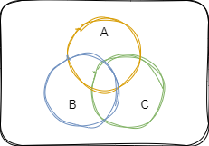

# 概率论

## 随机事件

**随机试验**($E$)：

1. 试验的可能结果不止一个，并且能事先明确试验的所有可能结果
2. 进行试验前不能确定哪一个结果会出现

**样本空间**($\Omega$)：

- $E$的所有可能结果组成的集合

$\Omega$中的元素，即$E$的每个结果称为样本点($\omega$)

**随机事件**：

- 试验$E$的样本空间$\Omega$的子集

必然事件：$\Omega\subset\Omega$
不可能事件：$\varnothing\subset\Omega$

### 事件的关系与运算

*设三个事件分别为A，B，C。*

1. 包含A$\subset$B：A必然导致B发生
2. 相等A=B：A发生当且仅当B发生
3. 互斥A$\cap$B=$\varnothing$：A与B不能同时发生
4. 对立A$\cap$B=$\varnothing$且A+B=$\Omega$：A与B不能同时发生，且至少有一个发生（也叫逆事件）

互斥是对立的必要不充分条件

1. 和事件$A{\cup}B$（或A+B）：和事件发生$\Leftrightarrow$A或B发生$\Leftrightarrow$A与B至少有一个发生
2. 积事件A$\cap$B（或AB）：积事件发生$\Leftrightarrow$A与B同时发生
3. 差事件A-B（即$A\overline{B}$）：差事件发生$\Leftrightarrow$A发生而B不发生
4. 补事件$\overline{A}$(即$\Omega$-A)：补事件发生$\Leftrightarrow$A不发生$\Leftrightarrow$样本空间与A的差事件

运算律

1. 交换律：A$\cup$B=B$\cup$A,A$\cap$B=B$\cap$A
2. 结合律：A$\cup$(B$\cup$C)=(A$\cup$B)$\cup$C,A$\cap$(B$\cap$C)=(A$\cap$B)$\cap$C
3. 分配律：A$\cup$(B$\cap$C)=(A$\cup$B)$\cap$(A$\cup$C),A$\cap$(B$\cup$C)=(A$\cap$B)$\cup$(A$\cap$C)
4. 对偶律：$\overline{A{\cup}B}$=$\overline{A}\cap\overline{B}$,$\overline{A{\cap}B}$=$\overline{A}\cup\overline{B}$

### 随机事件的概率

**频率**：在相同条件下重复试验，事件出现的次数$n_A$与试验次数$n$的的比值，记为$f_n(A)$

**概率**：事件A发生的可能性大小的量度，概率为频率的稳定值，记为$P(A)$

**定义 `概率`** 设E是随机试验，$\omega$是它的样本空间，对E的每一个事件A，将其对应于一个实数，记为$P(A)$，称为事件A的概率，如果集合函数$P(*)$满足下列条件：

1. 非负性：对任意一个事件，有$P(A) \geqslant 0$；
2. 规范性：对必然事件，有$P(\omega) = 1$；
3. 可列可加性：设$A_1,A_2, \cdots$是两两互不相容的事件，即对于$i \neq j,A_iA_j = \varnothing,i,j=1,2,\cdots$，有：$\displaystyle P(\bigcup_{i=1}^{\infty}A_i)= \sum_{i=1}^{\infty}P(A_i)$

对于不可重复试验，如果符合三个基本条件可以定义概率并称为主观概率

**概率的性质**:

- $P(\varnothing)=0$
- $P(A) \leqslant 1$
- $P(\overline{A})=1-P(A)$
- $P(A-B)=P(A)-P(AB)$
- $P(A+B)=P(A)+P(B)-P(AB)$

tips:
**零概率事件与不可能事件是不同的，只是不可能事件概率为0** *在数轴任取一点的概率为0（或许可以理解为概率是无穷小），但是可能发生*。类似地，**1概率事件与必然事件是不同的**
概率推不出事件

#### 概型

**古典（等可能）概型**：
1）试验的样本空间只含有有限个元素，即 $\Omega=\{\omega_1,\omega_2,\cdots,\omega_n\}$
2）试验中每个基本事件发生的可能性相同，即 $\displaystyle P(\{\omega_i\})=\frac{1}{n}$

**几何概型**：
在等可能性的情况下 $P(A)=tS(A)$，样本空间有满足平面上的一区域（或直线上的一线段、空间上的一立体）的无限个元素，概率为 $\displaystyle P(A)=\frac{S(A)}{S(\Omega)}$

### 条件概率

**条件概率**：A发生的条件下（A的概率不为0），事件B发生的概率，记为$P(B|A)$。若$P(A)>0$，则

$$
P(B|A)=\frac{P(AB)}{P(A)}
$$

定义 `样本空间的划分` 设 $\Omega$ 为试验 $E$ 的样本空间，$B_1,B_2,\cdots,B_n$ 为 $E$ 的一组事件，若 $B_iB_j=\varnothing,\bigcup\limits_{i=1}^n B_i=\Omega$ ，则称，$B_1,B_2,\cdots,B_n$ 为样本空间的一个划分

- **乘法公式** $P(AB)=P(B|A)P(A)=P(A|B)P(B)$
- **全概率公式** $\displaystyle P(A)=\sum_{i=1}^n P(A|B_i)P(B_i)$
- **贝叶斯Bayes公式** $\displaystyle P(B_i|A)=\frac{P(A|B_i)P(B_i)}{\sum\limits_{j=1}^n P(A|B_j)P(B_j)}$

### 事件的独立性

**事件独立**：事件$A,B$独立指事件满足$P(AB)=P(A)P(B)$
n个事件$A_1,A_2,\cdots,A_n$独立指其中任意两个、三个、$\cdots$n个事件的积事件的概率都等于各事件概率之积
无穷个事件独立指其中任意有限多个事件都相互独立

- 若A，B相互独立，则$A$与$\overline{B}$，$\overline{A}$与$B$，$\overline{A}$与$\overline{B}$也分别相互独立
- 若$n$个事件相互独立，则将其中任何$m$个事件换成相应的对立事件，形成的$n$个新的事件仍相互独立
- 若$n$个事件相互独立，则其中至少有一个事件发生的概率为$\displaystyle P(\bigcup_{i=1}^n A_i)=1-\prod_{i=1}^n[1-P(A_i)]$

tips:
互斥与独立：[[#事件的关系与运算|互斥]]是同一个样本空间，独立是不同样本空间，或同一样本空间不同事件。
如果两事件发生的概率都不为0，那么它们互斥不独立，独立不互斥。
零概率事件、1概率事件均与任何事件独立
不可能事件与任何事件既独立又互斥

## 一维随机变量及分布

将对随机事件的研究转化为对随机变量的研究，***将事物抽象为数*** $X:\Omega\to \mathbb{R}$

**定义 `一维随机变量`** 定义在样本空间上的实值单值函数 $X=X(\omega)$

### 离散型随机变量

离散型随机变量：随机变量的全部取值只有**有限个或可列无限个**

离散型随机变量的***分布律***：$\displaystyle P\{X=x_k\}=p_k$

**两点分布** 随机变量只可能取0与1两个值，可用来描述一个伯努利试验（只有两个可能结果 $A,\overline{A}$ 的试验 $E$，$k=0,1$）

$$
P\{X=k\}=p^k(1-p)^{1-k}
$$

**二项分布** n重伯努利试验的分布律，记为$X\sim b(n,p)$（$k=0,1,2,\cdots,n$）

$$
P\{X=k\}=C_n^kp^k(1-p)^{n-k}
$$

**泊松分布** n很大，p很小，np大小适中时二项分布的近似（$k=0,1,2,\cdots$）

$$
P\{X=k\}=\frac{\lambda^k e^{-\lambda}}{k!}
$$

  ***泊松定理***：在n重伯努利试验中，事件A在每次试验中发生的概率为$p_n$（与试验次数n有关），如果$n\to\infty$时，$np_n\to\lambda$，则对任意给定的非负整数k，有$\displaystyle\lim_{n\to\infty}\binom{n}{k}p_n^k(1-p_n)^{n-k}=\frac{\lambda^k}{k!}e^{-\lambda}$

### 连续型随机变量

连续型随机变量的 ***分布函数*** $F(x)$ :随机变量落在实数x左边的概率，即 $\displaystyle F(x)=P\{X\leqslant x\}$ 
连续型随机变量的 ***概率密度函数***  $f(x)$ :满足 $\displaystyle F(x)=\int_{-\infty}^x f(t)dt$  的非负函数

**均匀分布** $X\sim U(a,b)$

$$
f(x)=
\begin{cases}
    \dfrac{1}{(b-a)}&, a<x<b \\
    0&,others
\end{cases}
$$

**指数分布** $X\sim E(\lambda)$

$$
f(x)=
\begin{cases}
    \lambda e^{ -\lambda x }&,x>0 \\
    0&,x\leq 0
\end{cases}
$$

**正态分布** $X\sim N(\mu,\sigma^2)$

$$
f(x)=\frac{1}{\sqrt{2\pi}\sigma}e^{-\frac{(x-\mu)^{2}}{2\sigma^{2}}}, -\infty<x<+\infty
$$

 $N(0,1)$ 称为标准正态分布。若$X\sim N(\mu,\sigma^2)$，则 $Y=\dfrac{X-\mu}{\sigma}\sim N(0,1)$

**幂律分布**
$$
f(x,\alpha)=\begin{cases}
    \dfrac{\alpha-1}{\theta}\left( \dfrac{x}{\theta} \right)^{-\alpha} &,x\geq\theta>0,\alpha>1 \\
    0&,x<\theta
\end{cases}
$$

### 随机变量的函数的分布

设随机变量$X$具有概率密度$f_X(x)$，$-\infty<x<+\infty$，函数$g(x)$处处可导且恒有$g'(x)>0$或$g'(x)<0$，则$Y=g(X)$是连续型随机变量，其概率密度为(记$\alpha=\min\{g(-\infty),g(+\infty)\},\beta=\max\{g(-\infty),g(+\infty)\},h(x)$为$g(x)$的反函数)

$$
f_Y(y)=
\begin{cases}
    f_X[h(y)]|h'(y)|&,   \alpha<y<\beta     \\
    0&,others
\end{cases}
$$

> 求概率密度先求概率分布
> 有$F_Y(y)=P\{Y\leqslant y\}=P\{g(X)\leqslant y\}$
> 由$g(X)\leqslant y$转化为关于$X$的不等式，如$X_1\leqslant X\leqslant X_2$
> 于是$F_Y(y)=P\{X_1\leqslant X\leqslant X_2\}=F_X(X_2)-F_X(X_1)$
> 两边求导可得$f_Y(y)=F'_Y(y)$

## 多维随机变量及分布

定义在样本空间上的n个随机变量 $F:\Omega\to \mathbb{R}^n$

### 二维离散型随机变量

边缘分布
条件分布

边缘分布不能唯一确定联合分布

### 二维连续性随机变量

n维正态分布的概率密度函数：$f(x_{1},x_{2},\cdot,x_{n})=(2\pi)^{-\frac{n}{2}}|\boldsymbol{C}|^{-\frac{1}{2}}\exp \left\{ -\frac{1}{2}(\boldsymbol{X}-\boldsymbol{\mu})^{T}\boldsymbol{C}^{-1}(\boldsymbol{X}-\boldsymbol{\mu}) \right\}$
其中 $\boldsymbol{X}=(x_{1},\cdots,x_{n})^{T}$ ， $\boldsymbol{\mu}=(\mu_{1},\cdots,\mu_{n})^{T}$，$\boldsymbol{C}$ 为[[#矩|协方差矩阵]]

### 随机变量的独立性

### 两个随机变量的函数的分布

## 随机变量的数字特征

### 数学期望

**定义 `数学期望`** 数学期望记作$E(X)$
离散型随机变量的期望（若该级数收敛）

$$
E(X)=\sum_{i=1}^{\infty}x_ip_i
$$

连续型随机变量的期望（若该反常积分收敛）

$$
E(X)=\int_{-\infty}^{+\infty}xf(x)dx
$$

二维离散型随机变量的期望（高维同理）

$$
E(X)=\sum_{i=1}^{\infty}x_ip_{i\cdot}=\sum_{i=1}^{+\infty}\sum_{j=1}^{+\infty} x_ip_{ij}
$$

二维连续型随机变量的期望（高维同理）

$$
E(X)=\int_{-\infty}^{+\infty}xf_X(x)dx=\int_{-\infty}^{+\infty}\int_{-\infty}^{+\infty}xf(x,y)dxdy
$$

- 离散型随机变量$X$，$g(x)$是实值连续函数，则 $\displaystyle E[g(X)]=\sum_{i=1}^{\infty}g(x_i)p_i$
  连续型随机变量$X$，$g(x)$是实值连续函数，则 $\displaystyle E[g(X)]=\int_{-\infty}^{+\infty}g(x)f(x)dx$
- 数学期望的性质
  - $E(C)=C$
  - $E(CX)=CE(X)$
  - $E(X+Y)=E(X)+E(Y)$，可推广至有限个随机变量之和
  - 两个独立的随机变量，有$E(XY)=E(X)E(Y)$

**定义 `条件数学期望`** 若二维随机变量的条件分布的数学期望存在，则称为条件数学期望 
条件期望 $E(X|Y=y)$ 可以看成随机变量  $Y$ 的函数，因此 $E(X|Y)$ 本身也是个随机变量

**重期望公式** ：设 $(X,Y)$ 为二维随机变量，且 $E(X)$ 存在，则 $E(X)=E[E(X|Y)]$

### 方差

**定义 `方差`** 设$X$是一个随机变量，若$E[X-E(X)]^2$存在，则称其为$X$的**方差**，记为$D(X)$。显然有$D(X)=E(X^2)-[E(X)]^2$
在应用中引入与随机变量具有相同量纲的量$\sigma(X)=\sqrt{D(X)}$，称为**标准差**

- $D(C)=0$
- $D(aX+b)=a^2D(X)$
- $D(X\pm Y)=D(X)+D(Y)\pm 2E\{[X-E(X)][Y-E(Y)]\}$
  特别地，若$X,Y$相互独立，$D(X\pm Y)=D(X)+D(Y)$
- $D(X)=0\Longleftrightarrow P\{X=E(X)\}=1$

**标准化的随机变量**:

$$
X^*=\frac{X-E(X)}{\sqrt{D(X)}}
$$

此时有，$E(X^*)=0,D(X^*)=1$

#### 切比雪夫不等式

马尔可夫不等式：设$X$是只取非负值的随机变量，则对于任意正数$a$，有$\displaystyle P\{X\geqslant a\}\leqslant\frac{E(X)}{a}$

> 证明：$E(x)=\int_{0}^{+\infty}xf(x)dx\geqslant\int_{a}^{+\infty}xf(x)dx\geqslant\int_{a}^{+\infty}af(x)dx=a\int_{a}^{+\infty}f(x)dx=aP\{X\geqslant a\}$

**切比雪夫不等式**：设随机变量$X$，则对于任意正数$\varepsilon$，有

$$
P\{|X-E(X)|\geqslant\varepsilon\}\leqslant\frac{D(X)}{\varepsilon^2}
$$

> 证明：在马尔可夫不等式中，取$X$为$[X-E(X)]^2$，取$a$为$\varepsilon^2$，即证

### 协方差与相关系数

协方差与相关系数是描述两个随机变量之间的相关性的数字特征

**定义 `协方差`** $E\{[X-E(X)][Y-E(Y)]\}$ 称为随机变量 $X,Y$ 的协方差，记为 $\text{cov}(X,Y)$

* $\text{cov}(X,Y)=E(XY)-E(X)E(Y)$
* $\text{cov}(X,X)=D(X)$
* $\text{cov}(X,Y)=\text{cov}(Y,X)$
* $\text{cov}(aX,bY)=ab\text{cov}(X,Y)$ ，其中ab为常数
* $\text{cov}(C,X)=0$ ，其中C为常数
* $\text{cov}(X_{1}+X_{2},Y)=\text{cov}(X_{1},Y)+\text{cov}(X_{2},Y)$
* 若随机变量相互独立，则 $\text{cov}(X,Y)=0$

**定义 `相关系数`** 设随机变量 $X,Y$ 的的期望方差都存在，称  $\displaystyle \rho_{XY}=\frac{\text{cov}(X,Y)}{\sqrt{D(X)D(Y)}}$为随机变量 $X,Y$ 的相关系数

- 若 $\rho_{XY}=0$，则称 $X,Y$ 不相关
- 若 $\rho_{XY}=1$，则称 $X,Y$ 完全正线性相关；若 $\rho_{XY}=-1$，则称 $X,Y$ 完全负线性相关
- 其他情况则称 $X,Y$ 有一定程度线性关系，且绝对值越接近1，则线性相关程度越高

tips:
随机变量相互独立与不相关：随机变量 $X,Y$ [[#随机变量的独立性|相互独立]]是它们不相关的充分不必要条件
特别地，当 $(X,Y)$ 服从二维正态分布时，它们相互独立与不相关是等价的

### 矩

**定义 `矩`** 设 $X,Y$ 是随机变量，若存在：
$\mu_{k}=E(X^{k})$ 称为 $X$ 的k阶**原点矩**；
 $\nu_{k}=E\{[X-E(X)]^{k}\}$ 称为 $X$ 的k阶**中心矩**；
$E(X^{k}Y^{l})$ 称为 $X$ 和 $Y$ 的k+l阶**混合原点矩**；
$E\{[X-E(X)]^{k}[Y-E(Y)]^{}\}$ 称为 $X$ 和 $Y$ 的k+l阶**混合中心矩**。

**定义 `协方差矩阵`** 设n维随机变量 ${X_{1},X_{2},\cdots,X_{n}}$ 的二阶混合中心矩 $c_{ij}=\text{cov}(X_{i},X_{j})$ 都存在，则称矩阵 $\boldsymbol{C}=\{c_{ij}\}$ 为该n维随机变量的协方差矩阵

## 大数定律和中心极限定理

### 大数定律

**定义 `依概率收敛`** 设 $Y_{1},Y_{2},\cdots,Y_{n},\cdots$ 是一个随机变量序列，$a$ 是一个常数，若对于任何 $\varepsilon>0$，有
$$
\lim_{ n \to \infty } P\{|Y_{n}-a|<\varepsilon\}=1
$$
则称序列依概率收敛于 $a$，记为 $Y_{n}\stackrel{P}{\longrightarrow}a$

满足大数定律的随机变量有 $\displaystyle\lim_{ n \to \infty }P\left\{ \left| \frac{1}{n} \sum_{i=1}^{n}X_{i}-\frac{1}{n}\sum_{i=1}^{n}E(X_{i})\right|<\varepsilon \right\}=1$

**伯努利大数定律** 设试验 $E$ 是可重复进行的，事件 $A$ 在每次试验中出现的概率 $P(A)=p$，将试验独立地进行n次，用 $n_{A}$ 表示其中事件出现的次数，则 $\dfrac{n_{A}}{n}\stackrel{P}{\longrightarrow}p$

**切比雪夫大数定律的特殊情况** 设随机变量 $X_{1},X_{2},\cdots,X_{n},\cdots$ 相互独立，且具有相同的数学期望和方差 $E(X_{k})=\mu,D(X_{k})=\sigma^{2}(k=1,2,\cdots)$ 。记 $\displaystyle\overline{X}=\dfrac{1}{n}\sum_{k=1}^{n}X_{k}$ ，则 $\overline{X}\stackrel{P}{\longrightarrow}\mu$

**辛钦大数定律** 设随机变量 $X_{1},X_{2},\cdots,X_{n},\cdots$ 相互独立，且服从同一分布，具有数学期望 $E(X_{k})=\mu(k=1,2,\cdots)$ 。记 $\displaystyle\overline{X}=\dfrac{1}{n}\sum_{k=1}^{n}X_{k}$ ，则 $\overline{X}\stackrel{P}{\longrightarrow}\mu$

### 中心极限定理

**独立同分布情形的中心极限定理** 设随机变量 $X_{1},X_{2},\cdots,X_{n},\cdots$ 相互独立，服从同一分布，且具有相同的数学期望和方差 $E(X_{k})=\mu,D(X_{k})=\sigma^{2}(k=1,2,\cdots)$ ，则随机变量之和 $\sum_{i=1}^{n}X_{i}$ 的[[#方差|标准化的随机变量]]的分布函数 $F_{n(x)}$ 满足 $\displaystyle\lim_{ n \to \infty }=\lim_{ n \to \infty }P\left\{ \frac{\sum_{i=1}^{n}X_{i}-n\mu}{\sqrt{n}\sigma} \leqslant x \right\}=\Phi(x)$。其中 $\Phi(x)$ 是[[#连续型随机变量|标准正态分布]]的分布函数。

**棣莫弗-拉普拉斯中心极限定理** 设随机变量 $\eta_{n}\sim b(n,p)$ ，则 $\displaystyle\lim_{ n \to \infty }P\left\{ \frac{\eta_{n}-np}{\sqrt{np(1-p)}}\leqslant x \right\}=\Phi(x)$

## 样本及抽样分布

在一个统计问题中，研究的对象的全体称为**总体**，而把组成总体的每一个成员称为**个体**。总体中所包含的个体个数称为总体的**容量**。
总体的分布一般是未知的，因此需要通过从总体中抽取一部分个体，根据获得的数据对总体的分布做出推断。被抽出的部分个体称为总体的一个**样本**，从总体中抽取若干个体的过程称为**抽样**，样本中所含个体数量称为**样本容量**，样本中的每个个体称为**样品**。
要求样本具有随机性和独立性的抽样方法称为**简单随机抽样**

### 样本分布函数

定义 样本分布函数 设函数

#### 统计量

定义 `统计量` 若样本函数中不含有任何未知参数，则称为统计量

- 样本均值
- 样本方差
- 样本标准差
- 样本k阶原点矩
- 样本k阶中心距

> 样本方差
> 无偏估计自由度

### 抽样分布

统计量的分布称为抽样分布

#### 三个重要分布

$\chi^2$

$t$

$F$

#### 正态总体统计量的分布

## 参数估计

### 点估计

**定义 `点估计`** 设

---

估计方法
**矩估计法**
**最大似然估计法**
贝叶斯法
顺序统计量法

---

**估计量的评选标准** 无偏性、有效性、相合性

### 区间估计

**定义 `置信区间`** 设总体$X$的分布中含有未知参数$\theta$，$\underline{\theta}(X_1,X_2,\cdots,X_n)$和$\overline{\theta}(X_1,X_2,\cdots,X_n)$是由样本$X_1,X_2,\cdots,X_n$确定的两个统计量。对于给定的数$0<\alpha<1$，如果对参数$\theta$的任何值都有$P\{\underline{\theta}<\theta<\overline{\theta}\}\geqslant 1-\alpha$，则称随机区间$(\underline{\theta},\overline{\theta})$为参数$\theta$的**置信水平**为$1-\alpha$的**置信区间**
同理，$(\underline{\theta},+\infty)$或$(-\infty,\overline{\theta})$称为**单侧置信区间**

---

估计方法

#### 正态总体参数的区间估计

#### 非正态总体参数的区间估计

## 假设检验

**小概率原理**：如果小概率事件在一次试验中发生了，有理由怀疑试验的原定条件不成立
**概率反证法**：

若小概率事件的概率不超过$\alpha$，则称其为**显著性水平**
拒绝域

### 正态总体均值的检验

u
t

### 正态总体方差的检验

$\chi^2$
$F$

### 大样本检验

### p值检验

### 假设检验的两类错误

### 非参数假设检验

## 线性回归分析与方差分析

一元线性回归模型

**最小二乘法**，选择，使得最小

$\hat{y}=\hat{a}+\hat{b}x$

$$
\hat{b}=\frac{\sum\limits_{i=1}^n(x_i-\overline{x})(y_i-\overline{y})}{\sum\limits_{i=1}^n(x_i-\overline{x})^2}\\
\hat{a}=\overline{y}-\hat{b}\overline{x}\\
\hat{\sigma}^2=\frac{1}{n-2}\sum_{i=1}^n(y_i-\hat{a}-\hat{b}\overline{x_i})^2
$$

假设检验
区间估计

有时样本点明显不在一条直线附近，*例如满足幂函数分布，可以两边取对数转化为线性*

方差分析
