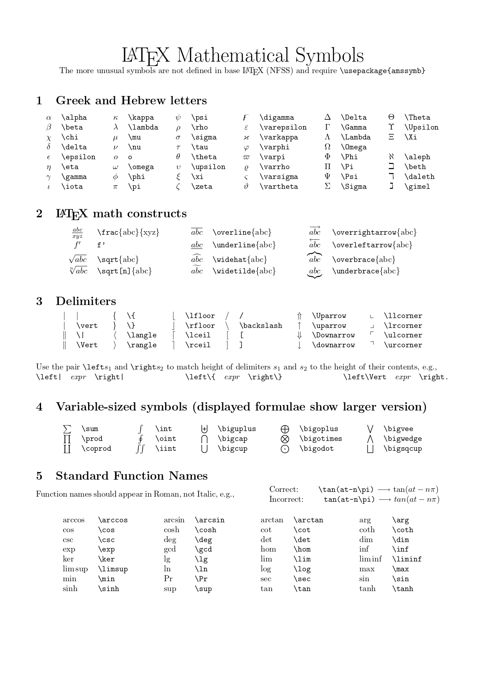
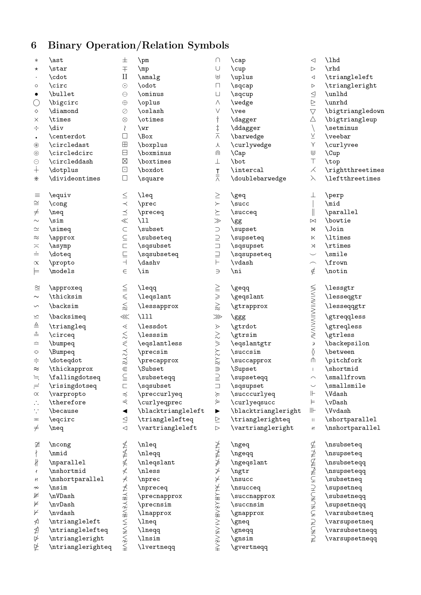
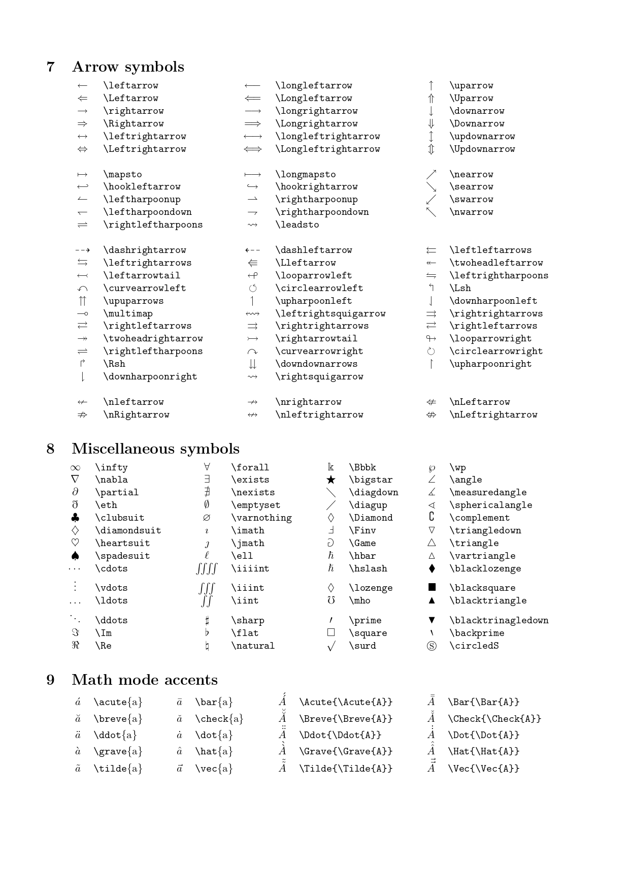
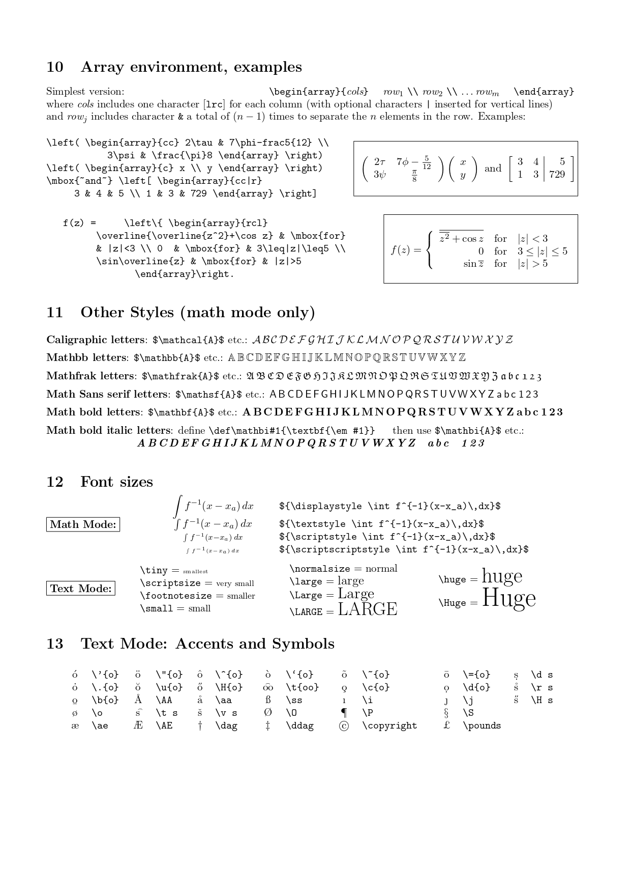

# Markdown语法

## 标题

**要创建标题，请在单词或短语前面添加井号 (#) 。# 的数量代表了标题的级别，共有6级。**

```markdown
# H1
## H2
### H3
#### H4
##### H5
###### H6
```

*不同的 Markdown 应用程序处理 # 和标题之间的空格方式并不一致。为了兼容考虑，请用一个空格在 # 和标题之间进行分隔。*

在段落中填写 `[TOC]` 以显示全文内容的目录结构。

## 段落

**要创建段落，请使用空白行将一行或多行文本进行分隔。**

```markdown
I really like using Markdown.

I think I'll use it to format all of my documents from now on.
```

> I really like using Markdown.
>
> I think I'll use it to format all of my documents from now on.

*不要用空格（spaces）或制表符（ tabs）缩进段落。如必要可以使用两个全角空格字符实体 `&emsp;&emsp;`*

## 换行

**在一行的末尾添加两个或多个空格，然后按回车键,即可创建一个换行(`<br>`)。**

*为了兼容性，请在行尾添加“结尾空格”或 HTML 的 `<br>` 标签来实现换行。*

## 强调

**要加粗文本，请在需要加粗部分的前后各添加两个星号 `**`**

*要用斜体显示文本，请在需要加粗部分的前后添加一个星号 `*`*

***要同时用粗体和斜体突出显示文本，请在需要加粗部分的前后各添加三个星号 `***`***
~~若要在单词中心放置一条水平线来删除单词，请在需要使用删除线的部分前后各添加两个波浪号~~ `~~`

## 引用

**要创建块引用，请在段落前添加一个 > 符号。**

```markdown
> Dorothy followed her through many of the beautiful rooms in her castle.
```

> Dorothy followed her through many of the beautiful rooms in her castle.

块引用可以包含多个段落。为段落之间的空白行添加一个 > 符号。

```markdown
> Dorothy followed her through many of the beautiful rooms in her castle.
>
> The Witch bade her clean the pots and kettles and sweep the floor and keep the fire fed with wood.
```

> Dorothy followed her through many of the beautiful rooms in her castle.
>
> The Witch bade her clean the pots and kettles and sweep the floor and keep the fire fed with wood.

块引用可以嵌套。在要嵌套的段落前添加一个 >> 符号。

```markdown
> Dorothy followed her through many of the beautiful rooms in her castle.
>
>> The Witch bade her clean the pots and kettles and sweep the floor and keep the fire fed with wood.
```

块引用可以包含其他 Markdown 格式的元素。并非所有元素都可以使用，你需要进行实验以查看哪些元素有效。

## 列表

**要创建有序列表，请在每个列表项前添加数字并紧跟一个英文句点。数字不必按数学顺序排列，但是列表应当以数字 1 起始。**

```markdown
1. First item
2. Second item
3. Third item
    1. Indented item
    2. Indented item
4. Fourth item
```

1. First item
2. Second item
3. Third item
   1. Indented item
   2. Indented item
4. Fourth item

**要创建无序列表，请在每个列表项前面添加 - （+或-或*或%）。缩进一个或多个列表项可创建嵌套列表。**但是应该选用相同的符号

```markdown
- First item
- Second item
- Third item
    - Indented item
    - Indented item
- Fourth item
```

- First item
- Second item
- Third item
  - Indented item
  - Indented item
- Fourth item

要在保留列表连续性的同时在列表中添加另一种元素，*请将该元素缩进四个空格或一个制表符*

## 代码

**要将单词或短语表示为代码，请将其包裹在反引号 (`) 中。**

```markdown
At the command prompt, type `nano`.
```

At the command prompt, type `nano`.

*如果你要表示为代码的单词或短语中包含一个或多个反引号，则可以通过将单词或短语包裹在双反引号(``)中。*
**要创建代码块，请将代码块的每一行缩进至少四个空格或一个制表符。**

```markdown
    <html>
      <head>
      </head>
    </html>
```

**围栏代码块**
您在代码块之前和之后的行上使用三个反引号（```）。要添加语法突出显示，请在受防护的代码块之前的反引号旁边指定一种语言。

```text
    ```json
    {
    "firstName": "John",
    "lastName": "Smith",
    "age": 25
    }
    ```
```

可以使用代码块描述文件结构：

```text
.
├─ docs/
│  └─ blog/
│     ├─ posts/
│     └─ index.md
└─ mkdocs.yml
```

## 分割线

**要创建分隔线，请在单独一行上使用三个破折号 (---) ，并且不能包含其他内容。为了兼容性，请在分隔线的前后均添加空白行。**

## 链接

**链接文本放在中括号内，链接地址放在后面的括号中，链接title可选。**

``[超链接显示名](超链接地址 "超链接title")``

```markdown
这是一个链接 [Markdown语法](https://markdown.com.cn "最好的markdown教程")。
```

*链接title是当鼠标悬停在链接上时会出现的文字，这个title是可选的，它放在圆括号中链接地址后面，跟链接地址之间以空格分隔。*

**使用尖括号可以很方便地把URL或者email地址变成可点击的链接。**

[https://markdown.com.cn](https://markdown.com.cn)
<fake@example.com>

**强调 链接, 在链接语法前后增加星号。 要将链接表示为代码，请在方括号中添加反引号。**

```markdown
**[LINK](https://markdown.com)**
*[Markdown Guide](https://www.markdownguide.org)*
[`code`](#code)
```

**[LINK](https://markdown.com)**
*[Markdown Guide](https://www.markdownguide.org)*
[`code`](#code)

**引用样式链接是一种特殊的链接，它使URL在Markdown中更易于显示和阅读。参考样式链接分为两部分：与文本保持内联的部分以及存储在文件中其他位置的部分，以使文本易于阅读。**

1. 引用类型的链接的第一部分使用两组括号进行格式设置。第一组方括号包围应显示为链接的文本。第二组括号显示了一个标签，该标签用于指向您存储在文档其他位置的链接。第二组括号中的标签不区分大小写，可以包含字母，数字，空格或标点符号。
2. 引用类型链接的第二部分使用以下属性设置格式：
   - 放在括号中的标签，其后紧跟一个冒号和至少一个空格（例如[label]:）。
   - 链接的URL，可以选择将其括在尖括号中。
   - 链接的可选标题，可以将其括在双引号，单引号或括号中。

```markdown
[example][1]

[1]: https://example.com
```

不同的 Markdown 应用程序处理URL中间的空格方式不一样。为了兼容性，请尽量使用%20代替空格。

**页内超链接**
在你准备跳转到的指定标题后插入锚点{#标记}，然后在文档的其它地方写上连接到锚点的链接。

```markdown
## 目录{#index}

跳转到[目录](#index)
```

## 图片

**要添加图像，请使用感叹号 (!), 然后在方括号增加替代文本，图片链接放在圆括号里，括号里的链接后可以增加一个可选的图片标题文本。**

````

**给图片增加链接，请将图像的Markdown 括在方括号中，然后将链接添加在圆括号中。**

``[](链接)``

## 表格

**要添加表，请使用三个或多个连字符（---）创建每列的标题，并使用管道（|）分隔每列。您可以选择在表的任一端添加管道。**

```markdown
| Syntax | Description |
| ----| --- |
| Header | Title |
| Paragraph | Text |
```

| Syntax    | Description |
| --------- | ----------- |
| Header    | Title       |
| Paragraph | Text        |

**您可以通过在标题行中的连字符的左侧，右侧或两侧添加冒号（:），将列中的文本对齐到左侧，右侧或中心。**

```markdown
| Syntax      | Description | Test Text     |
| :---        |    :----:   |          ---: |
| Header      | Title       | Here's this   |
| Paragraph   | Text        | And more      |
```

| Syntax    | Description |   Test Text |
| :-------- | :---------: | ----------: |
| Header    |    Title    | Here's this |
| Paragraph |    Text    |    And more |

- 您可以在表格中设置文本格式。例如，您可以添加链接，代码（仅反引号（`）中的单词或短语，而不是代码块）和强调。
- 您不能添加标题，块引用，列表，水平规则，图像或HTML标签。
- 您可以使用表格的HTML字符代码（`&#124;`）或使用转义字符（`\|`）在表中显示竖线（|）字符。
- 表格单元格里换行可以借助于 HTML 里的 `<br />` 实现

## 任务列表

**任务列表使您可以创建带有复选框的项目列表。在支持任务列表的Markdown应用程序中，复选框将显示在内容旁边。要创建任务列表，请在任务列表项之前添加破折号-和方括号[ ]，并在[ ]前面加上空格。要选择一个复选框，请在方括号[x]之间添加 x 。**

```markdown
- [x] Write the press release
- [ ] Update the website
- [ ] Contact the media
```

- [X] Write the press release
- [ ] Update the website
- [ ] Contact the media

## 注脚

在需要添加注脚的文字后加上脚注名字[^注脚名字],称为加注。 然后在文本的任意位置(一般在最后)添加脚注，脚注前必须有对应的脚注名字。

注意：经测试注脚与注脚之间必须空一行，不然会失效。成功后会发现，即使你没有把注脚写在文末，经Markdown转换后，也会自动归类到文章的最后。

```markdown
使用 Markdown[^1]可以效率的书写文档, 直接转换成 HTML[^2]

[^1]: Markdown 是一种纯文本标记语言

[^2]: HyperText Markup Language 超文本标记语言
```

使用 Markdown[^1]可以效率的书写文档, 直接转换成 HTML[^2]

## 注释

不是很推荐在markdown中使用注释，除非确实有必要

①Html隐藏
   ``<div style="display:none">这是一段注释</div>``
②Xml注释

```html
   <!--
   整段整段的不可见内容
   -->
```

③Markdown reference Links

> 在reference形式中，链接(link)分成了展示部分和引用部分，其中引用(reference)部分是不直接显示出来的。

## 内嵌 HTML 标签

**对于 Markdown 涵盖范围之外的标签，都可以直接在文件里面用 HTML 本身。如需使用 HTML，不需要额外标注这是 HTML 或是 Markdown，只需 HTML 标签添加到 Markdown 文本中即可。**
Markdown 语法在 HTML 区块标签中将不会被进行处理

### 转义字符

**要显示原本用于格式化 Markdown 文档的字符，请在字符前面添加反斜杠字符 \ 。**

> 可转义字符: \\ \` \* \_ \{\} \[\] \(\) \# \+ \- \. \! \|

在 HTML 文件中，有两个字符需要特殊处理： < 和 & 。 < 符号用于起始标签，& 符号则用于标记 HTML 实体，如果你只是想要使用这些符号，要使用实体的形式，像是 `&lt;` 和 `&amp;`

`&ensp;` 代表半角空格，`&emsp;` 代表全角空格。

### 分页

```html
<div STYLE="page-break-after: always;"></div>
<!-- 可以帮助转换pdf时分页 -->
```

### HTML表格

使用HTML表格可以实现更加强大的效果，不过有些效果（如文字颜色等）需要markdown编译器的支持

```html
<table  style="text-align: center; margin-left: 175px;">
    <caption>国际单位制</caption>
    <tr>
        <th rowspan="2">基本量</th>
        <th rowspan="2">基本量纲</th>
        <th colspan="2">SI单位</th>
    </tr>
    <tr>
        <th>名称</th>
        <th>符号</th>
    </tr>
    <tr>
        <td>长度</td>
        <td>L</td>
        <td>米</td>
        <td>m</td>
    </tr>
    <tr>
        <td>质量</td>
        <td>M</td>
        <td>千克</td>
        <td>kg</td>
    </tr>
</table>
```

<table  style="text-align: center; margin-left: 175px;">
    <caption>国际单位制</caption>
    <tr>
        <th rowspan="2">基本量</th>
        <th rowspan="2">基本量纲</th>
        <th colspan="2">SI单位</th>
    </tr>
    <tr>
        <th>名称</th>
        <th>符号</th>
    </tr>
    <tr>
        <td>长度</td>
        <td>L</td>
        <td>米</td>
        <td>m</td>
    </tr>
    <tr>
        <td>质量</td>
        <td>M</td>
        <td>千克</td>
        <td>kg</td>
    </tr>
    <tr>
        <td>时间</td>
        <td>T</td>
        <td>秒</td>
        <td>s</td>
    </tr>
    <tr>
        <td>电流</td>
        <td>I</td>
        <td>安[培]</td>
        <td>A</td>
    </tr>
    <tr>
        <td>温度</td>
        <td>O</td>
        <td>开[尔文]</td>
        <td>K</td>
    </tr>
    <tr>
        <td>物质的量</td>
        <td>N</td>
        <td>摩[尔]</td>
        <td>mol</td>
    </tr>
    <tr>
        <td>发光强度</td>
        <td>J</td>
        <td>坎[德拉]</td>
        <td>cd</td>
    </tr>
</table>

### HTML图片

Markdown格式生成的图片默认居左对齐，大小受图片实际大小限制。如果只指定宽度或高度，另一个按照长宽比自动设定

`<div></div>`

```html
<table>
    <tr>
        <td style="text-align: center;" width="600px" height="initial"> <!-- 设置文字居中、容器的长度与宽度  -->
             
            <!-- 设置图片居左、图片的长度与宽度 -->
            <span>
                可以实现图文混排<br>
                使用br标签换行
            </span>
        </td>
    </tr>
</table>
markdown的内容...
```

```html
<div style="display: table; text-align: center; border: none 0px; width: 600px; height: 500px;">
    
    <div style="display: inline-block; width: 300px; height: 500px;">
        可以实现图文混排<br>
        使用br标签换行
    </div>
</div>
markdown的内容...
```

<div style="display: table; text-align: center; border: none 0px; width: 600px; height: 500px;">
    
    <div style="display: inline-block; width: 300px; height: 500px;">
        可以实现图文混排<br>
        使用br标签换行
    </div>
</div>

## python提取指定标题

```python
import re

def extract_section(input_file, output_file, target_heading):
    """
    从 Markdown 文件中提取从指定标题开始到遇到更高级别标题为止的内容，并保存到新文件中。
    忽略代码块中的内容。

    :param input_file: 输入的 Markdown 文件路径
    :param output_file: 输出的 Markdown 文件路径
    :param target_heading: 目标标题（支持 #、##、### 等）
    """
    with open(input_file, 'r', encoding='utf-8') as file:
        content = file.read()

    # 移除代码块内容（以 ``` 或 ~~~ 包裹的内容）
    code_block_pattern = r"(```.*?```|~~~.*?~~~)"
    content_without_code = re.sub(code_block_pattern, lambda m: ' ' * len(m.group(0)), content, flags=re.S)

    # 匹配目标标题的正则表达式
    pattern = rf"^(#+)\s+{re.escape(target_heading)}\s*.*?$"  # 匹配指定标题
    matches = re.finditer(pattern, content_without_code, re.MULTILINE)

    for match in matches:
        heading_level = len(match.group(1))  # 获取标题级别（# 的数量）
        start_pos = match.start()  # 标题的起始位置

        # 查找下一个更高级别的标题（# 数量更少的标题）
        next_heading_pattern = rf"^(#{{1,{heading_level - 1}}})\s+.*?$"
        next_match = re.search(next_heading_pattern, content_without_code[match.end():], re.MULTILINE)

        if next_match:
            end_pos = match.end() + next_match.start()
        else:
            end_pos = len(content)  # 如果没有更高级别标题，则提取到文件末尾

        # 提取内容（从原始内容中提取，而不是从移除代码块的内容中提取）
        extracted_content = content[start_pos:end_pos].strip()

        # 写入到输出文件
        with open(output_file, 'w', encoding='utf-8') as output:
            output.write(extracted_content)
        print(f"提取成功，内容已保存到 {output_file}")
        return

    print(f"未找到标题 '{target_heading}' 的内容。")

# 示例用法
input_md_file = "input.md"  # 输入的 Markdown 文件路径
output_md_file = "output.md"  # 输出的 Markdown 文件路径
heading_to_extract = "四级标题"  # 替换为你想提取的标题

extract_section(input_md_file, output_md_file, heading_to_extract)
```

## Markdown中的LaTex

LaTeX 公式写法有两种，一种是用在正文中的，一种是单独显示的

```latex
$...$

$$
...默认居中
$$
```

\displaystyle 转义符\（反斜杠）+“关键词”

几乎所有latex语法都能够嵌套
\alpha要跟符号（包括空格符），不能直接跟字母，不推荐接数字

默认字体(罗马斜体) $ABCabc123$ $\mathrm{ABCabc123}$

字体加粗 $\boldsymbol{ABCabc123}$
直立的 $\textup{ABCabc123}$
意大利斜体 $\textit{ABCabc123}$$\mathit{ABCabc123}$
斜体 $\textstyle{ABCabc123}$

等宽 $\mathtt{ABCabc123}$ $\texttt{}$
黑体 $\mathbf{ABCabc123}$ $\textbf{}$
黑板报体 $\mathbb{ABCabc123}$
罗马体 $\mathrm{ABCabc123}$ $\textrm{}$ $\text{}$
无衬线体 $\mathsf{ABCabc123}$ $\textsf{}$
手写体 $\mathcal{ABCabc123}$
哥特字体 $\mathfrak{ABCabc123}$
哥特字体 $\scriptstyle{ABCabc123}$ $\scriptscriptstyle{ABCabc123}$


字号尺寸
${\tiny abc\text{极小}tiny}$
${\scriptsize abc \text{超小} scriptsize}$
${\small abc \text{小} small}$
${\normalsize abc \text{正常} normal}$
${\large abc \text{大} large}$
${\Large abc \text{超大} Large}$
${\LARGE abc \text{特大} LARGE}$
${\huge abc \text{巨大} huge}$
${\Huge abc \text{巨无霸} Huge}$






\omicron

空集$\varnothing$ `\varnothing`
**或** $\lor$、**与** $\land$、**非** $\lnot$

$\nabla$ $\Delta$ $\mathcal{L}$ $\mathscr{L}$

行内公式： $\lim_{ n \to \infty },\lim\limits_{ n \to \infty }$
或者 $\displaystyle \lim_{ n \to \infty }$

latex文字上面，下面大括号用法
$\varphi(e_{i})=(f_{1}(e_{i}),\cdot\cdot\cdot, f_{n}(e_{i}))=( \overbrace{ 0,\cdot\cdot\cdot,0 }^{i-1\text{个}},1,0,\cdot\cdot\cdot,0), i=1,2,\cdot\cdot\cdot,n.$

不同的"frac"会生成不同大小的分式。\tfrac \frac \dfrac \cfrac
"d"代表"display"，会生成一个比较大的适合显示的分数： $\dfrac{3}{7}$
"t"代表"text"，会生成一个比较小的适合在一行文字内显示的分数： $\tfrac{3}{7}$
还有一个\cfrac命令是用于连分数的，"c"代表"continued" $\cfrac{3}{7+\cfrac{3}{7+\cfrac{3}{7+\ldots}}}$
\cfrac 在 \dfrac 的基础上添加了可让分子左对齐或右对齐的可选参数：[l] 左对齐、[r] 右对齐$\cfrac[l]1{1111}+\cfrac[r]1{1111}$


弧线
Latex可以通过以下方式实现：

```latex
\usepackage{yhmath}
$\wideparen{ABCDEFG}$
```

上面这种方式在markdown中并不支持，这里提供另外的两种思路：

$\mathop{\frown}\limits_{AB}$
$\mathop{AB}\limits^{\frown}$

公式中括号的应用，可以用一系列命令 (\big, \Big, \bigg, \Bigg) 改变括号大  
小
也可以用自动模式自动调节大小 $\left( 3+\dfrac{7x+5}{1+y^2} \right)$
用“$$”与“$$”显示公式，可以自动居中，括号必须成对出现，如果在一行中只  
有一半的括号，则要添加对应的“影子括号”，例如在一行中有“\left(”，则要在后面添加“\right.”

分隔符\middle
$$ P=\left(A=2|\frac{A^2}{B}>4\right) $$ $$ P=\left(A=2\middle|\frac{A^2}{B}>4\right) $$

向量a使用$\boldsymbol{a}$
\mathbf的渲染效果是加粗的正体字符，而\boldsymbol的渲染效果是加粗的斜体字符

$\tbinom{n}{r}$ $C_{n}^{r}$ ${n \choose r}$
$\varnothing\emptyset$

[^1]: Markdown 是一种纯文本标记语言
    
[^2]: HyperText Markup Language 超文本标记语言
