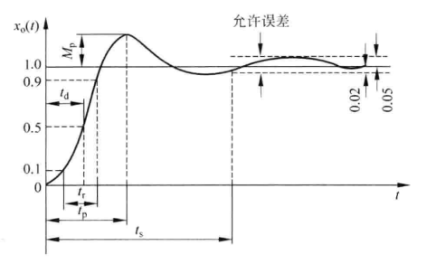

# 控制工程基础

**开环系统是没有输出反馈的一类控制系统
闭环系统是反馈控制系统**

对于典型闭环系统

闭环系统传递函数$G_{闭环}(s) = \frac{X_o(s)}{X_i(s)} = \frac{G(s)}{1+G(s)H(s)}$
$G(s)$称为系统前向通道传递函数
$G(s)H(s)$称为系统开环传递函数

## 控制系统的动态数学模型

### 拉氏变换

对于函数x(t)，如果满足：

1. 当t<0时,x(t)=0;当t>0时,x(t)在每个有限区间上是分段连续的。
2. $\int_{0}^{\infty}x(t)e^{-\sigma t}dt<\infty$（其中$\rho$为正实数）。

则可定义$f(x)$的拉氏变换$X(s)$为：

$$X(s)=L[x(t)]:=\int_{0}^{\infty}x(t)e^{-\sigma t}dt$$

#### 常见的拉氏变换及性质

单位阶跃函数$1(t)=\begin{cases}0,& \text{t<0}\\1,& \text{t>0}\end{cases}$

1. $L[1(t)]=\frac{1}{s}$
2. $L[e^{at}\cdot 1(t)]=\frac{1}{s-a}$
3. $L[\sin{\omega t}\cdot 1(t)]=\frac{\omega}{s^2+\omega^2}$
4. $L[\cos{\omega t}\cdot 1(t)]=\frac{s}{s^2+\omega^2}$

性质

1. 叠加原理：如果$L[x_1(t)]=X_1(s),L[x_2(t)]=X_2(s)$，那么
   $L[ax_1(t)+bx_2(t)]=aX_1(s)+bX_2(s)$
2. 微分定理：$L[\frac{d}{dt} x(t)] = sX(s) - x(0^+)$
3. 积分定理：$L[\int x(t) dt] = \frac{X(s)}{s} + \frac{x^{-1}(0^+)}{s}$
4. 衰减定理：$L[e^{-at}x(t)] = X(s+a)$

#### 拉氏反变换

$$x(t)=L^{-1}[X(s)]:= \frac{1}{2 \pi j} \int_{a - j \infty}^{a + j \infty}X(s)e^{st}ds$$

一般控制系统的传递函数通常是有理分式，其中使分母为零的s值称为极点；使分子为零的s值称为零点。
这种复变函数积分的方法通常十分繁琐，而对于有理分式形式的象函数，可以化成典型函数象函数相加的形式，写出相应的原函数。

*有理分式拆开：*

$$
\begin{aligned}
   X(s) &= \frac{b_0 s^m + b_1 s^{m-1} + \cdots + b_{m-1} s + b_m}{s^n + a_1 s^{n-1} + \cdots + a_{n-1} s + a_n} \\
   &= \frac{b_0 s^m + b_1 s^{m-1} + \cdots + b_{m-1} s + b_m}{(s + p_1)^{r1} (s + p_2)^{r2} \cdots } \\
   &= \frac{a_1}{s+p_1} + \frac{a_2}{(s+p_2)^2} + \cdots +\frac{a_{r1}}{(s+p_{r1})^{r1}} + \cdots \\
\end{aligned}
$$

$a_r = [X(s)(s+p_1)^{r1}]_{s=-p_1}$
$a_{r-1} = \frac{d}{ds} \{[X(s)(s+p_1)^{r1}] \}_{s=-p_1}$
$\cdots$
$a_1 = \frac{1}{(r-1)!} \{ \frac{d^{r1-1}}{ds^{r1-1}}[X(s)(s+p_1)^{r1}] \}_{s=-p_1}$

对于复数解，也可

*典型函数象函数拉氏变换：*

$$x(t)=L^{-1}[\frac{a}{(s+p)^r}] = \frac{a}{(r-1)!} t^{r-1} e^{-p} \cdot 1(t)$$

#### 拉氏变换解常系数线性微分方程

例：解方程$\ddot{y}(t) + 5 \dot{y}(t) + 6 y(t) = 6$，其中$\ddot{y}(0) = 2，\dot{y}(0) = 2$。
1）将方程两边拉氏变换：
2）带入已知量，解出待解量的拉氏变换式：
3）将得到的待解量的拉氏变换式进行拉氏反变换：

### 传递函数

在零初始条件下，线性定常系统的传递函数系统为输出象函数与输入象函数之比。
$$G(s) = \frac{X_o(s)}{X_i(s)}$$
G(0)称为静态放大系数（静态增益）

#### 典型环节

#### 系统函数方块图

#### 信号流图

**梅逊公式**：

### 实际物理系统

质量-弹簧-阻尼系统
电阻-电容-电感系统

## 时域瞬态响应分析

瞬态响应：系统在某一输入信号作用下其输出量从初始状态到稳定状态的响应过程
稳态响应：当某一信号输入时，系统在时间趋于无穷大时的输出状态

### 时域分析性能指标

1. 上升时间($t_r$)：响应曲线从零时刻首次达到稳态值的时间。$x_o(t_r) = 1$
2. 峰值时间($t_p$)：响应曲线从零时刻首次达到峰值的时间。$\frac{dx_o(t_p)}{dt_p} = 0$
3. 最大超调量($M_p$)：最大峰值与稳态值的差。$M_p = x_o(t_p) - 1$
4. 调整时间($t_s$)：响应曲线达到并一直保持在允许误差范围内的最短时间。$$

## 控制系统的频率特性

对于大多数机电系统可简单的将拉氏变换G(s)中的s换成jw得到相应的傅里叶变换式

### 极坐标图（奈奎斯特曲线）

### 对数坐标图（伯德图）

## 控制系统的稳定性分析

系统稳定性：系统在任何足够小的初始偏差的作用下，其过渡过程

## 控制系统的误差分析

误差为控制系统理想输出与实际输出之差（记作e(t)，其拉氏变换象函数记作E(s)）。
输入信号与反馈信号比较后的信号（$\epsilon (s)$）也能反映系统误差的大小，称为偏差。
$$\epsilon (s) = H(s)E(s)$$
由终值定理：
$$e_{ss} = \lim_{t \to \infty}e(t) = \lim_{s \to 0}sE(s)$$

1. 输入引起的误差
2. 干扰引起的误差

## 控制系统的校正

## 根轨迹

