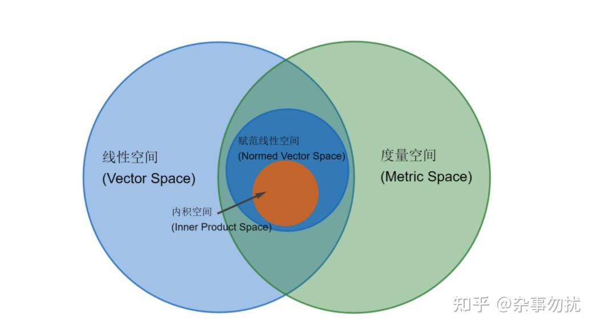

# 高等代数

## 数域与多项式环

**定义 `数域`** 设$P$是一些复数组成的集合，其中包括0和1。如果$P$中任意两个数的和、差、积、商（除数不为0）仍然是$P$中的数，那么$P$就称为一个**数域**。
如果数集中任意两个数对某个运算的结果仍在该数集中，称该数集对该运算是**封闭**的。因此数域是包含0,1，且对加、减、乘、除（除数不为0）封闭的数集。

一元多项式
整除关系，带余除法
最大公因式
不可约多项式，唯一因式分解定理
复数域
实数域
有理数域

韦达定理
牛顿多项式

## 矩阵

**定义 `矩阵`** 由$mn$个数排成的$m$行$n$列的表

$$
\begin{pmatrix}
    a_{11}&a_{12}&\cdots&a_{1n}\\
    a_{21}&a_{22}&\cdots&a_{2n}\\
    \vdots&\vdots&\ddots&\vdots\\
    a_{m1}&a_{m2}&\cdots&a_{mn}
\end{pmatrix}
$$

称为一个$m\times n$**矩阵**，简记为$A=(a_{ij})_{m\times n}$

$n\times n$矩阵也称为$n$阶方阵

$$
\boldsymbol{A}=
\left(\begin{matrix}
    a_{11}&a_{12}&\cdots&a_{1n}\\
    a_{21}&a_{22}&\cdots&a_{2n}\\
    \vdots&\vdots&\ddots&\vdots\\
    a_{n1}&a_{n2}&\cdots&a_{nn}
\end{matrix}\right)
$$

$$
\boldsymbol{|A|}=
\begin{vmatrix}
    a_{11}&a_{12}&\cdots&a_{1n}\\
    a_{21}&a_{22}&\cdots&a_{2n}\\
    \vdots&\vdots&\ddots&\vdots\\
    a_{n1}&a_{n2}&\cdots&a_{nn}
\end{vmatrix}
$$

定义 $|A|$ 为**方阵$A$的行列式**，有时也记为 $\det A$

当$m=1$时，称为$n$维**行向量**；为了书写时不至误解，通常用逗号分隔元素 $(a_1,a_2,\cdots)$
当$n=1$时，称为$m$维**列向量**；为便于排版，通常写成行向量的转置 $(a_1,a_2,\cdots)^T$
当$m=n=1$时，实际上就是一个数
*（**向量可以看成特殊的矩阵；矩阵可以看成行/列向量组，或者向量组成的向量**）*

### 矩阵的运算

以后涉及矩阵的运算默认在同一个数域下进行，并且符合运算的要求

**加法** $\boldsymbol{A+B}=(a_{ij})_{m,n}+(b_{ij})_{m,n}=(a_{ij}+b_{ij})_{m\times n}$
**减法** $\boldsymbol{A-B=A+(-B)}$
**数乘** $\lambda\boldsymbol{A}=(\lambda a_{ij})_{m\times n}$
**乘法** $\displaystyle\boldsymbol{AB}=(a_{ij})_{m\times n}\times(b_{ij})_{n\times s}=\left(\sum_{k=1}^n a_{ik}b_{kj}\right)_{m\times s}$
方阵$|AB|=|A||B|$
方幂

**转置** $\boldsymbol{A}^T=(a_{ji})_{n\times m}$
共轭 $\overline{\boldsymbol{A}}=(\overline{a_{ij}})$

---

**计算矩阵方幂的方法**：（当然注意结合使用）
（1）递推法、数学归纳法。可以先求前几项找规律
（2）相似变换。如果可相似对角化则 $A^n=(P^{-1}BP)^n=P^{-1}B^nP$ ，更一般地可以利用相似标准型（如Jordan标准型）
（3）注意特殊矩阵性质（如单位矩阵、基础右移循环矩阵、幂零Jordan块），将矩阵拆成特殊矩阵便于计算
（4）二项式定理。将矩阵 $A$ 拆成矩阵和 $A=A_1+A_2$ 的形式，如果 $A_1,A_2$ 可交换，则可以使用二项式定理

### 初等变换与矩阵的相抵

**定义 `初等变换与初等矩阵`** 由单位矩阵经过一次初等变换得到的矩阵，下列是初等变换以及对应的初等矩阵：
（1）对换矩阵的 $i,j$ 行（列）：对换单位矩阵 $i,j$ 的行（列），记为 $P_{ij}$
（2）用非零常数 $k$ 乘以矩阵的第 $i$ 行（列）：$P_i(k)$
（3）将矩阵的第 $j$ 行（第 $i$ 列）乘以常数 $k$ 后加到第 $i$ 行（第 $j$ 列）上去： $P_{ij}(k)$

**定义 `矩阵的相抵`** 如果矩阵可以由另一个矩阵经过一系列初等变换得到，则称这两个矩阵**等价或相抵**

* **初等变换不改变矩阵的秩。对换行列式乘以-1；倍乘行列式乘以k；倍加不改变矩阵的行列式**
* 对于 $m\times n$ 矩阵，初等行变换相当于左乘相应的 $m$ 阶初等矩阵；初等列变换相当于右乘相应的 $n$ 阶初等矩阵
* （1）型初等行变换，可以通过一些（2）、（3）型实现
* 初等矩阵都是可逆的，它们的逆矩阵还是初等矩阵，并且有
  * $P_{ij}^{-1}=P_{ij},P_{i}(k)^{-1}=P_i(k^{-1}),P_{ij}(k)^{-1}=P_{ij}(-k)$
  * $|P_{ij}^{-1}|=-1,|P_{i}(k)^{-1}|=k,|P_{ij}(k)^{-1}|=1$
* 任意 $m\times n$ 矩阵总可以经过**有限次初等变换**化为 $\displaystyle\begin{pmatrix*}I_r&O\\O&O\end{pmatrix*}$ 形式的 $m\times n$ 矩阵，称为矩阵的**相抵标准型**
  推论：可逆矩阵总可以经过有限次初等变换化为单位矩阵
* 矩阵 $A,B$ **等价的充分必要条件是存在可逆矩阵** $P,Q$ 使得 $A=PBQ$
  矩阵 $A,B$ **等价的充分必要条件是它们秩相同**

### 行列式

**定义 `排列`** 由$1,2,\cdots,n$组成的一个有序数组称为一个**n阶排列**。排列$12\cdots n$称为自然排列
在一个排列中，如果一对数的前后位置与大小顺序相反，那么它们就称为一个逆序，一个排列中逆序的总数称为这个排列的**逆序数**，记为$\tau(j_1j_2\cdots j_n)$。称逆序数的奇偶性为排列的奇偶性。

* **对换改变序列的奇偶性**
  推论：所有排列中奇排列和偶排列各有 $\frac{n!}{2}$ 个
* **任意一个n阶排列与自然排列都可以经过一系列对换互变**，并且所作对换个数与该排列奇偶性相同

**定义 `n阶行列式`**

$$
\begin{vmatrix}
    a_{11}&a_{12}&\cdots&a_{1n}\\
    a_{21}&a_{22}&\cdots&a_{2n}\\
    \vdots&\vdots&\ddots&\vdots\\
    a_{n1}&a_{n2}&\cdots&a_{nn}
\end{vmatrix}
=\sum_{j_1j_2\cdots j_n}(-1)^{\tau(j_1j_2\cdots j_n)}a_{1j_1}a_{2j_2}\cdots a_{nj_n}
$$

其中$\displaystyle\sum_{j_1j_2\cdots j_n}$表示对所有n阶排列求和

* **行列互换，行列式不变** $|A|=|A^T|$ *表明行列式行列的地位对称*
* **上（下）三角形行列式等于主对角线元素乘积**：

$$
\begin{vmatrix}
    a_{11}&a_{12}&\cdots&a_{1n}\\
    0&a_{22}&\cdots&a_{2n}\\
    \vdots&\vdots&\ddots&\vdots\\
    0&0&\cdots&a_{nn}
\end{vmatrix}
=a_{11}a_{22}\cdots a_{nn}
$$

* **斜上（下）三角行列式等于副对角线乘积乘以** $\displaystyle (-1)^{\frac{n(n+1)}{2}}$
* 一行的公因子可以提出去

$$
\left|\begin{matrix}
    a_{11}&a_{12}&\cdots&a_{1n}\\
    \vdots&\vdots&&\vdots\\
    ka_{i1}&ka_{i2}&\cdots&ka_{in}\\
    \vdots&\vdots&&\vdots\\
    a_{n1}&a_{n2}&\cdots&a_{nn}
\end{matrix}\right|
=
k\left|\begin{matrix}
    a_{11}&a_{12}&\cdots&a_{1n}\\
    \vdots&\vdots&&\vdots\\
    a_{i1}&a_{i2}&\cdots&a_{in}\\
    \vdots&\vdots&&\vdots\\
    a_{n1}&a_{n2}&\cdots&a_{nn}
\end{matrix}\right|
$$

* 某一行是两组数的和，那么行列式等于两个行列式的和

$$
\left|\begin{matrix}
    a_{11}&a_{12}&\cdots&a_{1n}\\
    \vdots&\vdots&&\vdots\\
    b_1+c_1&b_2+c_2&\cdots&b_n+c_n\\
    \vdots&\vdots&&\vdots\\
    a_{n1}&a_{n2}&\cdots&a_{nn}
\end{matrix}\right|
=
\left|\begin{matrix}
    a_{11}&a_{12}&\cdots&a_{1n}\\
    \vdots&\vdots&&\vdots\\
    b_{1}&b_{2}&\cdots&b_{n}\\
    \vdots&\vdots&&\vdots\\
    a_{n1}&a_{n2}&\cdots&a_{nn}
\end{matrix}\right|
+
\left|\begin{matrix}
    a_{11}&a_{12}&\cdots&a_{1n}\\
    \vdots&\vdots&&\vdots\\
    c_{1}&c_{2}&\cdots&c_{n}\\
    \vdots&\vdots&&\vdots\\
    a_{n1}&a_{n2}&\cdots&a_{nn}
\end{matrix}\right|
$$

* 把一行的倍数加到另一行，行列式不变

$$
\left|\begin{matrix}
    a_{11}&a_{12}&\cdots&a_{1n}\\
    \vdots&\vdots&&\vdots\\
    a_{i1}&a_{i2}&\cdots&a_{in}\\
    \vdots&\vdots&&\vdots\\
    a_{k1}&a_{k2}&\cdots&a_{kn}\\
    \vdots&\vdots&&\vdots\\
    a_{n1}&a_{n2}&\cdots&a_{nn}
\end{matrix}\right|
=
\left|\begin{matrix}
    a_{11}&a_{12}&\cdots&a_{1n}\\
    \vdots&\vdots&&\vdots\\
    a_{i1}+ca_{k1}&a_{i2}+ca_{k2}&\cdots&a_{in}+ca_{kn}\\
    \vdots&\vdots&&\vdots\\
    a_{k1}&a_{k2}&\cdots&a_{kn}\\
    \vdots&\vdots&&\vdots\\
    a_{n1}&a_{n2}&\cdots&a_{nn}
\end{matrix}\right|
$$

* 对换行列式两行位置行列式反号

$$
\left|\begin{matrix}
    a_{11}&a_{12}&\cdots&a_{1n}\\
    \vdots&\vdots&&\vdots\\
    a_{i1}&a_{i2}&\cdots&a_{in}\\
    \vdots&\vdots&&\vdots\\
    a_{k1}&a_{k2}&\cdots&a_{kn}\\
    \vdots&\vdots&&\vdots\\
    a_{n1}&a_{n2}&\cdots&a_{nn}
\end{matrix}\right|
=-
\left|\begin{matrix}
    a_{11}&a_{12}&\cdots&a_{1n}\\
    \vdots&\vdots&&\vdots\\
    a_{k1}&a_{k2}&\cdots&a_{kn}\\
    \vdots&\vdots&&\vdots\\
    a_{i1}&a_{i2}&\cdots&a_{in}\\
    \vdots&\vdots&&\vdots\\
    a_{n1}&a_{n2}&\cdots&a_{nn}
\end{matrix}\right|
$$

* 如果行列式一行为0，行列式为0
  如果两行相同，行列式为0
  如果两行成比例，行列式为0
* 行列式的另一种定义：**n阶行列式是由n个n维行向量（或列向量）为邻边的n维图形的体积**（1维体积为长度；2维体积为面积；3为体积就是体积）

定义 `阶梯型矩阵` 非零行在零行上方；上行首非零元在下行首非零元的右边
**任意一个矩阵经过一系列初等行变换总能变成阶梯型矩阵**
**而阶梯型矩阵一定是上三角矩阵，其行列式等于主对角线元素乘积**

#### 行列式展开定理

**定义** 在n阶行列式

$$
\left|\begin{matrix}
    a_{11}&\cdots&a_{1j}&\cdots&a_{1n}\\
    \vdots&&\vdots&&\vdots\\
    a_{i1}&\cdots&a_{ij}&\cdots&a_{in}\\
    \vdots&&\vdots&&\vdots\\
    a_{n1}&\cdots&a_{nj}&\cdots&a_{nn}
\end{matrix}\right|
$$

中删去元素$a_{ij}$所在的第$i$行与第$j$列，得到的n-1阶行列式称为元素$a_{ij}$的**余子式**，记为$M_{ij}$
$A_{ij}=(-1)^{i+j}M_{ij}$称为元素$a_{ij}$的**代数余子式**

**行列式按行（列）展开**：

$$
\left|\begin{matrix}
    a_{11}&a_{12}&\cdots&a_{1n}\\
    \vdots&\vdots&&\vdots\\
    a_{i1}&a_{i2}&\cdots&a_{in}\\
    \vdots&\vdots&&\vdots\\
    a_{n1}&a_{n2}&\cdots&a_{nn}
\end{matrix}\right|
=\sum_{j=1}^na_{ij}A_{ij}=\sum_{i=1}^na_{ij}A_{ij}
$$

推论：逆用行列式展开定理 $b_{i1}A_{i1}+b_{i2}A_{i2}+\cdots+b_{in}A_{in}$ 的值为把原行列式第 $i$ 行替换成 $b_{i1},b_{i2},\cdots,b_{2n}$ 得到的行列式的值
特别地，一行的元素与另一行相应元素的代数余子式乘积之和为零，即$\displaystyle\sum_{j=1}^na_{kj}A_{ij}=0\quad(k\neq i)$

#### Laplace定理

拉普拉斯定理是行列式按行（列）展开定理的推广，即按 $k$ 行（列）展开

**定义** `推广余子式与代数余子式的概念`
在n阶行列式 $|A|$ 中任意选定k行k列 $(k\leqslant n)$，设这k行k列在 $|A|$ 中所在的行指标、列指标分别是 $i_1,i_2,\cdots,i_k;j_1,j_2,\cdots,j_k$
令 $\{i'_1,i'_2,\cdots,i'_{n-k}\}=\{1,2,\cdots,n\}\backslash\{i_1,i_2,\cdots i_k\},\{j'_1,j'_2,\cdots,j'_{n-k}\}=\{1,2,\cdots,n\}\backslash\{j_1,j_2,\cdots j_k\}$
位于这些行列交点上的个元素按原来的次序组成的k阶行列式 $M$，称为**行列式 $|A|$ 的k阶子式**；
在 $|A|$ 中删去这k行k列 $(k<n)$ 后余下的元素按原来的次序组成的n-k阶行列式 $M'$，称为**k阶子式 $M$ 的余子式**。
$A=(-1)^{(i_1+i_2+\cdots+i_k)+(j_1+j_2+\cdots+j_k)}M'$称为$M$**的代数余子式**。

记 $M=A\begin{pmatrix}i_1&i_2&\cdots&i_k\\j_1&j_2&\cdots&j_k\end{pmatrix},M'=A\begin{pmatrix}i'_1&i'_2&\cdots&i'_{n-k}\\j'_1&j'_2&\cdots&j'_{n-k}\end{pmatrix}$

**拉普拉斯定理** 设在行列式 $|A|$ 中任意选取了 $k$ 个行（同理也可以选择列）。由这 $k$ 行元素所组成的一切 $k$ 阶子式与它们的代数余子式的乘积之和等于行列式 $|A|$ ，即

$$
|A|=\sum_{1\leqslant j_1<j_2<\cdots<j_k\leqslant n}A\begin{pmatrix}i_1&i_2&\cdots&i_k\\j_1&j_2&\cdots&j_k\end{pmatrix}(-1)^{(i_1+i_2+\cdots+i_k)+(j_1+j_2+\cdots+j_k)}A\begin{pmatrix}i'_1&i'_2&\cdots&i'_{n-k}\\j'_1&j'_2&\cdots&j'_{n-k}\end{pmatrix}
$$

#### Cauchy-Binet公式

柯西-比内公式：$A=(a_{ij})_{m\times n},B=(b_{ij})_{n\times m}$，
（1）$m>n$ 则有 $|AB|=0$
（2）$m\leqslant n$ 则有：$|AB|$ 等于 $A$ 的所有 $m$ 阶子式与 $B$ 的相应 $m$ 阶子式乘积之和

$$
|AB|=\sum_{1\leq j_1<j_2<\cdots<j_m\leq n}A\begin{pmatrix}1&2&\cdots&m\\j_1&j_2&\cdots&j_m\end{pmatrix}B\begin{pmatrix}j_1&j_2&\cdots&j_m\\1&2&\cdots&m\end{pmatrix}
$$

推论：设正整数 $r\leqslant m$
（1）$r>n$，那么 $AB$ 的所有 $r$ 阶子式都等于0
（2）$r\leqslant n$，那么 $AB$ 的任一 $r$ 阶子式为

$$
AB\begin{pmatrix}i_1&i_2&\cdots&i_r\\j_1&j_2&\cdots&j_r\end{pmatrix}=\sum_{1\leq k_1<k_2<\cdots<k_r\leq n}A\begin{pmatrix}i_1&i_2&\cdots&i_r\\k_1&k_2&\cdots&k_r\end{pmatrix}B\begin{pmatrix}k_1&k_2&\cdots&k_r\\j_1&j_2&\cdots&j_r\end{pmatrix}
$$

#### 特殊行列式的计算

对于n阶或比较复杂的行列式，最好先研究一般情况方便寻找规律，并且可以用于验算

代数余子式的线性组合：只需要把行列式第i行元素换为。如果是余子式先改为代数余子式

计算行列式的工具：

* 用定义计算行列式。只有少数行列式可以容易算出，因此大部分行列式的计算是使用行列式的性质
* **行列式的性质**
* **行列式展开定理** 常用于某一行/列很多0的情况，也可用于构造高阶行列式递推关系（有时用拉普拉斯定理更简便）
* **分块矩阵性质** $\begin{vmatrix*}A&M\\O&B\end{vmatrix*}=\begin{vmatrix*}A&O\\N&B\end{vmatrix*}=|A||B|$

计算行列式的方法：

* 降阶法：利用行列式的性质，将行列式的某一行（列）化出尽可能多的零，任何按照这一行（列）展开降阶
  求和法 行和相等，将其余行加到第一行，然后提取公因子
* 递推法和数学归纳法
* 拆分法
* 升阶法
* 求根法
* 拉普拉斯定理
* 组合定义
* 矩阵乘法
* 柯西公式
* 降阶公式

行列式函数求导

重要行列式求值：

* **爪型行列式**：若 $a_i\ne 0$，将第 $i$ 列乘以 $-\frac{c_i}{a_i}$ 加到第一列上；若 $a_i=0$，则先按 $c_i$ 行展开，再按 $b_i$ 列展开

$$
\begin{vmatrix}
    a_1&b_2&b_3&\cdots&b_n\\
    c_2&a_2&0&\cdots&0\\
    c_3&0&a_3&\cdots&0\\
    \vdots&\vdots&\vdots&&\vdots\\
    c_n&0&0&\cdots&a_n
\end{vmatrix}
=(a_1-\sum_{i=2}^n\frac{b_ic_i}{a_i})a_2a_3\cdots a_n
$$

* 将第一行乘以-1依次加到其余各行，可得爪型行列式

$$
\begin{vmatrix}
    x_1-a_1&x_2&x_3&\cdots&x_n\\
    x_1&x_2-a_2&x_3&\cdots&x_n\\
    x_1&x_2&x_3-a_3&\cdots&x_n\\
    \vdots&\vdots&\vdots&&\vdots\\
    x_1&x_2&x_3&\cdots&x_n-a_n
\end{vmatrix}
=(-1)^n a_1a_2a_3\cdots a_n(\sum_{i=1}^n\frac{x_i}{a_i}-1)
$$

* 三对角行列式
* **范德蒙德行列式**：

$$
\left|\begin{matrix}
    1&1&\cdots&1\\
    a_1&a_2&\cdots&a_n\\
    a_1^2&a_2^2&\cdots&a_n^2\\
    \vdots&\vdots&&\vdots\\
    a_{1}^{n-1}&a_{2}^{n-1}&\cdots&a_{n}^{n-1}
\end{matrix}\right|
=\prod_{1\leqslant j<i\leqslant n}(a_i-a_j)
$$

### 可逆矩阵

**定义 `可逆矩阵`** 对于数域 $F$ 上的矩阵 $A$，如果存在数域 $F$ 上的矩阵 $B$，使得 $AB=BA=I$，那么称 $A$ 是可逆矩阵。并把 $B$ 称为 $A$ 的逆矩阵，记作 $A^{-1}$
显然可逆矩阵和它的逆矩阵都是方阵。可逆矩阵也称为非奇异矩阵

定义 `伴随矩阵`

$$
A^*=(A_{ij})^T
$$

$$
AA^*=A^*A=|A|I_n
$$

* 与逆矩阵和伴随矩阵相关计算：
  * $(A^{-1})^{-1}=A$
  * $(AB)^{-1}=B^{-1}A^{-1}$ , $(kA^{-1})^{-1}=k^{-1}A^{-1}$
  * $(A')^{-1}=(A^{-1})'$
  * $(AB)^*=B^*A^*$
  * $(A^*)^*=|A|^{n-2}A$
  * $|A^*|=|A|^{n-1}A$
* $n$ 阶方阵 $A$ **可逆的充分必要条件是**：
  1. $|A|\ne 0$
  2. $A$ 与单位矩阵 $I_n$ 等价
  3. $A$ 可以表示为有限个初等矩阵之积
  4. $A$ 的 $n$ 个行（列）向量线性无关
* 由 $|AB|=|A||B|$ 可知可逆矩阵之积必可逆；任意方阵与同阶奇异矩阵之积必奇异
  由等价矩阵同秩可知初等变换不改变可逆性

---

**求逆矩阵的方法**：

（1）伴随矩阵。利用伴随矩阵的性质 $A^{-1}=\frac{A^*}{|A|}$
（2）初等变换。可以利用初等变换的性质，作分块矩阵 $\begin{array}{c:c}(A&I_n)\end{array}$ ，对这个矩阵进行初等行变换将左边 $A$ 变为 $I_n$，这时右边 $I_n$ 就变成了 $A$，具体矩阵 $A$ 求逆一般比求伴随矩阵方便
（3）逆矩阵定义。根据逆矩阵的定义，找到或验证存在 $AB=I_n$ 或 $BA=I_n$ ，则 $A^{-1}=B$。对于满足某个等式但未给出的抽象的矩阵，优先考虑定义法

---

**摄动法**：有些命题对可逆矩阵是容易的，如何推广到一般矩阵上？
原理：设 $A$ 是一个n阶方阵，存在一个正数 $a$，使得对任意的 $0<t<a$，矩阵 $A+tI_n$ 可逆（经过微小的一维摄动后 $A+tI_n$ 总是可逆矩阵）
$|A+tI_n|$ 是一个关于未定元的n次多项式，至多只有n个不同的根。若根都是零，不妨取 $a=1$；若有非零根，只需取 $a$ 为所有非零根的模长的最小值

1）证明命题对可逆矩阵 $A$ 成立
2）（由原理知存在一系列有理数 $t_k$ 使得 $A+t_kI_n$ 是可逆矩阵）验证 $A+t_kI_n$ 对命题也成立
3）如果命题关于 $t_k$ 连续，则可取极限 $t_k\to 0$ ，从而得到该命题对一般矩阵成立

### 矩阵的秩

**定义 `矩阵的秩`** 矩阵 $A$ 中最高阶非零子式的阶数称为矩阵的**秩**，并规定零矩阵的秩为0
矩阵行向量组的秩称为矩阵的**行秩**；矩阵列向量组的秩称为矩阵的**列秩**。**矩阵的行秩、列秩、秩相等**，记为 $r(A)$ 或 $\text{rank}(A)$

* **矩阵的初等行/列变换不改变矩阵的秩**
  推论：任一矩阵与可逆矩阵相乘秩不变
* **矩阵的秩等于矩阵在初等行变换下的阶梯型矩阵中非零行的个数**（若 $A$ 是方阵: $|A|\neq 0\Leftrightarrow r(A)=n$（即矩阵 $A$ 满秩）；$|A|= 0\Leftrightarrow r(A)<n$）
* 矩阵 $A$ 秩为 $r$ 的充要条件是 $A$ 有一个 $r$ 阶子式不为0，而所有 $r+1$ 阶子式都为0
* **矩阵的列/行向量组线性无关的充分必要条件是矩阵满秩**；线性相关的充分必要条件是矩阵不满秩（若矩阵有非零的k阶子式，则该子式所在的行/列向量组线性无关）
* 矩阵左乘列满秩或右乘行满秩矩阵，秩不变（*由线性齐次方程组理论可证*）；矩阵乘以非零常数秩不变
* $r(A_{m\times n})\leqslant \min\{m,n\}$
* $r(A)=0\Longleftrightarrow A=0$
* $r(A)=r(A^T)$ ，并且对于实矩阵还等于 $r(AA^T)=r(A^TA)$
  因为 $A\alpha=0\Rightarrow A^TA\alpha=0,A^TA\alpha=0\Rightarrow \alpha^TA^TA\alpha=0=(A\alpha)^T A\alpha=0\Rightarrow A\alpha=0$，最后一个箭头因为内积为0
* $\max\{r(A),r(B)\}\leqslant r(A,B)\leqslant r(A)+r(B)$
* $r(\begin{pmatrix*}A&O\\ O&B\end{pmatrix*})=r(A)+r(B),r(A)+r(B)+r(C)\geqslant r(\begin{pmatrix*}A&C\\ O&B\end{pmatrix*})\geqslant r(A)+r(B)$
* $r(A)-r(B)\leqslant r(A+B)\leqslant r(A)+r(B)$
* **Sylvester秩不等式**：设 $A,B$ 分别是 $s\times n,n\times m$ 矩阵，则 $r(A)+r(B)-n\leqslant r(AB)\leqslant \min[r(A),r(B)]$ ，即 $r(AB)+n=r(\begin{pmatrix*}AB&O\\ O& E\end{pmatrix*})=r(\begin{pmatrix*}A&E\\ O&B\end{pmatrix*})\geqslant r(A)+r(B)$
  特别地若 $AB=0$，则 $r(A)+r(B)\leqslant n$ ，即 $\text{dim}\ W_A\geqslant r(B)$
  进一步有Frobenius不等式 $r(AB)+r(BC)-r(B)\leqslant r(ABC)$
* $r(A^*)=\begin{cases}n,\ r(A)=n\\1,\ r(A)=n-1\\0,\ r(A)<n-1\end{cases}$
* **秩1方阵的性质**：$r(A)=1\Longleftrightarrow A$ 为各行（列）成比例的非零矩阵 $\Longleftrightarrow$ 可以分解为 $A=\alpha\beta^T,\alpha,\beta\ne 0$
  并且有迹 $\text{tr}(A)=\alpha^T\beta$；特征值 $\lambda_1=\lambda_{n-1}=0,\lambda_n=\text{tr}(A)$ 且 $\alpha$ 是 $\lambda_n$ 的特征向量，；当且仅当 $\text{tr}(A)\ne 0$ 时可对角化

---

**对于矩阵秩的问题的思考方向**：
（1）秩等于行/列向量组的极大线性无关组个数
（2）$r(A)=n-\text{dim}\ W_A$ 转换到 $Ax=0$ 的解空间 $W_A$ 上更直观
（3）利用（分块）初等变换不改变矩阵的秩
（4）复矩阵考虑Jordan标准型

### 矩阵的迹

$\text{tr}(\boldsymbol{A+B})=\text{tr}(A)+\text{tr}(B)$
$tr\lambda A=\lambda tr(A)$
$A^T=A,\overline{A}=\overline{tr A}$
$tr(AB)=tr(BA)$
$tr(A)=\sum\lambda_i,tr(A^2)=\sum\lambda^2$
$x^TAx=tr(Axx^T)$

### 线性方程组

$$
\begin{cases}
    a_{11}x_1+a_{12}x_2+\cdots+a_{1n}x_n=b_1 \\
    a_{21}x_1+a_{22}x_2+\cdots+a_{2n}x_n=b_2 \\
    \qquad\qquad\cdots\ \cdots\ \cdots \\
    a_{s1}x_1+a_{s2}x_2+\cdots+a_{sn}x_n=b_s
\end{cases}
$$

**定义 `增广矩阵`** 把线性方程组的已知量依次序按矩阵的形式排列：

$$
\tilde{A}=
\left(\begin{array}{cccc:c}
    a_{11}&a_{12}&\cdots&a_{1n}&b_1\\
    a_{21}&a_{22}&\cdots&a_{2n}&b_2\\
    \vdots&\vdots&&\vdots&\vdots\\
    a_{s1}&a_{s2}&\cdots&a_{sn}&b_s
\end{array}\right)
$$

称为线性方程组的**增广矩阵**。除去最后一列得到的矩阵称为**系数矩阵** $A$
**将增广矩阵进行初等行变换得到阶梯型矩阵的过程其实就是消元解方程组的过程**

* $r(\tilde{A})=r(A)=n$ ，则方程组有且只有一组解
* $r(\tilde{A})=r(A)<n$ ，则方程组有无穷多组解
* $r(\tilde{A})\ne r(A)$ ，则方程组无解

**定义 `基础解系`** 设 $\boldsymbol{Ax=0}$ 是n元齐次线性方程组，假设是它的一组解向量，若这组解向量线性无关且方程组的任意一个解向量均可以表示为它们的线性组合，则称为齐次方程组的一个基础解系 *任意一个线性无关且与某个基础解系等价的向量组也是基础解系*

* 设 $\boldsymbol{Ax=0}$ 是n元齐次线性方程组
  * $r(A)=n$ 则方程组只有0解
  * $r(A)<n$ 则方程组有非零解，且基础解系由 $n-r$ 个向量组成（**解空间的维数** $\text{dim}\ W=n-r(A)$ ）
* 设 $\boldsymbol{Ax=b}$ 是n元非齐次线性方程组，对应的导出齐次方程组 $\boldsymbol{Ax=0}$ 的基础解系为 $\eta_1,\eta_2,\cdots,\eta_{n-r}$，向量 $\gamma$ 是非齐次线性方程组的一个解（特解），则非齐次方程组的所有解均可以表示为：$a_1\eta_1+a_2\eta_2+\cdots+a_{n-r}\eta_{n-r}+\gamma$ ，其中 $a_1,a_2,\cdots,a_{n-r}$ 为任意实数（即非齐次解为齐次解+特解）

**克拉默法则**：$\boldsymbol{Ax=b}$ 的解为 $\boldsymbol{x_i=A^{-1}b}=\frac{D_i}{D}$

### 特征值与特征向量

* **属于不同特征值的特征向量是线性无关的**
  特征值的几何重数小于等于代数重数

$n-r(\lambda I-A)\leqslant k$

$P(A)\to P(\lambda_i),A^{-1}\to\lambda_i^{-1},A^*\to|A|\lambda_i^{-1}=(\prod\lambda_k)\lambda_i^{-1}$

$AB,BA$ 具有相同的非零特征值和其重数

特征多项式决定了矩阵的行列式、迹、正负惯性指数

**Hamilton-Cayley定理**：矩阵 $A$ 的特征多项式 $f(\lambda)$ 是 $A$ 的一个零化多项式，即$f(\boldsymbol{A})=\boldsymbol{O}$

**定义 `最小多项式`** 根据Hamilton-Cayley定理一定存在多项式使得 $f(A)=O$，规定零化多项式中次数最低的首项系数为1的多项式为的**最小多项式**。

* 最小多项式是唯一的
* 最小多项式整除零化多项式
  **最小多项式是特征多项式的因式**
* **最小多项式与特征多项式具有相同的根**（不计重数）
* 方阵 $A$ 的最小多项式次数小于等于 $r(A)+1$
* 准对角矩阵 $A=\text{diag}\{A_1,A_2\}$ 的最小多项式 $g(x)$ 等于最小公倍式 $[g_1(x),g_2(x)]$
* 数量矩阵 $kI$ 的最小多项式为 $x-k$
  $J(\lambda_0,k)$ 的最小多项式为 $(x-\lambda_0)^k$
  求任一矩阵的最小多项式可以先求出Jordan标准型

**奇异值**：矩阵 $A'A$ 特征值的根号

### 矩阵的相似

**定义 `矩阵的相似`** 设 $A$ 与 $B$ 都是数域 $K$ 上的 $n$ 阶方阵，如果存在一个可逆矩阵 $P$，使得 $P^{-1}AP=B$，那么称两矩阵是**相似**的记作 $A\sim B$

* 设 $A_1\sim B_1,A_2\sim B_2$，则 $A_1+A_2\sim B_1+B_2,A_1A_2\sim B_1B_2$
  设 $A\sim B,P(x)$ 为多项式，则 $P(A)\sim P(B),A^{-1}\sim B^{-1},A'\sim B',A^*\sim B^*$
  $A\sim A'$
* **相似的矩阵具有相同的秩**
  **相似的矩阵具有相同的特征多项式**（从而具有相同的**行列式、迹、正负惯性指数**）
* 两同阶矩阵相似的充要条件是它们的**Jordan标准型相同**
  两同阶矩阵相似的充要条件是 $\lambda-$ 矩阵 $\lambda I-A,\lambda I-B$ 等价

#### 相似对角化

**定义 `相似对角化`** 如果矩阵 $A$ 能够相似于一个对角矩阵 $\Lambda$，那么称 $A$ 可对角化

* 如果 $P^{-1}AP=\Lambda$，有 $A^n=P(\Lambda^n)P^{-1}$，而对角矩阵的方幂只需主对角元方幂即可
* $n$ 阶方阵 $A$ 可对角化的充要条件是**有 $n$ 个线性无关的特征向量**。记 $P=(\alpha_1,\cdots,\alpha_n),\Lambda=\text{diag}\{\lambda_1,\cdots,\lambda_n\}$，则有 $P^{-1}AP=\Lambda$。并称 $\Lambda$ 为矩阵 $A$ 的**相似标准型**，除主对角线上元素的排列次序外矩阵的相似标准型是唯一的
* $n$ 阶方阵 $A$ 可对角化的充要条件是 $A$ 属于不同特征值的特征子空间的维数之和等于 $n$
  推论：如果矩阵有 $n$ 个不同的特征值，则可对角化
* $n$ 阶方阵 $A$ 可对角化的充要条件是 $A$ 的特征多项式的全部复根属于 $K$，并且**每个特征值的几何重数等于它的代数重数**
  即特征多项式有因式 $(\lambda-\lambda_i)^{k_i}$，则需要 $k_i=n-r(\lambda_i E-A)$
* $n$ 阶方阵 $A$ 可对角化的充要条件是 $A$ 的最小多项式是其数域上互素的一次因式的乘积
  复矩阵可对角化的充要条件是 $A$ 的最小多项式没有重根
  复矩阵可对角化的充要条件是 $A$ 的不变因子没有重根
  复矩阵可对角化的充要条件是 $A$ 的初等因子全是一次的

#### 实对称矩阵与正交相似

定义 `正交相似` 存在一个正交矩阵 $T$，使得 $T^{-1}AT=B$ ，则称 $A$ **正交相似**于 $B$。
显然正交相似**即相似又合同**也可称为**正交合同**

* 实对称矩阵的特征多项式的每一个复根都是实数，从而都是特征值
* **实对称矩阵属于不同特征值的特征向量是正交的**
* **实对称矩阵一定正交相似于对角矩阵**，从而实对称矩阵必可相似对角化
* 可正交相似于一个对角矩阵的实矩阵一定是实对称矩阵
* 两个实对称矩阵正交相似的充要条件是它们相似

---

**对于实对称矩阵，找正交矩阵 $T$ 使得 $T^{-1}AT$ 为对角矩阵的方法**：

1. 计算 $|\lambda I-A|$，求出不同的根 $\lambda_1,\cdots,\lambda_m$（即的特征值）
2. 对于每一个特征值 $\lambda_j$，求 $(\lambda_j I-A)x=0$ 的一个基础解系 $\alpha_{j1},\alpha_{j2},\cdots,\alpha_{jr_{j}}$（即特征值对应特征向量）
3. 把它们施密特正交化和单位化，得到 $\eta_{j1},\eta_{j2},\cdots,\eta_{jr_{j}}$（它们也是对应特征向量。如果没有要求是正交矩阵则不必单位化）
4. 令 $T=(\eta_{11},\eta_{12},\cdots,\eta_{1r_{1}},\cdots,\eta_{m1},\eta_{m2},\cdots,\eta_{mr_{m}})$ ，且 $T^{-1}AT=\text{diag}\{\lambda_1,\cdots,\lambda_1,\cdots,\lambda_m,\cdots,\lambda_m\}$

### 矩阵的分块

**矩阵的分块**：把一个大矩阵看出是由一些小矩阵组成的，特别在运算中把这些小矩阵当作数一样来处理

把小矩阵看成数后分块矩阵的运算和数字矩阵完全一样。特别地分块对角矩阵的积、逆只需要直接对对角线矩阵运算即可
$\begin{pmatrix}A&B\\ C&D\end{pmatrix}\begin{pmatrix}X&Y\\ Z&W\end{pmatrix}=\begin{pmatrix}AX+BZ&AY+BW\\ CX+DZ&CY+DW\end{pmatrix}$

分块矩阵转置大矩阵和小矩阵都要转置
$\begin{pmatrix}A&B\\ C&D\end{pmatrix}^T=\begin{pmatrix}A^T&C^T\\ B^T&D^T\end{pmatrix}$

分块上（下）三角形矩阵行列式等于主对角线矩阵行列式乘积；分块斜上（下）三角形矩阵行列式等于副对角线矩阵行列式乘积再乘以 $(-1)^{mn}$
$\begin{vmatrix}A&O\\ O&B\end{vmatrix}=|A||B|,\begin{vmatrix}O&A\\ B&O\end{vmatrix}=(-1)^{mn}|A||B|$

分块上（下）三角形矩阵的秩
$r(\begin{pmatrix*}A&O\\ O&B\end{pmatrix*})=r(A)+r(B),r(\begin{pmatrix*}A&C\\ O&B\end{pmatrix*})\geqslant r(A)+r(B)$

**分块初等行（列）变换**：
1）对换两个块行（列）的位置
2）用可逆矩阵左（右）乘某一快行（列）
3）把一个块行（列）的左（右） $P$ 倍加到另一个块行（列）上

**分块初等变换不改变矩阵的秩。对换行列式乘以 $(-1)^{mn}$；倍乘行列式乘以 $|P|$；倍加不改变矩阵的行列式**
把单位矩阵分块得到的矩阵经过一次分块初等变换得到的矩阵称为**分块初等矩阵**，经过一次初等行（列）变换可以看成左（右）乘相应的分块初等矩阵

由分块初等变换可以得出：$\begin{vmatrix}I_n&B\\ A&I_m\end{vmatrix}=|I_m-AB|=|I_n-BA|$，这样的分块初等变换技巧是常用的
由分块初等变换转化为分块对角矩阵（其逆是好求的），而分块初等变换可以写成乘以分块初等矩阵，于是 $\begin{pmatrix}A_1&A_3\\ O&A_2\end{pmatrix}^{-1}=\begin{pmatrix}A_1^{-1}&-A_1^{-1}A_3A_2^{-1}\\ O&A_2^{-1}\end{pmatrix}$ 。同理可将一般分块矩阵初等变换转化为分块三角矩阵，得到一般分块矩阵求逆公式。
当 $A$ 可逆时 $\begin{vmatrix}A&B\\ C&D\end{vmatrix}=|A||D-CA^{-1}B|$ ，如果 $m=n$ 还可以写成 $|AD-ACA^{-1}B|$ ，进一步如果 $A,C$ 可交换可以写成 $|AD-CB|$ （由对称性注意到这里不需要 $A$ 可逆，可以根据摄动法证明）

### 二次型与矩阵的合同

**定义 `二次型`** 一个系数在数域 $P$ 中的 $x_1,x_2,\cdots,x_n$ 的二次齐次多项式

$$
\begin{align*}
f(x_1,x_2,\cdots,x_n)&=a_{11}x_1^2+a_{12}x_1x_2+\cdots+a_{1n}x_1x_n\\
&+a_{21}x_2x_1+a_{22}x_2^2+\cdots+a_{2n}x_2x_n\\
&\quad\cdots\ \cdots\ \cdots\\
&+a_{n1}x_nx_1+a_{n2}x_nx_2+\cdots+a_{nn}x_n^2
\end{align*}
$$

称为**数域 $P$ 上的一个n元二次型**，其中规定 $a_{ji}=a_{ij}$
把二次型的系数排成一个n阶方阵

$$
\boldsymbol{A}=
\left(\begin{matrix}
    a_{11}&a_{12}&\cdots&a_{1n}\\
    a_{21}&a_{22}&\cdots&a_{2n}\\
    \vdots&\vdots&\ddots&\vdots\\
    a_{n1}&a_{n2}&\cdots&a_{nn}
\end{matrix}\right)
$$

称为**二次型的矩阵**。二次型的矩阵都是对称的，有 $A=A^T$
记 $\boldsymbol{x}=(x_1,x_2,\cdots,x_n)$，则二次型可表示为 $f(x_1,x_2,\cdots,x_n)=\boldsymbol{x}'\boldsymbol{Ax}$

定义 `可退化线性替换` 设矩阵 $C$ 可逆，则称 $x=Cy$ 为变量 $x$ 到 $y$ 的一个非退化线性替换。显然二次型线性替换后仍是二次型

**定义 `矩阵的合同`** 数域 $P$ 上 $n\times n$ 矩阵 $A,B$ 称为**合同的**，如果有 $P$ 上的可逆 $n\times n$ 矩阵 $C$，使 $B=C^TAC$。由矩阵 $A$ 到矩阵 $B$ 的变换称为矩阵的一个**合同变换**

* **经过非退化线性替换，新二次型的矩阵与原二次型的矩阵是合同的**
* **数域上任意一个二次型都可以经过非退化线性替换变成只包含平方和的形式**称为一个**标准型**
  使用矩阵语言可表述为：**数域上任意一个对称矩阵 $A$ 都合同与一对角矩阵**，这个对角矩阵称为 $A$ 的**一个合同标准型**（一般不唯一）
* 二次型的任一标准型中系数不为0的平方项的个数等于矩阵的二次型的秩，也称为二次型的秩
* **合同的矩阵有相同的秩**，就是说二次型的标准型中系数不为零的平方项的个数是唯一确定的
* 实二次型的平方项系数只为 $1,0,-1$，且系数为1的项都写在前面的标准型称为该**实二次型的规范性**
  **惯性定理：实二次型的规范性是唯一的**。并把系数为1的项数称为正惯性系数；系数为-1的项数称为负惯性系数。**正负惯性系数之和为矩阵的秩**。
  **两实对称矩阵合同等价于它们正负惯性系数相同**
* 复二次型的平方项系数只为 $1,0$的标准型称为该**复二次型的规范性**
  **两复二次型合同等价于它们秩相同**

**定义 `二次型的正定`**（负定、半正定、半负定、不定） 对于二次型 $x'Ax$，如果对于任意非零实向量 $\alpha$，都有 $\alpha'A\alpha>0$ 则称二次型 $x'Ax$ 和矩阵 $A$ 为**正定**的。同理定义负定、半正定、半负定。如果既不是半正定也不是半负定则称为不定。

* 实对称矩阵正定 $\Longleftrightarrow$ 特征值全大于0 $\Longleftrightarrow$ 矩阵的所有顺序主子式全大于0 $\Longleftrightarrow$ 正惯性系数等于n $\Longleftrightarrow$ 合同于 $I_n$
* 实对称矩阵半正定 $\Longleftrightarrow$ 特征值全非负 $\Longleftrightarrow$ 矩阵的所有顺序主子式全非负 $\Longleftrightarrow$ 正惯性系数等于秩 $\Longleftrightarrow$ 合同于 $\begin{pmatrix*}I_r&O\\O&O\end{pmatrix*}$
* 实对称矩阵 $A$ 负定 $\Longleftrightarrow$ 实对称矩阵 $-A$ 正定 $\Longleftrightarrow$ 矩阵的奇数阶顺序主子式全小于0，偶数阶顺序主子式全大于0

---

**二次型化为标准型**的方法：

1）**配方法**
先视二次型仅与 $x_1$ 有关，将 $x_2,x_3,\cdots$ 看成常数：
①若二次型含有平方项 $x_1^2$，对 $x_1$ 配方
②若二次型只有交叉项 $x_1x_2$，则先作平方差替换(可逆且简单)产生平方项

$$
\begin{cases}
    x_1=y_1-y_2,\\x_2=y_1+y_2,\\x_3=y_3,\\\cdots
\end{cases}
$$

然后依次视 $x_2,x_3,\cdots$ 为自变量

2）**成对初等变换法**（就是配方法的矩阵形式）
3）**正交变换法**（利用正交相似就是正交合同）
求二次型矩阵的特征值、特征向量（如果一个特征值有两个以上特征向量，需要正交化）
对正交化后的特征向量单位化
正交矩阵即为单位化的特征向量组，特征值即为系数

**判断二次曲面类型**：
对于空间直角坐标系中的二次方程 $a_{11}x^2+a_{22}y^2+a_{33}z^2+2a_{12}xy+2a_{13}xz+2a_{23}yz+2a_1x+2a_2y+2a_3z+a_0=0$，如果二次项系数不全为0则表示二次曲面
（1）对二次项部分 $a_{11}x^2+a_{22}y^2+a_{33}z^2+2a_{12}xy+2a_{13}xz+2a_{23}yz$ 正交替换化为标准型 $a^*_{11}x'^2+a^*_{22}y'^2+a^*_{33}z'^2$
（2）分别对 $x',y',z'$ 配方，然后平移变换得到方程
（3）根据方程判断曲面类型，共有17种：椭球面、虚椭球面、重合的8个点；单叶双曲面、双叶双曲面、二次锥面；椭圆抛物面；椭圆柱面、虚椭圆柱面、重合的4条直线；双曲抛物面、双曲柱面、一对相交平面；抛物柱面；一对平行平面、一对虚平行平面、一对重合平面

**瑞利商**：$A$ 为 $n\times n$ 的对称矩阵，$x$ 为维度为 $n$ 的向量，记 $A$ 的 特征值为 $\lambda_{min}=\lambda_1\leq\lambda_2\leq...\leq\lambda_n=\lambda_{max}$

$$
\lambda_{min}\leqslant R=\frac{x^TAx}{x^Tx}\leqslant\lambda_{max}
$$

由于A为对称矩阵，可以相似对角化为特征对角阵 $Q^TAQ=diag\{{\small \lambda_{1} \ ,\lambda_{2} ,\cdot\cdot\cdot,\lambda_{n}} \} $，令 $x=Qy$ ，则瑞利商变为 $\frac{\mathop{\sum}\limits_{i}^n \lambda_iy_i^2}{\mathop{\sum}\limits_{i}^n y_i^2}$
广义瑞利商：设A是n阶对称矩阵，x是n维非零列向量，B为n阶正定矩阵，$\displaystyle R=\frac{x^TAx}{x^TBx}$ 由于B为正定矩阵，因此存在可逆矩阵P使得 $P^TBP=E$ 可以得到 $\displaystyle R=\frac{x^TAx}{x^TBx}=\frac{y^T (P^TAP) y}{y^Ty}$

### 特殊矩阵与特殊关系

零矩阵：所有元素都为0的矩阵 $O$
单位矩阵：主对角线元素为1，其他元素为0的矩阵，记为 $I、E$
数量矩阵

* **与所有 $n$ 阶矩阵可交换的方阵一定是 $n$ 阶数量矩阵**

**对角矩阵**：主对角线外的元素全为0的方阵，简记为 $\text{diag}\{d_1,\cdots,d_n\}$
**上（下）三角型矩阵**：主对角线下（上）方元素都为0的方阵
**初等矩阵**：由单位矩阵经过一次初等行（列）变换得到的矩阵称为初等矩阵

* **两个对角矩阵的乘积还是对角矩阵，并且是把相应的主对角元相乘**
  推论：对角矩阵的方幂只需把相应主对角元求方幂
  **对角矩阵的逆就是对主对角线求逆**（主对角元是数则是倒数）
* 两个上（下）三角型矩阵的乘积还是上（下）三角型矩阵，并且 $AB$ 的主对角元等于 $A,B$ 相应的主对角元的乘积。如果矩阵可逆那么 $A^{-1}$ 还是上（下）三角型矩阵
* 上（下）三角型矩阵是**幂零矩阵**（存在 $A^l=0$）的充要条件是主对角元全为0，并且 $l\leqslant n$ （因为一定有 $A^n=0$）
* **用初等矩阵左（右）乘一个矩阵 $A$，相当于矩阵 $A$ 做了一次相应的初等行（列）变换**

**对称矩阵**：满足 $A'=A$ 的方阵
**反对称矩阵**：满足 $A'=-A$ 的方阵
**正交矩阵**：满足 $AA'=I$ 的方阵

* 设 $A,B$ 都是对称矩阵，则 $A+B,kA$ 也是对称矩阵，如果矩阵可逆那么 $A^{-1}$ 还是对称矩阵。**$AB$ 是对称矩阵的充要条件是 $A,B$ 可交换**（即 $AB=BA$）。实对称矩阵满足 $A^2=0$，则 $A=0$。
* 设 $A,B$ 都是反对称矩阵，则 $A+B,kA,AB-BA$ 也是反对称矩阵。$|A|=(-1)^n|A|$，故奇数阶反对称矩阵行列式为0。反对称矩阵的秩是偶数。
* **任一矩阵可以唯一表示成一个对称矩阵和一个反对称矩阵之和** $A=\frac{1}{2}(A+A')+\frac{1}{2}(A-A')$
* 正交矩阵的乘积仍是正交矩阵，$A^{-1}=A',|A|=\pm 1$，**列向量组构成欧式空间的一组标准正交基**

正定矩阵：$\alpha^T A\alpha>0$

标准单位向量 $e_1$

基础矩阵 $E_{ij}=e_ie'_j$

**基础右移循环矩阵**:（把单位矩阵每一列循环右移。同理有循环左移基础矩阵）

$$
C=\begin{pmatrix}
    0&1&0&\cdots&0\\
    0&0&1&\cdots&0\\
    \vdots&\vdots&\vdots&&\vdots\\
    0&0&0&\cdots&1\\
    1&0&0&\cdots&0\\
\end{pmatrix}\\
$$

利用标准单位向量改写矩阵，注意到 $C^2=(Ce_n,Ce_1,Ce_2,\cdots,Ce_{n-1})=(e_{n-1},e_n,e_1,\cdots,e_{n-2})$ ，不断重复可求 $C^k$

$$
C^k=\begin{pmatrix}
    O&I_{n-k}\\
    I_k&O
\end{pmatrix},1\leq k\leq n
$$

对于循环矩阵

$$
A=\begin{pmatrix}
    a_1&a_2&a_3&\cdots&a_n\\
    a_n&a_1&a_2&\cdots&a_{n-1}\\
    \vdots&\vdots&\vdots&&\vdots\\
    a_2&a_3&a_4&\cdots&a_1
\end{pmatrix}\\
$$

可以表示为 $A=a_1I+a_2C+a_3C^2+\cdots+a_nC^{n-1}$

**幂零Jordan块**：

$$
J_n(0)=\begin{pmatrix}
    0&1&0&\cdots&0\\
    0&0&1&\cdots&0\\
    \vdots&\vdots&\vdots&&\vdots\\
    0&0&0&\cdots&1\\
    0&0&0&\cdots&0\\
\end{pmatrix}\\
^k=\begin{pmatrix}
    O&I_{n-k}\\
    O&O
\end{pmatrix},1\leq k\leq n
$$

多项式的友阵

---

**矩阵的关系**：

等价：若矩阵A,B同型，存在可逆矩阵P,Q使PAQ=B（注：等式两边秩相等，可看成多个初等变换得到），则称矩阵A,B等价；
相似：若矩阵A,B为同阶方阵，存在可逆P,使（P逆AP）=B，则称矩阵A,B相似；
合同：若矩阵A,B为同阶方阵，存在可逆P使（P转置AP）=B，则称A,B合同；
正交相似：若矩阵A,B为同阶方阵，存在正交P，使（P转置AP）=B（注：此时P转置=P逆），则称矩阵A,B正交相似。
对于方阵 $A,B$ ，若有正交矩阵 $P$ ，有 $P^{T}AP=B$ ，则称 $A $ 与 $B$ 正交相似
矩阵 $A$ 满足 $A^{T}A=E$ ，则称 $A$ 为正交阵

等价（只有秩相同）–>合同（秩和正负惯性指数相同）–>相似（秩，正负惯性指数，特征行列式（特征值、矩阵行列式、迹））

相似矩阵合同矩阵必为等价矩阵
正交相似矩阵必为合同矩阵，正交合同矩阵必为相似矩阵
如果A与B都是n阶实对称矩阵，且有相同的特征根．则A与B既相似又合同

## $\lambda-$ 矩阵

**定义 $\lambda-$ `矩阵`** 元素是属于多项式环 $P[\lambda]$ 的矩阵称为 $\lambda-$ 矩阵

定义 $\lambda-$ `矩阵的逆` 对于矩阵 $A(\lambda)$，如果存在 $B(\lambda)$ 使得 $A(\lambda)B(\lambda)=B(\lambda)A(\lambda)=E$ 则称 $B(\lambda)$ 是 $A(\lambda)$ 的**逆矩阵**记为 $A^{-1}(\lambda)$，此时称 $A(\lambda)$ 可逆。
逆矩阵是唯一的；$A(\lambda)$ 可逆的充要条件是 $|A(\lambda)|$ 是非零的数；$A(\lambda)$ 可逆的充要条件是可以表示 成一些初等矩阵的积

### $\lambda-$ 矩阵的初等变换、相抵

可以经过一系列初等变换得到

* 数字矩阵 $A$ 相似的充要条件是它们的特征矩阵 $\lambda I-A$ 相抵
* 任意一个非零的 $s\times n$ 矩阵 $A(\lambda)$ 都相抵于对角矩阵 $\text{diag}\{d_1(\lambda),d_2(\lambda),\cdots,d_r(\lambda),0,\cdots,0\}$，称为 $A(\lambda)$ 的**Smith标准型** 其中 $d_i(\lambda)$ 是首项系数为1的多项式，且 $d_i(\lambda)|d_{i+1}(\lambda)$。Smith标准型是唯一的。
  特别地，特征矩阵 $\lambda I-A$ 相抵于对角矩阵 $\text{diag}\{1,\cdots,1,d_1(\lambda),\cdots,d_m(\lambda)\}$，称为 $A$ 的**法式**

### 行列式因子、不变因子与初等因子

**定义 `行列式因子`** $A(\lambda)$ 全部 $k$ 阶子式的首项系数为1的最大公因式 $D_k(\lambda)$ 称为 $A(\lambda)$ 的 $k$ 阶行列式因子
**定义 `不变因子`** Smith标准型的主对角线非零元素 $d_1(\lambda),\cdots,d_r(\lambda)$ 称为 $A(\lambda)$ 的不变因子（通常简称 $\lambda I-A$ 的不变因子为 $A$ 的不变因子）
**定义 `初等因子`** 把 $A$ 的每一个次数大于零的不变因子分解成互不相同的首项为1的一次因式方幂的乘积，所有这些一次因式方幂（计算重数）称为矩阵 $A$ 的**初等因子**

* **行列式因子与不变因子**： $D_k(\lambda)=d_1(\lambda)d_2(\lambda)\cdots d_k(\lambda)$
* **两个数字矩阵相抵的充要条件是它们有相同的行列式因子或不变因子或初等因子组**
* 矩阵的**最小多项式就是最后一个不变因子** $d_r(\lambda)$
* **求数字矩阵初等因子**：首先用初等变换化特征矩阵 $\lambda I-A$ 为对角矩阵，然后将主对角线上的元素分解成互不相同的一次因式方幂的乘积，则所有这些一次因式的方幂（计算重数）就是 $A$ 的全部初等因子
* **初等因子与不变因子**：把同类初等因子按降幂排列，不同的初等因子依次乘积就是不变因子。
* **初等因子与Jordan标准型**：复矩阵 $A$ 在复数域上有初等因子组 $(\lambda-\lambda_1)^{k_1},(\lambda-\lambda_2)^{k_2},\cdots,(\lambda-\lambda_m)^{k_m}$ 。$\lambda_i$ 可重复
  等价于其相似于分块对角矩阵 $J=\text{diag}\{J_{k_1}(\lambda_1),J_{k_2}(\lambda_2),\cdots,J_{k_m}(\lambda_m)\}$

### 数字矩阵的标准型理论

Smith标准型  主理想整环 任意矩阵
Jordan标准型 代数闭域 方阵
有理标准型 任何域 方阵
相似标准型
合同标准型（规范性）

#### Jordan标准型

$$
J_k(\lambda_0)=\begin{pmatrix*}
  \lambda_0&1&0&\cdots&0&0&0\\
  0&\lambda_0&1&\cdots&0&0&0\\
  \vdots&\vdots&\vdots&&\vdots&\vdots&\vdots\\
  0&0&0&\cdots&0&\lambda_0&1\\
  0&0&0&\cdots&0&0&\lambda_0\\
\end{pmatrix*}
$$

$$
A=\begin{pmatrix*}
  J_{k_1}(\lambda_1)\\
  &&J_{k_2}(\lambda_2)\\
  &&&\ddots\\
  &&&&J_{k_s}(\lambda_s)
\end{pmatrix*}
$$

由若干个Jordan块组成的准对角矩阵 $A$ 称为**Jordan形矩阵**。其中 $\lambda_i$ 为可以相同的复数。

* **每个复方阵 $A$ 一定与一个Jordan形矩阵相似**。这个Jordan形矩阵除Jordan块排列顺序外是唯一的，称为 $A$ 的**Jordan标准型**。
  因为Jordan形矩阵是三角矩阵，所以其主对角线上的元素就是特征多项式的全部根（重根按重数计算）
* 复矩阵 $A$ 在复数域上有初等因子组 $(\lambda-\lambda_1)^{k_1},(\lambda-\lambda_2)^{k_2},\cdots,(\lambda-\lambda_m)^{k_m}$ ，则其Jordan标准型为 $J=\text{diag}\{J_{k_1}(\lambda_1),J_{k_2}(\lambda_2),\cdots,J_{k_m}(\lambda_m)\}$（$\lambda_i$ 可重复）
* 属于特征值 $\lambda_0$ 的Jordan块个数为 $n-r(\lambda_0 I_n-A)$
* $J_k(\lambda_0)$ 的最小多项式为 $(x-\lambda_0)^k$
* $J_n(\lambda)^k=(J_n(0)+\lambda I_n)^k$ ，可交换因此应用二项式定理可求幂，并且其Jordan标准型为 $J_n(\lambda^k)$
* $r(A)=r(J)=\sum r(J_{k_i}(\lambda_i))$
  $r(J_k(\lambda))=\begin{cases}k&,\lambda\ne 0\\k-1&,\lambda=0\end{cases}$

#### 有理标准型

## 线性空间

线性空间是 $d$ 维欧氏空间（$0\leq d\leq 3$）等的推广

**定义 `线性空间`** 设$V$是一个非空集合，$P$是一个数域。
在集合$V$的元素之间定义了一种代数运算，叫做**加法**（对于$V$中任意两个元素$\boldsymbol{\alpha,\beta}$，在$V$中都有唯一一个元素$\boldsymbol{\gamma}$与它们对应，称为$\boldsymbol{\alpha,\beta}$的和，记为$\boldsymbol{\gamma=\alpha+\beta}$）；
在数域$P$与集合$V$的元素之间还定义了一种代数运算，叫做**数量乘法**（对于数域$P$中任一数与$V$中任一元素$\boldsymbol{\alpha}$，在$V$中都有唯一一个元素$\boldsymbol{\delta}$与它们对应，称为$k,\boldsymbol{\beta}$的数量乘积，记为$\boldsymbol{\delta}=k\boldsymbol{\alpha}$）。
    如果加法满足：
① $\boldsymbol{\alpha+\beta=\beta+\alpha}$
② $\boldsymbol{(\alpha+\beta)+\gamma=\alpha+(\beta+\gamma)}$
③ $\boldsymbol{0+\alpha=\alpha}$
④ $\boldsymbol{\alpha+\beta=0}$
    数量乘法满足：
⑤ $1\boldsymbol{\alpha=\alpha}$
⑥ $k(l\boldsymbol{\alpha})=(kl)\boldsymbol{\alpha}$
    数量乘法与加法满足：
⑦ $(k+l)\boldsymbol{\alpha}=k\boldsymbol{\alpha}+l\boldsymbol{\alpha}$
⑧ $k(\boldsymbol{\alpha+\beta})=k\boldsymbol{\alpha}+k\boldsymbol{\beta}$
那么$V$称为数域$P$上的**线性空间** *线性空间的元素也称为**向量**（加粗表示）；线性空间也称为向量空间*

**定义2 `线性空间`** 设 $(V,+)$ 是一个阿贝尔群，$P$ 是一个域
定义 $P$ 中的数与 $V$ 中元素的一种代数运算，称为数乘：$\cdot:P\times V\to V,(k,\boldsymbol{\alpha})\mapsto k\boldsymbol{\alpha}$，满足：
1）数乘对向量加法分配律：$k(\boldsymbol{\alpha+\beta})=k\boldsymbol{\alpha}+k\boldsymbol{\beta}$
2）数乘对标量加法分配律：$(k+l)\boldsymbol{\alpha}=k\boldsymbol{\alpha}+l\boldsymbol{\alpha}$
3）数乘结合律：$k(l\boldsymbol{\alpha})=(kl)\boldsymbol{\alpha}$
4）标量乘法单位元：$1\boldsymbol{\alpha=\alpha}$
则称代数系统 $(V,+,\cdot,P)$ 是 $V$ 关于 $+,\cdot$ 构成 $P$ 上的一个**线性空间**，$P$ 为线性空间的**基域**，$V$ 中元素称为**向量**，$P$ 中元素称为**标量**。

* 零元素是唯一的
* 负元素是唯一的
* $0\boldsymbol{\alpha}=\boldsymbol{0},k\boldsymbol{0}=\boldsymbol{0},(-1)\boldsymbol{\alpha}=-\boldsymbol{\alpha}$
* $k\boldsymbol{\alpha}=0$ 则 $k=0$ 或 $\boldsymbol{\alpha=0}$

### 向量的线性关系

**定义 `线性相关`** 数域 $P$ 的一个线性空间 $V$ 上的向量 $\boldsymbol{\alpha}_1,\boldsymbol{\alpha}_2,\cdots,\boldsymbol{\alpha}_r(r>0)$ 称为**线性相关**，如果存在数域 $P$ 中的不全为0的数 $k_1,k_2,\cdots,k_r$ 使 $k_1\boldsymbol{\alpha}_1+k_2\boldsymbol{\alpha}_2+\cdots+k_r\boldsymbol{\alpha}_r=\boldsymbol{0}$。否则称为**线性无关**。

**定义 `线性组合`** 设 $V$ 是数域 $P$ 上的一个线性空间，$\boldsymbol{\alpha}_1,\boldsymbol{\alpha}_2,\cdots,\boldsymbol{\alpha}_r(r>0)$ 是 $V$ 中的一组向量，$k_1,k_2,\cdots,k_r$ 是数域 $P$ 中的数，那么向量 $\boldsymbol{\alpha}=k_1\boldsymbol{\alpha}_1+k_2\boldsymbol{\alpha}_2+\cdots+k_r\boldsymbol{\alpha}_r$ 称为向量组 $\boldsymbol{\alpha}_1,\boldsymbol{\alpha}_2,\cdots,\boldsymbol{\alpha}_r$ 的一个**线性组合**，也称向量可由向量组**线性表出**

* **若一组向量线性相关，则任意包含这组向量的向量组必线性相关；若一组向量线性无关，则从这组向量中任意取出一组向量必线性无关**
* **向量组线性相关的充要条件是其中至少有一个向量可以表示为其余向量的线性组合**
* **若向量可以表示为一组向量的线性组合，则表示唯一的充分必要条件是这组向量线性无关**
* **线性组合的传递性**：设有向量组 $A,B,C$，若 $A$ 中任一向量都是 $B$ 中向量的线性组合，$B$ 中任一向量都是 $C$ 中向量的线性组合，则 $A$ 中任一向量都是 $C$ 中向量的线性组合
* 设向量组 $A$ 含有 $r$ 个向量，$B$ 含有 $s$ 个向量，且 $A$ 中任一向量均可用 $B$ 中向量线性表示。**若 $A$ 中向量线性无关，则** $r\leq s$
* 数域上的线性方程组 $x_1\boldsymbol{\alpha_1}+\cdots+x_n\boldsymbol{\alpha_n}=\boldsymbol{\beta}$ 有解 $\Longleftrightarrow \boldsymbol{\beta}$ 可以由 $\boldsymbol{\alpha}_1,\cdots,\boldsymbol{\alpha}_n$ 线性表出 $\Longleftrightarrow \boldsymbol{\beta}\in<\boldsymbol{\alpha_1,\cdots,\alpha_n}>$

### 基、维度、坐标

**定义 `极大无关组`** 设线性空间 $V$ 中有一族向量 $S$，如果 $S$ 中存在一组线性无关的向量 $\alpha_1,\alpha_2,\cdots,\alpha_r$ 使得 $S$ 中任一向量都可以被这组向量线性表出。则称向量组 $\{\alpha_1,\alpha_2,\cdots,\alpha_r\}$ 是向量族 $S$ 的**极大无关组**。如果两向量组可以互相线性表出，则称它们**等价**。
向量族的极大无关组可能有许多，但是**每个极大无关组含向量的个数都相同，这个数称为向量族的秩**，记为 $\text{rank}\{\alpha_1,\cdots,\alpha_r\}$

* 一个向量组与它任一极大线性无关组等价
  一个向量组的任意两个极大线性无关组等价
* 等价的线性无关向量组所含向量个数相等，从而具有相等的秩
* **向量组线性无关的充要条件是它的秩等于它所含向量的个数**
* **如果向量组 $S_1$ 可以由向量组 $S_2$ 线性表出，那么** $\text{rank}\ S_1\leqslant\text{rank}\ S_2$

**定义 `基、维度、坐标`** 数域 $F$ 的线性空间 $V$ 的一个极大无关组称为的一组**基**。基含向量的数量称为线性空间的**维度**，记为 $\text{dim}_FV$（规定零空间维数为 $0$，不至误解时可省略 $F$）
设线性空间的一组基为 $\boldsymbol{\varepsilon}_1,\boldsymbol{\varepsilon}_2,\cdots,\boldsymbol{\varepsilon}_n$ ，于是 $V$ 中任一向量 $\boldsymbol{\alpha}$ 可被线性表出为：$\boldsymbol{\alpha}=a_1\boldsymbol{\varepsilon}_1+a_2\boldsymbol{\varepsilon}_2+\cdots+a_n\boldsymbol{\varepsilon}_n$ ，其中系数是由基唯一确定的，这组数称为 $\boldsymbol{\alpha}$ 在基 $\boldsymbol{\varepsilon}_1,\boldsymbol{\varepsilon}_2,\cdots,\boldsymbol{\varepsilon}_n$ 下的**坐标**，记为 $(a_1,a_2,\cdots,a_n)'$

* **任一域上的任一线性空间都有一个基**
* 有限维线性空间任意两个基所含向量个数相等
  无限维线性空间任一基都含有无穷多个向量
* $\text{dim}\ V=0\Leftrightarrow V=\{0\}$
* $n$ 维线性空间中任意 $n+1$ 个向量都线性相关
  **$n$ 维线性空间中任意 $n$ 个线性无关的向量都是一组基**
* **$V$ 中任意一个线性无关的向量组都可以扩充成 $V$ 的一个基**

**基变换下的坐标变换**：对不同的基，同一个向量的坐标一般是不同的。
设 $\boldsymbol{\varepsilon}=(\boldsymbol{\varepsilon}_1,\boldsymbol{\varepsilon}_2,\cdots,\boldsymbol{\varepsilon}_n)$ 与 $\boldsymbol{\varepsilon}'=(\boldsymbol{\varepsilon}'_1,\boldsymbol{\varepsilon}'_2,\cdots,\boldsymbol{\varepsilon}'_n)$ 是线性空间的两组基，任一向量 $\boldsymbol{\xi}$ 在对应基下的坐标分别为 $\boldsymbol{x}=(x_1,x_2,\cdots,x_n)^T$ 与 $\boldsymbol{x}'=(x'_1,x'_2,\cdots,x'_n)^T$。则任一向量可以写成

$$
\boldsymbol{\xi}=x_1\boldsymbol{\varepsilon}_1+x_2\boldsymbol{\varepsilon}_2+\cdots+x_n\boldsymbol{\varepsilon}_n=\begin{pmatrix}\boldsymbol{\varepsilon}_1,\boldsymbol{\varepsilon}_2,\cdots,\boldsymbol{\varepsilon}_n\end{pmatrix}\begin{pmatrix}x_1\\x_2\\\vdots\\x_n\end{pmatrix}=\boldsymbol{\varepsilon}\boldsymbol{x}\\
\boldsymbol{\xi}=x'_1\boldsymbol{\varepsilon}'_1+x'_2\boldsymbol{\varepsilon}'_2+\cdots+x'_n\boldsymbol{\varepsilon}'_n=\begin{pmatrix}\boldsymbol{\varepsilon}'_1,\boldsymbol'{\varepsilon}_2,\cdots,\boldsymbol{\varepsilon}'_n\end{pmatrix}\begin{pmatrix}x'_1\\x'_2\\\vdots\\x'_n\end{pmatrix}=\boldsymbol{\varepsilon}'\boldsymbol{x}'
$$

若两组基满足关系：

$$
\begin{cases}
    \varepsilon'_1=a_{11}\varepsilon_1+a_{21}\varepsilon_2+\cdots+a_{n1}\varepsilon_n\\
    \varepsilon'_2=a_{12}\varepsilon_1+a_{22}\varepsilon_2+\cdots+a_{n2}\varepsilon_n\\
    \qquad\qquad\cdots\ \cdots\ \cdots\\
    \varepsilon'_n=a_{1n}\varepsilon_1+a_{2n}\varepsilon_2+\cdots+a_{nn}\varepsilon_n
\end{cases}
$$

则系数矩阵的转置

$$
A=
\left(\begin{matrix}
    a_{11}&a_{12}&\cdots&a_{1n}\\
    a_{21}&a_{22}&\cdots&a_{2n}\\
    \vdots&\vdots&\ddots&\vdots\\
    a_{n1}&a_{n2}&\cdots&a_{nn}
\end{matrix}\right)
$$

称为从基到基的**过渡矩阵**，即有 $\boldsymbol{\varepsilon}'=\boldsymbol{\varepsilon}A$
由于 $\boldsymbol{\xi}=\boldsymbol{\varepsilon}'\boldsymbol{x}'=\boldsymbol{\varepsilon}A\boldsymbol{x}=\boldsymbol{\varepsilon}\boldsymbol{x}$，根据基向量的线性无关性 $\boldsymbol{\varepsilon},A$ 显然是可逆的，于是有坐标变换公式：

$$
\boldsymbol{x}'=A^{-1}\boldsymbol{x}
$$

### 线性子空间

**定义 `线性子空间`** 数域 $F$ 的一个线性空间 $V$ 的一个非空子集 $U$ 称为 $V$ 的一个**线性子空间**，如果 $U$ 对于 $V$ 的两种运算也构成数域 $F$ 上的线性空间
*显然零子空间和线性空间自身是平凡子空间*

* **线性空间 $V$ 的非空子集 $U$ 是线性子空间的充要条件是 $U$ 对 $V$ 中的加法和数量乘法都封闭** $\forall\boldsymbol{\alpha,\beta}\in U,k\in F\Rightarrow k\boldsymbol{\alpha},\boldsymbol{\alpha+\beta}\in U\leftrightarrow k\boldsymbol{\alpha+\beta}\in U$
* $\text{dim}\ U\leqslant\text{dim}\ V$

**定义 `向量组的生成子空间`** 设 $\boldsymbol{\alpha}_1,\boldsymbol{\alpha}_2,\cdots,\boldsymbol{\alpha}_r$ 是线性空间 $V$ 中的一组向量，这组向量所有可能的线性组合 $k_1\boldsymbol{\alpha}_1+k_2\boldsymbol{\alpha}_2+\cdots+k_r\boldsymbol{\alpha}_r$ 所成的集合是 $V$ 的一个包含该向量组的最小子空间，称为**由** $\boldsymbol{\alpha}_1,\boldsymbol{\alpha}_2,\cdots,\boldsymbol{\alpha}_r$ **生成的子空间**记作 $L(\boldsymbol{\alpha}_1,\cdots,\boldsymbol{\alpha}_r)$ 或 $<\boldsymbol{\alpha}_1,\cdots,\boldsymbol{\alpha}_r>$

* 两个向量组的生成子空间相同的充分必要条件是这两个向量组等价
* **向量组的生成子空间的维数等于向量组的秩，且向量组的一个极大线性无关组就是该子空间的一个基**
* 子空间的基必定可扩充为整个空间的基

---

**子空间的交** 如果 $V_1,V_2$ 是线性空间 $V$ 的两个子空间，那么它们的交 $V_1\cap V_2$ 也是 $V$ 的子空间
**子空间的和** 如果 $V_1,V_2$ 是线性空间 $V$ 的两个子空间，那么它们的和 $V_1+ V_2=\{\alpha_1+\alpha_2|\alpha_1\in V_1,\alpha_2\in V_2\}$ 也是 $V$ 的子空间，并且是包含 $V_1\cup V_2$ 的最小子空间
定义 `子空间的直和` 如果和 $V_1+V_2$ 中每个向量的分解式 $\boldsymbol{\alpha}=\boldsymbol{\alpha_1+\alpha_2}$ 是唯一的，这个和就称为**直和**记为 $V_1\oplus V_2$

* 设 $V_1,V_2,W$ 都是子空间，$W\subset V_1,W\subset V_2\Rightarrow W\subset V_1\cap V_2$ ；$W\supset V_1,W\supset V_2\Rightarrow W\supset V_1+ V_2$
* $V_1\subset V_2\Longleftrightarrow V_1\cap V_2=V_1\Longleftrightarrow V_1+V_2=V_2$
* **交和空间维数公式**： $\text{dim}\ V_1+\text{dim}\ V_2=\text{dim}(V_1+V_2)+\text{dim}(V_1\cap V_2)$
* $V_1+V_2$ 是直和 $\Longleftrightarrow V_1+V_2 $ 中零向量的表达方法唯一 $\Longleftrightarrow V_1\cap V_2=0$ $\Longleftrightarrow$ $V_1$ 的一个基与 $V_2$ 的一个基合起来是 $V_1+V_2$ 的一个基
* 设 $U$ 是线性空间 $V$ 的子空间，那么**一定存在一个子空间 $W$，使得 $V=U\oplus W$**，此时称 $W$ 是 $U$ 的一个**补空间**
  欧式空间的每一个子空间都有唯一的正交补

---

**定义 `线性空间的同构`** 数域 $P$ 的个线性空间 $V$ 与 $V'$ 称为**同构**的，记为 $V\cong V'$，如果存在 $V$ 到 $V'$ 的一个双射 $\sigma$ 满足
1）$\sigma(\boldsymbol{\alpha+\beta})=\sigma(\boldsymbol{\alpha})+\sigma(\boldsymbol{\beta})$
2）$\sigma(k\boldsymbol{\alpha})=k\sigma(\boldsymbol{\alpha})$
其中 $\boldsymbol{\alpha,\beta}\in V,k\in P$ 并称这样的映射称为**同构映射**

* 向量组线性相关的充分必要条件是它们在同构映射下的像线性相关
* 如果 $V_1$ 是线性空间 $V$ 的子空间，那么 $\sigma(V_1)$ 是线性空间 $\sigma(V)$ 的子空间，如果 $V_1$ 是有限维的，则 $\text{dim}\ V_1=\text{dim}\ \sigma(V_1)$
* 同构映射的逆映射以及两个同构映射的乘积还是同构映射
* 数域上两个**有限维线性空间同构的充分必要条件是它们有相同的维数**

### 商空间

定义 商集

* $\text{dim}\ $

## 线性映射

**定义 `线性映射`** 设 $\varphi$ 是数域 $F$ 上线性空间 $V$ 到 $V'$ 的映射，如果满足：
（1）$\varphi(\alpha+\beta)=\varphi(\alpha)+\varphi(\beta)\quad\alpha,\beta\in V$
（2）$\varphi(k\alpha)=k\varphi(\alpha)\quad\alpha\in V,k\in F$
则称 $\varphi$ 是线性空间 $V$ 到 $V'$ 的**线性映射**。若 $\varphi$ 是单射，则称为**单线性映射**；若 $\varphi$ 是满射，则称为**满线性映射**；若 $\varphi$ 是双射，则称为**线性同构**
称 $\text{Im}\ \varphi=\{\varphi(\alpha)|\alpha\in V\}$ 为映射的**像集**（值域）；称 $\text{Ker}\ \varphi=\{\alpha\in V|\varphi(\alpha)=0\}$ 为映射的**核**
线性空间 $V$ 到自身的线性映射称为 $V$ 上的**线性变换**
域 $F$ 上线性空间 $V$ 到 $F$ 的线性映射称为 $V$ 上的**线性函数**
域 $F$ 上线性空间 $V$ 到 $V'$ 的所有线性映射组成的集合记为 $\text{Hom}(V,V')$

令 $\mathscr{A}:K^n\to K^s,\alpha\mapsto A\alpha$，容易验证 $\mathscr{A}$ 是一个线性映射
值域等于列向量组的生成子空间： $\text{Im}\ \mathscr{A}=<\alpha_1,\cdots,\alpha_n>$，线性方程组 $Ax=\beta$ 有解等价于 $\beta\in\text{Im}\ \mathscr{A}$
核等于线性方程组 $Ax=0$ 的解空间 $W$： $\text{Ker}\ \mathscr{A}=W$

* $\text{dim Im }\mathscr{A}=r(A)$
  $\text{dim Ker }\mathscr{A}=n-r(A)$
* $\text{dim Im }\varphi+\text{dim Ker }\varphi=\text{dim }V$
* 线性映射把 $V$ 中线性相关的向量组映成 $V'$ 中线性相关的向量组（但可能把线性无关的向量组映成线性相关的向量组，因为不一定可逆）
* **线性空间 $V$ 到 $V'$ 的线性映射完全被它在 $V$ 的一个基的作用决定**，即如果 $\mathscr{A}(\alpha_i)=\mathscr{B}(\alpha_i)$ 则 $\mathscr{A}=\mathscr{B}$

**定义 `线性映射的运算`**

### 线性映射的矩阵表示

当线性空间 $V,V'$ 都是有限维时， $V$ 到 $V'$ 的线性映射有矩阵表示，此时可以利用矩阵来研究线性映射

**定义 `线性映射在基下的表示矩阵`** 设 $V,V'$ 都是域 $F$ 上的有限维线性空间 $\text{dim}\ V=n,\text{dim}\ V'=s$， $\mathscr{A}$ 是 $V$ 到 $V'$ 的线性映射。分别取 $V,V'$ 的一组基 $\alpha_i,\eta_i$，于是有 $\mathscr{A}(\alpha_1,\cdots,\alpha_n)=(\eta_1,\cdots,\eta_s)A$，此时称 $A$ 为 $\mathscr{A}$ 在基 $\alpha_i$ 和基 $\eta_i$ 下的矩阵
如果 $\mathscr{A}$ 是线性变换，由于 $\mathscr{A}\alpha_i\in V$ ，因此可以用基 $\alpha_i$ 表示，于是有 $\mathscr{A}(\alpha_1,\cdots,\alpha_n)=(\alpha_1,\cdots,\alpha_n)A$，此时称 $A$ 为 $\mathscr{A}$ 在基 $\alpha_i$ 下的矩阵

* **线性空间上同一个线性变换在不同基下的表示矩阵相似**

**仿射变换=线性变换+平移**
变换前是直线，变换后依然是直线；直线的比例不变
仿射变换 $\boldsymbol{y=Ax+b}$ 可以写作 $\displaystyle\begin{pmatrix*}\boldsymbol{y}\\ 1\end{pmatrix*}=\begin{pmatrix*}\boldsymbol{A}&\boldsymbol{b}\\0& 1\end{pmatrix*}\begin{pmatrix*}\boldsymbol{x}\\ 1\end{pmatrix*}$
即增加一个维度后可以用高维度的线性变换表示低维度的仿射变换

### 线性变换的特征值和特征向量、可对角化条件

特征多项式 $f(\lambda)=(\lambda-\lambda_1)^{r_1}(\lambda-\lambda_2)^{r_2}\cdots(\lambda-\lambda_s)^{r_s}$ 记 $\displaystyle f_i(\lambda)=\frac{f(\lambda)}{(\lambda-\lambda_i)^{r_i}}$

**特征子空间** $V_{\lambda_i}=\{\alpha\in V|\mathscr{A}\alpha=\lambda_i \alpha\}$ （其实就是全部特征向量+零向量）
**根子空间** $V^{\lambda_i}=\{\alpha\in V|(\mathscr{A}-\lambda_i\mathscr{E})^{r_i}\alpha=0\}$

### 线性变换的不变子空间

**定义 `不变子空间`** 设 $\mathscr{A}$ 是数域上线性空间 $V$ 的线性变换， $W$ 是 $V$ 的子空间，如果 $W$ 中的向量在 $\mathscr{A}$ 下的像仍在 $W$ 中，则称 $W$ 是 $\mathscr{A}$ 的不变子空间或简称 $\mathscr{A}-$ 子空间

* 任何一个子空间都是数乘变换的不变子空间
* **若线性变换 $\mathscr{A,B}$ 可交换，则 $\mathscr{B}$ 的像集与核都是 $\mathscr{A}-$ 子空间**
  显然多项式 $f(\mathscr{A})$ 与 $\mathscr{A}$ 可交换，所以 $f(\mathscr{A})$ 的像集与核都是 $\mathscr{A}-$ 子空间
* **线性空间可分解成 $\mathscr{A}$ 根子空间的直和**（而根子空间是 $f_i(\mathscr{A})$ 的值域，从而是 $\mathscr{A}-$ 子空间）

**定义 `循环子空间`** 设V是域P上的n维线性空间，σ是V上的线性变换.若0≠ξ∈V，则存在k使ξ，σ(ξ)，…，σk-1(ξ)线性无关，但ξ，σ(ξ)，…，σk(ξ)线性相关.由ξ，σ(ξ)，…，σk-1(ξ)生成的子空间L，称为σ循环子空间.
当L=V时，V称为循环空间(关于σ的).而σ称为循环变换.V的线性变换σ是循环的充分必要条件是它的最低多项式(也称最小多项式)的次数为n=dim V

### 线性变换和矩阵的最小多项式

### 线性变换的Jordan标准型

## 内积空间

在线性空间上定义内积后，称为内积空间

实内积空间 $\mathbb{R}^n$ 是指在实数域上定义了内积的线性空间，有限维实内积空间称为欧式空间；复内积空间 $\mathbb{C}^n$ 是指在复数域上定义了内积的线性空间，也称为酉空间

内积空间的完备化是Hilbert空间，距离空间的完备化是Banach空间

内积空间：
(·,·):V×V→F

1. (正定)(v, v) ≥ 0；(v, v) = 0 当且仅当v = 0,

2.(线性)(u, v + w) = (u, v) + (u,w)

3.(线性) (λu, v) = λ(u, v)

4.(对称)(u, v) = (v, u)(F为复数域时，改为(u, v) = (v, u)的共轭)具有内积的线性空间成为内积空间。

距离空间：
设X为一个集合，一个映射d:X×X→R。若对于任何x,y,z属于X，有

(I)(正定性)d(x,y)≥0，且d(x,y)=0当且仅当x = y;

(Ⅱ)(对称性)d(x,y)=d(y,x);

(Ⅲ)(三角不等式)d(x,z)≤d(x,y)+d(y,z)

则称d为集合X的一个距离。称偶对(X，d)为一个度量空间，或者称X为一个对于度量d而言的距离空间。

赋范线性空间：
设X是实数域（或复数域）上的线性空间，函数‖·‖：X→R满足条件：

①对任意x∈X，‖x‖≥0；且‖x‖=0，当且仅当x=0；（注意：x=0为X上的零元）

②对任意x∈X 及α∈K，‖αx‖=|α|‖x‖（齐次性）

③对任意x，y∈X，‖x+y‖≤‖x‖+‖y‖（三角不等式）

注：关于③，也可以写成||x-y||≤||x-z||+||z-y||，这只需要将x=x-z,y=z-y代入③即可

称‖·‖是X上的一个范数，X上定义的范数‖·‖称为赋范空间（赋范线性空间），记为（X，‖·‖），简记为X

### 双线性函数

**定义 `双线性函数`** $V$ 是数域上一个线性空间，$f(\alpha,\beta)$ 是 $V$ 上一个二元函数，如果：
1）$f(\alpha,k_1\beta_1+k_2\beta_2)=k_1f(\alpha,\beta_1)+k_2f(\alpha,\beta_2)$
2）$f(k_1\alpha_1+k_2\alpha_2,\beta)=k_1f(\alpha_1,\beta)+k_2f(\alpha_2,\beta)$
则称 $f(\alpha,\beta)$ 为 $V$ 上一个**双线性函数**（即将一个变元固定时是另一个变元的线性函数）

度量矩阵
$f(\alpha,\beta)=X^T AY$

* **同一个双线性函数在不同基下的度量矩阵是合同的**

### 欧氏空间 $\mathbb{R}^n$

**定义 `内积`** 设 $V$ 是实数域上一线性空间，在 $V$ 上定义了一个二元函数，称为**内积**记作 $(\alpha,\beta)$，如果它具有以下性质：（其实就是一个**正定的对称双线性函数**）
1）$(\alpha,\beta)=(\beta,\alpha)$
2）$(k\alpha,\beta)=k(\alpha,\beta)$
3）$(\alpha+\beta,\gamma)=(\alpha,\gamma)+(\beta,\gamma)$
4）$(\alpha,\alpha)\geqslant 0$ 当且仅当 $\alpha=0,(\alpha,\alpha)=0$
定义了这样的内积的线性空间称为**欧几里得空间**
非负实数 $\sqrt{(\alpha,\alpha)}$ 称为向量的**长度**，记为 $|\alpha|$
非零向量 $\alpha,\beta$ 的**夹角**规定为 $\displaystyle<\alpha,\beta>=\arccos\frac{(\alpha,\beta)}{|\alpha||\beta|}$
$(\alpha,\beta)=0$ ，称 $\alpha,\beta$ 是**正交**的，记为 $\alpha\perp\beta$

一般定义内积 $(\alpha,\beta)=\alpha^T\beta$ ，称为标准内积，容易验证这样的定义符合内积的要求

* **Cauchy-Schwarz不等式**：在实内积空间中，$|(\alpha,\beta)|\leqslant |\alpha||\beta|$，等号当且仅当 $\alpha,\beta$ 线性相关时成立
  推论：柯西不等式、施瓦兹不等式、三角不等式、勾股定理、余弦定理

#### 标准正交基与Schmidt正交化

**Schmidt正交化定理**：设 $\alpha_1,\cdots,\alpha_s$ 是 $\mathbb{R}^n$ 中一个线性无关的向量组，令

$$
\begin{align*}
&\beta_1=\alpha_1\\
&\beta_2=\alpha_2-\frac{(\alpha_2,\beta_1)}{(\beta_1,\beta_1)}\beta_1\\
&\cdots\\
&\beta_s=\alpha_s-\sum_{j=1}^{s-1}\frac{(\alpha_s,\beta_j)}{(\beta_j,\beta_j)}\beta_j
\end{align*}
$$

则 $\beta_1,\cdots,\beta_s$ 是与原向量组等价的正交向量组

可知线性空间的一组基经过施密特正交化可以得到一组正交基，再经过标准化 $\displaystyle\eta_i=\frac{\beta_i}{|\beta_i|}$ 就得到了一组标准正交基。

#### 正交变换

**定义 `正交变换`** 保持向量的内积不变的变换称为正交变换

* 线性变换 $\mathscr{A}$ 是**正交变换的充要条件**是： $\mathscr{A}$ 保持向量的长度不变；标准正交基变换后也是标准正交基；$\mathscr{A}$ 在任一标准正交基下的矩阵是正交矩阵

#### 正交补空间

**定义 `正交补`** 子空间 $V_2$ 称为子空间 $V_1$ 的一个正交补，如果 $V_1\perp V_2,V_1+V_2=V$ 。记 $V_2=V_1^{\perp}$

* **如果子空间 $V_1,\cdots,V_s$ 两两正交，那么和 $V_1+\cdots+V_s$ 是直和** $\text{dim}\ V_1+\text{dim}\ V_1^{\perp}=\text{dim}\ V$
* n维欧氏空间的每一个子空间都有**唯一的正交补**。$V_1^{\perp}$ 恰由所有与 $V_1$ 正交的向量组成。
