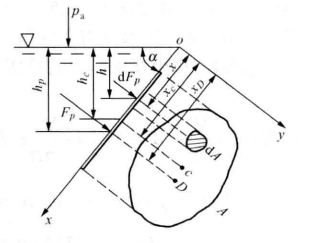
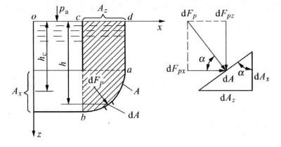

# 流体力学

## 流体

**流体是一种受任何微小剪切力作用都能连续变形的物质。**
流体按集态不同可分为液体和气体。液体和气体的交界面称为液体的自由表面。

1. **连续介质假设**：流体力学一般并不研究流体微观的分子运动，而只研究宏观的机械运动，因此可将流体视为由无数连续分布的流体微团组成的连续介质。在此假设下，表征流体属性的密度、速度、压强、温度等物理量在空间一般也是连续分布的。（分析在空气稀薄的高空运动、高真空技术等问题不适用）
2. **理想流体假设**：实际流体都是有粘性的，在流体运动时，都有内摩擦力，考虑粘性时，研究流体运动规律比较复杂。为使问题简化，忽略流体的粘性，把没有粘性的流体称为理想流体。理想在运动时不产生内摩擦力。（与热力学中理想气体无关）
3. **不可压缩假设**：忽略一般工程中没有多大影响的微小体积变化，把流体的密度视为常量。（水击现象、水下爆炸等问题不可忽略）

*要注意的是，这只是为了简便处理的假设，在某些问题上可能不适用。*

### 密度

密度表征流体在空间某点质量的密集程度
$$\rho = \lim_{\delta V \to 0}\frac{\delta m}{\delta V} = \frac{dm}{dV}$$
流体的相对密度指在一定温度下，液体密度与277K纯水的密度之比，用符号d表示。
流体的比体积指单位质量流体所占有的体积，即流体密度的倒数
混合气体密度为各组分气体密度与所占体积百分数乘积之和

### 流体的压缩性和膨胀性

**压缩系数**($m^2/N$)：单位压强所引起的体积变化率
$$\kappa = -\frac{\delta V / V}{\delta p}$$
体积模量为压缩系数的倒数

**体膨系数**($1/K$)：单位温升所引起的体积变化率
$$\alpha_V = \frac{\delta V / V}{\delta T}$$

### 流体的粘性

黏性是指流体微团间发生相对滑移时产生切向阻力的性质（黏性形成流体内摩擦，使流体黏附与接触的固体表面）
动力黏度($Pa \cdot s$)：$\mu = \frac{fh}{Av}$（f为摩擦力大小，h为流体上下接触的两板距离，A为接触面积）
运动黏度：动力黏度与密度的比值

牛顿流体

### 作用在流体上的力

1. 表面力：作用在所研究流体外表面上与表面积大小成正比的力，也就是周围流体作用于分离体表面上的力。（表面力可分为垂直于作用面的压力和平行于作用面的切力。）
2. 质量力（体积力）：某种力场作用在流体每一个质点上，与所作用的流体质量成正比的力。（如重力）

### 流体的表面性质

表面张力
毛细现象

## 流体静力学

（*通常将地球作为惯性参考系*）

绝对压强：以完全真空为基准
计示压强：以当地大气压强为基准，数值等于绝对压强与当地大气压强之差

**流体静压强**：

流体静压强的方向沿作用面的内法线方向，大小与其作用面在空间的方位无关。
流体压强是空间坐标的连续函数。

**平衡方程**：

$$
\left.
\begin{array}{rcl}
f_x-\frac{1}\rho\frac{\partial p}{\partial x}=0 \\
f_y-\frac{1}\rho\frac{\partial p}{\partial y}=0 \\
f_z-\frac{1}\rho\frac{\partial p}{\partial z}=0
\end{array}
\right\}\tag{1}
$$

**压强差公式**：

$$
dp=\rho(f_xdx+f_ydy+f_zdz)\tag{2}
$$

在等压面上，$dp=0$

**Pascal原理**：

作用在流体上的`质量力只有重力`的情况下，`不可压缩`的`静止`流体中的等高面为等压面
在重力作用下的连续均质不可压缩静止流体中，各点单位重量流体的总势能（位势能、压强势能）保持不变

$$
p=p_0+\rho gh \\
(流体密度\rho，重力加速度g，自由表面压强p_0，深度h处的压强为p)
$$

### 静止液体作用在平面上的总压力

1. 总压力的大小：$F_p=\rho gh_cA$($h_c$为平面形心c的淹深，$A$为平面的面积)即**数值上等于平面面积为底，平面形心淹深为高的液柱的重力**
2. 总压力的方向：垂直平面指向液体外
3. 总压力的作用点（压力中心）：根据总压力对oy轴之矩等于各微元面积上压强的合力对oy轴之矩的代数和求得。

### 静止液体作用在曲面上的总压力

矢量$F_{p} = F_{px} + F_{pz}$

1. 总压力的水平分力：$F_{px} = \rho g h_{c} A_{x}$($h_c$为平面形心c的淹深，$A$为平面在oyz平面上的投影面积)
2. 总压力的铅直分力：$F_{pz} = \rho g V_{p}$($V_{p}$为曲面ab上液柱abcd的体积，这样的体积称为压力体*压力体是数学概念，体内可以没有液体*)
3. 总压力的作用点：

## 流体动力学

### 流体的运动

描述方法：

1. 拉格朗日描述：着眼于每个流体质点流动参数随时间的变化，综合所有质点的运动从而得到整个流场的运动规律。（如：$a_x = \frac{d^2 x}{dt^2}$）
2. **欧拉描述**：着眼于流场中所有空间点流动参数随时间的变化，即研究各种矢量场和标量场。（如：$a_x = \frac{dv_x}{dt} = \frac{\partial v_x}{\partial t} + v_x \frac{\partial v_x}{\partial x}+ v_y \frac{\partial v_y}{\partial y}+ v_z \frac{\partial v_z}{\partial z}$）当地加速度、迁移加速度 随体导数=当地导数+迁移导数

迹线：流体质点的运动轨迹（拉格朗日描述）。
**流线**：流场中给定时刻，流线上每个点的速度矢量都与它相切（欧拉描述）（流线的微分方程：$\frac{dx}{v_x} = \frac{dy}{v_y} = \frac{dz}{v_z}$）。
脉线、时间线
系统：系统是一团流体质点的集合。在运动过程中，尽管系统的形状和位置不断地变化，但始终包含着这团流体质点，有确定的质量（拉格朗日描述）。
控制体：控制体是指流场中某一确定的空间区域，它的形状是根据流体流动情况和边界位置选定的，它对选定的参考坐标系是固定不变的。这个区域的周界称为控制面（欧拉描述）。

定常流动：流动参量不随时间变化的流动。
流量：单位时间流经某截面的流体量，分为体积流量($m^3/s$)和质量流量($kg/s$)。

流管：流场内作本身不是流线又不相交的封闭曲线，通过该曲线上的各点的流线所构成的管状表面称为流管。
湿周($\chi$):在总流的有效截面上，流体同固体边界接触部分的周长。
水力半径($R_h$)：总流的有效截面积与湿周之比称为水力半径。

输运公式

### 连续方程（质量守恒）

控制体内流体质量的时间变化率与经过控制面流体质量的静通量之和等于零。
对于`不可压缩`流体`密度可视为常量`的`定常流动`，有$v_a A =$常数。

### 动量定理

$$F = \rho q_{V} \Delta v$$

### 伯努利方程（能量守恒）

**`不可压缩`的`理想流体`在`重力场`中作`定常流动`时，`对于同一条流线上的点`**：
$$\frac{v^2}{2g} + z + \frac{p}{\rho g} = H$$
($\frac{v^2}{2g}$为单位重量流体的动能，称为速度水头；z为坐标，称为水头；$\frac{p}{\rho g}$称为压强水头；H为与流线相关的常数)

`重力作用`上`不可压缩`的`黏性流体`总流：
$$
\frac{\alpha_1 v_{1a}^2}{2g} + z_1 +\frac{p_1}{\rho g} = \frac{\alpha_2 v_{2a}^2}{2g} + z_2 +\frac{p_2}{\rho g} +h_w
$$
($\alpha$为总流的动能修正系数，恒大于1且流动的紊乱度越大越接近1；$h_w$为有截面$A_1$至截面$A_2$平均单位重量流体的能量损失)

## 管内流动

### 管内流动的能量损失

1. 沿程能量损失$$h_f = \lambda \frac{l}{d} \frac{v^2}{2g}$$
2. 局部能量损失$$h_j = \xi \frac{v^2}{2g}$$

### 黏性流体的两种运动状态

1. 层流
2. 紊流

雷诺数：$$Re = \frac{\rho v d}{\mu}$$
因为当$Re$界于上下临界雷诺数之间时，流动极不稳定，上临界雷诺数没有实用意义，通常将下临界雷诺数($Re_{cr}$)作为判别层流和紊流的准则数。
对于圆管，一般认为$Re \leqslant 2000$时为层流；$Re > 2000$时为紊流。

###

$$q_V = \frac{\pi d^4 \Delta p}{128 \mu l}$$